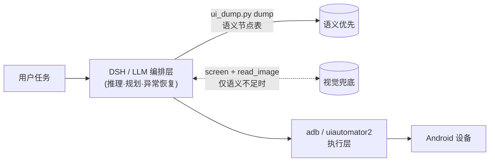

# Agent 框架选型与 DSH 直驱指南

回答一个架构问题：**不写自研纯视觉方案，能否直接用 DSH 或成熟开源框架
驱动安卓？** 答案是可以，且推荐"语义优先、视觉兜底"的混合方式。

## 为什么弃纯视觉

| 纯视觉（截图+OCR+坐标） | 语义驱动（Accessibility/uiautomator 树） |
| --- | --- |
| 坐标随分辨率/布局漂移，点错难自查 | 节点自带 resource-id/text/desc，定位稳定 |
| 看不懂 WebView/自绘控件的真实状态 | 可获 checked/enabled/scrollable 等状态位 |
| 每步都要过一遍多模态模型，贵且慢 | XML 一次 dump（1–3 s）全程复用 |
| FLAG_SECURE 黑屏即失明 | 语义树对 FLAG_SECURE 仍可见（截图黑是预期） |

上一章的 shell 后端（[SHELL_BACKEND.md](SHELL_BACKEND.md)）保留为设备端
常驻引擎的最小内核；日常任务自动化建议直接用下面的路线 A 或 B。

## 路线 A：DSH 直驱（零框架，agent 即框架）

DSH（DeepSeek Harness）本身具备：shell 执行（pwsh/bash）、文件读写、
**多模态读图**（`read_image`）、LLM 推理。配上 adb 就是完整的 Android
agent 闭环——语义感知、视觉兜底、决策、执行、验证全部在一个会话里完成，
不用写一行胶水代码。

### 前置

1. 安装 [platform-tools](https://developer.android.com/tools/releases/platform-tools)，`adb` 进 PATH；
2. 手机开启开发者选项 → USB 调试，连接后 `adb devices` 能看到设备。

### 标准作业流程（SOP）

```text
感知   python tools/agent/ui_dump.py dump            # 语义节点表
兜底   python tools/agent/ui_dump.py screen s.png    # 需要时截图
       → 让 DSH 用 read_image 查看 s.png
决策   DSH（LLM）根据节点表/截图选择动作
执行   adb shell input tap 540 1200                  # 点击 N 节点中心
       adb shell input text 'hello%sworld'           # %s = 空格
       adb shell input keyevent 4                    # BACK
       adb shell am start -a android.settings.SETTINGS
验证   再次 dump，确认目标节点消失/出现
```

### 直接贴给 DSH 的提示词模板

> 你是一个 Android 操作 agent。工具：`python
> android-global-agent/tools/agent/ui_dump.py dump [--serial S]` 输出当前
> 界面的可交互节点表（含点击中心坐标）；`… screen <path>` 截图（可用
> read_image 查看）；操作用 `adb shell input tap/text/keyevent`、
> `am start`、`am force-stop`。请循环"感知→执行→验证"完成以下任务，
> 每步先说计划再执行：____（任务描述）____

### 诚实边界

- 每步开销 = uiautomator dump（1–3 s）+ LLM 往返（秒级），适合任务级
  自动化，不适合 30/60 fps 实时交互；
- DSH 是会话式编排层，不是设备端常驻守护（那是本仓库 C++ 内核的定位）；
- 会话上下文有上限，长任务让 DSH 分阶段并把状态写进文件。

## 路线 B：成熟开源框架

| 框架 | 驱动方式 | LLM | 成熟度 | 适用场景 |
| --- | --- | --- | --- | --- |
| [uiautomator2](https://github.com/openatx/uiautomator2)（openatx） | 语义树（设备端 atx-agent） | 自行接入 | 工业级，国内事实标准 | Python 工程化首选；`d(text="登录").click()` |
| [Appium](https://github.com/appium/appium) | WebDriver 协议，语义/图像 | 自行接入 | 工业标准 | 跨端测试体系、已有 CI |
| [Airtest](https://github.com/AirtestProject/Airtest)（网易） | poco 语义树 + airtest 图像 | 自行接入 | 成熟，IDE 友好 | 游戏+应用混合、中文文档 |
| [Maestro](https://github.com/mobile-dev/maestro) | YAML 声明式，语义定位 | 无 | 稳定 | 确定性回归流程，非 agent |
| [AutoXJS](https://github.com/kkevsekk1/AutoX)（Auto.js 系） | 设备端 AccessibilityService | 可调 HTTP | 成熟 | **设备端常驻**全局脚本，无需主机 |
| [droidrun](https://github.com/droidrun/droidrun) | adb + LLM 工具链 | 内置 | 新锐（2024–25） | LLM-first agent 开箱即用 |
| [AutoDroid](https://github.com/MobileSystemsLab/AutoDroid)（MobiSys'24） | 语义 + LLM 知识库 | 内置 | 学术开源 | 研究复现 |
| [Android World](https://github.com/google-research/android_world)（Google） | adb + 语义，任务基准 | 外挂 | 研究级 | agent 评测/基准 |
| ~~Mobile-Agent / AppAgent~~ | 纯视觉多模态 | 内置 | 活跃 | 本路线明确排除（用户要求弃纯视觉） |

### 选型建议

- **任务级自动化、演示、探索**：路线 A（DSH 直驱）。零搭建，语义+视觉
  +推理一步到位，本文 SOP 即可。
- **工程化产品/长期服务**：uiautomator2 做设备控制层，LLM 网关做决策层，
  `ui_dump.py` 的节点过滤逻辑可直接移植。
- **设备端全局常驻**（本仓库原始目标）：AutoXJS（快）或本仓库 C++ 内核
  + AIDL 桥（要低延迟多指时）。
- **回归测试**：Maestro。

## 推荐混合架构



三条路线共用同一套 Android 侧能力（uiautomator dump、screencap、input、
am/pm/cmd），差别只在编排层——所以随时可以从小（DSH 会话）平滑长大到
工程化框架，不推翻重来。
