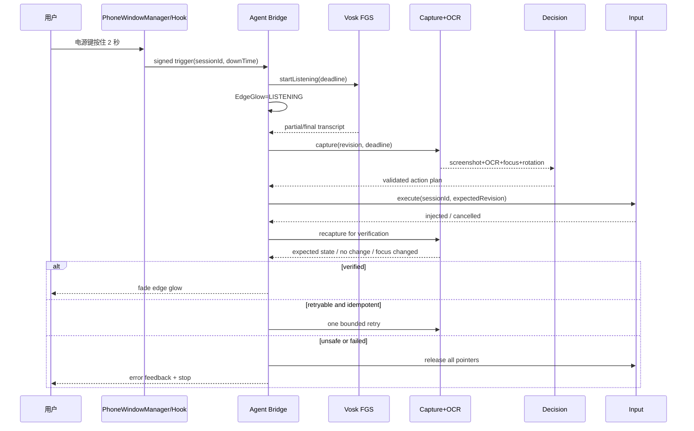

# Android 14 全局 Agent 系统工程手册

基线：Android 14 / API 34 / AOSP `android-14.0.0_r1` 语义；目标仅限自有或已授权的 AVD。生产分支、QPR、OEM backport 必须按设备 fingerprint 对源码重新核对。本文中的 Root、platform 签名、SELinux permissive 都是开发条件，不是产品安全模型。

## 0. 结论、边界与联动架构

完整链路由三个权限边界组成：`system_server` 内的电源键触发入口、platform-signed 的 Java bridge、独立 SELinux 域中的 native `agentd`。触发、截屏、OCR/STT、决策和输入共享一个带 `sessionId/revision/deadline` 的 Binder 会话；任何一步超时、Binder death、焦点变化或屏幕旋转都会取消当前手势并重新感知。

```mermaid
flowchart LR
    P[电源键按下] --> I[InputReader / InputDispatcher]
    I --> W[PhoneWindowManager / LSPosed Hook]
    W -->|受签名广播或 Binder| B[Platform-signed Agent Bridge]
    B --> O[边缘光效: Listening]
    B --> S[Vosk 流式 STT]
    S --> C[SurfaceFlinger 单帧捕获]
    C --> F[OCR + 前台 Activity/Window + 可选无障碍树]
    F --> D[上下文匹配与动作规划]
    D --> G[动作校验: 坐标/焦点/时限/幂等性]
    G --> U[/dev/uinput 或 InputManager 注入]
    U --> V[再次截屏 + OCR/焦点比对]
    V -->|成功| X[提交状态并渐隐光效]
    V -->|可重试且未超限| C
    V -->|失败/焦点变化| R[发送 CANCEL、回退并记录]
```

### 必须先纠正的四个前提

1. “Google APIs”标签只是候选，不保证 `adb root`；最终以 `ro.build.type=userdebug|eng`、`ro.debuggable=1` 和 `adb root` 实测为准。“Google Play”镜像通常是 production/user build，不能 `adb root`，应排除。`ro.secure` 单一属性不足以判断。
2. 普通 Android Studio debug keystore 不能签入 `android.uid.system`。`userdebug` 允许调试和 `adb root`，不代表接受任意 debug 证书。自编 AOSP `userdebug` 应使用同一构建树的 `build/make/target/product/security/platform.{x509.pem,pk8}` 测试 platform key；生产使用产品 platform key。Google APIs 预编译镜像的 platform 私钥不可得，因此不能靠普通 debug key 获得 UID 1000。
3. `PhoneWindowManager` 编译进 `services.jar`，不是 `framework.jar`。API 34 上用 Magisk 只覆盖 `framework.jar` 不会修改该类；覆盖 `services.jar` 还会受 system_server classpath、预编译 oat/ART boot image 和补丁级别影响。完整 AOSP 构建是主方案，LSPosed 是脆弱的开发备选。
4. 把一个 `.cil` 文件推到 `/system/etc/selinux/` 不会让 Android 14 自动合并或热加载。正式策略必须进入 AOSP sepolicy 构建并重启；Magisk/KernelSU 的 `sepolicy.rule` 是开发期、实现相关的启动时补丁。`setenforce 0/1` 只切换执行模式，不重新加载策略。

## 第一部分：开发环境准备

## 1. AVD 镜像选择与启动

### 1.1 选择矩阵

| 镜像 | `adb root` | UID 1000 platform 签名 | 本方案用途 |
| --- | --- | --- | --- |
| 自编 AOSP 14 `aosp_x86_64-userdebug` | 是 | 是，持有本构建 platform test key | 完整首选 |
| SDK “AOSP/default” API 34 | 需实测 | 通常无对应私钥 | Root daemon、native 原型 |
| SDK “Google APIs” API 34 | 需实测，不作保证 | 无对应私钥 | 仅 Root 自检通过后的兼容测试 |
| “Google Play” API 34 | 通常否 | 否 | 禁止用于本方案 |

安装 SDK 镜像示例：

> "sdkmanager \"platform-tools\" \"emulator\" \"platforms;android-34\" \"system-images;android-34;default;x86_64\""

> "avdmanager create avd -n AgentApi34 -k \"system-images;android-34;default;x86_64\" --device \"pixel_7\""

自编 AOSP 的确定性流程：

> "source build/envsetup.sh"

> "lunch aosp_x86_64-userdebug"

> "m -j"

### 1.2 启动命令

> "${ANDROID_SDK_ROOT}/emulator/emulator -avd AgentApi34 -writable-system -selinux permissive -partition-size 4096 -no-snapshot-load -show-kernel"

| 参数 | 必要性 |
| --- | --- |
| `-writable-system` | 为本次启动创建可写 system/overlayfs 路径；没有它就不能向 `/system/priv-app` 推送。它不等于关闭 AVB，也不持久保证下次启动仍可写。 |
| `-selinux permissive` | 开发期让 AVC 只审计不阻断，便于收集最小策略。仅在镜像内核支持时有效；生产必须 enforcing。 |
| `-partition-size 4096` | 将 system 分区上限设为 4096 MB，给 priv-app、模型和调试符号留空间；动态分区/overlayfs 的实际可用空间仍以 `df` 为准。 |
| `-no-snapshot-load` | 避免旧快照覆盖 system/SELinux 状态；非用户硬性参数，但对可复现部署必要。 |
| `-show-kernel` | 暴露 early boot、AVB、SELinux 和 init 错误；稳定后可移除。 |

首次 remount 若提示 verity 仍启用，执行：

> "adb root"

> "adb disable-verity"

> "adb reboot"

> "adb wait-for-device && adb root && adb remount"

### 1.3 Root 强制验收

规定序列及预期结果：

> "adb root" 预期：`restarting adbd as root` 或 `adbd is already running as root`；若出现 `adbd cannot run as root in production builds`，立即更换镜像。

> "adb remount" 预期：`remount succeeded`；若要求 reboot，按上一节执行 `disable-verity`，不要把失败忽略掉。

> "adb shell id" 预期至少包含 `uid=0(root) gid=0(root)`；shell 进程不是 root 即验收失败。

补充门禁：

> "adb shell getprop ro.build.version.sdk" 预期：`34`。

> "adb shell getprop ro.build.type" 预期：`userdebug` 或 `eng`。

> "adb shell getprop ro.debuggable" 预期：`1`。

> "adb shell getenforce" 开发启动预期：`Permissive`。

> "adb shell df -h /system /system_ext /data" 预期：目标分区有足够空间。

**模块自检 M1**

- API/路径：模拟器参数来自 Android Emulator CLI；设备属性由 `system/core/init/property_service.cpp` 和产品构建属性生成。
- 13→14：命令形态基本相同，但动态分区、overlayfs 和具体 SDK 镜像签名会变；不得从 API level 推断 Root，必须实测。
- 权限：Root 为本模块硬门槛；无 Root 只能安装普通 APK，不能完成 system 分区与 sepolicy 联动。
- 性能/省电：启动阶段无运行时预算；关闭不需要的 `-show-kernel`，日常使用 Quick Boot 前要确认不会恢复旧 system 状态。
- 失败即停：任一 `adb root/remount/id` 不满足，不进入 UID 1000、截屏或 uinput 测试。

## 2. Agent 获得系统级权限

### 2.1 Manifest 与 privileged allowlist

AOSP 来源：`frameworks/base/core/res/AndroidManifest.xml` 定义平台权限；`frameworks/base/core/java/android/content/pm/PackageParser.java`/PackageManager 解析 shared UID；Android 14 具体实现以目标分支 `frameworks/base/services/core/java/com/android/server/pm/` 为准。`android:sharedUserId` 已弃用，但预装平台组件仍可在受控产品中使用；新产品更推荐独立 UID + 窄 Binder 服务。

```xml
<manifest xmlns:android="http://schemas.android.com/apk/res/android"
    package="com.example.globalagent"
    android:sharedUserId="android.uid.system">
    <permission android:name="com.example.globalagent.permission.TRIGGER"
        android:protectionLevel="signature" />
    <uses-permission android:name="android.permission.INJECT_EVENTS" />
    <uses-permission android:name="android.permission.INTERNAL_SYSTEM_WINDOW" />
    <uses-permission android:name="android.permission.RECORD_AUDIO" />
    <uses-permission android:name="android.permission.FOREGROUND_SERVICE" />
    <uses-permission android:name="android.permission.FOREGROUND_SERVICE_MICROPHONE" />
    <uses-permission android:name="android.permission.SYSTEM_ALERT_WINDOW" />
    <application android:debuggable="true" android:directBootAware="true">
        <activity android:name=".MainActivity" android:exported="true">
            <intent-filter>
                <action android:name="android.intent.action.MAIN" />
                <category android:name="android.intent.category.LAUNCHER" />
            </intent-filter>
        </activity>
        <service android:name=".SpeechService" android:exported="false"
            android:foregroundServiceType="microphone" />
        <receiver android:name=".PowerTriggerReceiver" android:exported="true"
            android:permission="com.example.globalagent.permission.TRIGGER">
            <intent-filter>
                <action android:name="com.example.globalagent.action.POWER_LONG_PRESS" />
            </intent-filter>
        </receiver>
    </application>
</manifest>
```

`/system/etc/permissions/privapp-permissions-com.example.globalagent.xml`：

```xml
<permissions>
    <privapp-permissions package="com.example.globalagent">
        <permission name="android.permission.INJECT_EVENTS" />
        <permission name="android.permission.INTERNAL_SYSTEM_WINDOW" />
    </privapp-permissions>
</permissions>
```

只列产品确实需要且允许 privileged allowlist 的权限。`RECORD_AUDIO` 仍受 runtime permission、AppOps 和麦克风隐私开关约束；platform 签名不是绕过用户隐私状态的通行证。

### 2.2 签名门禁

自编 AOSP 开发镜像使用同一 checkout 的 platform test key：

> "apksigner sign --key \"$AOSP/build/make/target/product/security/platform.pk8\" --cert \"$AOSP/build/make/target/product/security/platform.x509.pem\" --out app-platform.apk app-unsigned.apk"

安装前比较证书摘要：

> "adb pull /system/framework/framework-res.apk /tmp/framework-res.apk"

> "apksigner verify --print-certs /tmp/framework-res.apk"

> "apksigner verify --print-certs app-platform.apk"

两者 signer certificate SHA-256 必须相同。不同即停止；不要靠关闭签名校验、修改 PackageManager 或普通 debug keystore 强行共享 UID。生产使用设备厂商保管的 platform key，并关闭 `android:debuggable`。

### 2.3 一键部署脚本 `deploy.sh`

以下脚本假定 APK 已用匹配的 platform key 签名；它会先做 Root/API 门禁，再部署 `/system/priv-app/YourAgent`。`stop/start` 会重启整个 Android framework，适合 AVD，不适合有业务负载的设备。

    #!/usr/bin/env bash
    set -euo pipefail

    APK="${1:-app/build/outputs/apk/debug/app-platform.apk}"
    PERMS_XML="${2:-deploy/privapp-permissions-com.example.globalagent.xml}"
    PKG="com.example.globalagent"
    REMOTE_DIR="/system/priv-app/YourAgent"
    REMOTE_APK="$REMOTE_DIR/YourAgent.apk"
    REMOTE_PERMS="/system/etc/permissions/privapp-permissions-com.example.globalagent.xml"

    test -f "$APK" || { echo "missing APK: $APK" >&2; exit 2; }
    test -f "$PERMS_XML" || { echo "missing allowlist: $PERMS_XML" >&2; exit 2; }
    test "$(adb shell getprop ro.build.version.sdk | tr -d '\r')" = "34"
    adb root
    adb wait-for-device
    adb remount
    adb shell 'test "$(id -u)" = 0'

    FRAMEWORK_RES="$(mktemp "${TMPDIR:-/tmp}/framework-res.XXXXXX")"
    trap 'rm -f "$FRAMEWORK_RES"' EXIT
    adb pull /system/framework/framework-res.apk "$FRAMEWORK_RES" >/dev/null
    IMAGE_CERT="$(apksigner verify --print-certs "$FRAMEWORK_RES" | sed -n 's/^Signer #1 certificate SHA-256 digest: //p')"
    APK_CERT="$(apksigner verify --print-certs "$APK" | sed -n 's/^Signer #1 certificate SHA-256 digest: //p')"
    test -n "$IMAGE_CERT" && test "$IMAGE_CERT" = "$APK_CERT" || {
        echo "platform certificate mismatch" >&2; exit 3;
    }

    adb shell "mkdir -p '$REMOTE_DIR'"
    adb push "$APK" "$REMOTE_APK"
    adb push "$PERMS_XML" "$REMOTE_PERMS"
    adb shell "chown root:root '$REMOTE_APK' && chmod 0644 '$REMOTE_APK'"
    adb shell "chown root:root '$REMOTE_PERMS' && chmod 0644 '$REMOTE_PERMS'"
    adb shell "restorecon -RF '$REMOTE_DIR' || true"
    adb shell "restorecon '$REMOTE_PERMS' || true"
    adb shell stop
    adb shell start
    adb wait-for-device
    until adb shell cmd package path "$PKG" >/dev/null 2>&1; do sleep 1; done
    adb shell cmd package path "$PKG"
    adb shell "dumpsys package '$PKG' | sed -n '/userId=/p;/sharedUserId=/p;/pkgFlags=/p'"

若动态分区把组件放在 `/system_ext`，使用 `/system_ext/priv-app/YourAgent`，并把 allowlist 放到 `/system_ext/etc/permissions/`；APK 与 allowlist 必须在同一产品构建语义下验收。

### 2.4 UID 1000 验收

> "adb shell am start -n com.example.globalagent/.MainActivity"

> "adb shell pidof com.example.globalagent"

> "adb shell 'PID=$(pidof com.example.globalagent); cat /proc/$PID/status | sed -n \"/^Uid:/p\"'" 预期四列均以 `1000` 开头。

> "adb shell ps -A -o USER,UID,PID,NAME | sed -n '/com.example.globalagent/p'" 预期 USER 为 `system`、UID 为 `1000`。

**模块自检 M2**

- API/路径：`android:sharedUserId` 为 manifest 属性；权限定义见 `frameworks/base/core/res/AndroidManifest.xml`；priv-app enforcement 在 `frameworks/base/services/core/java/com/android/server/pm/permission/`，目标 tag 需 `rg` 自检。
- 13→14：shared UID 仍为弃用接口，安装/更新校验和 privileged allowlist 更严格；具体 PackageManager 类名随分支漂移，需实测。
- 权限：UID 1000 强制要求匹配 platform 证书；单纯 Root 推送和 `0644` 不足。无 platform key 时降级为独立 UID bridge + root native daemon，不声称 UID 1000。
- 性能/省电：system UID 不应成为常驻大进程；OCR/Vosk 放独立进程，空闲释放模型或按内存等级缓存。
- 失败即停：证书摘要、PackageManager 扫描、UID 任何一项不匹配，删除测试 AVD 重建，不在脏状态继续。

## 3. SELinux 策略

### 3.1 正式 AOSP 策略

源码位置：platform policy 在 `system/sepolicy/`，设备 policy 在 `device/<vendor>/<product>/sepolicy/`；合并和预编译由 `system/sepolicy/Android.bp`、`build/soong` 完成。推荐让 native `agentd` 独占域，不给通用 `system_app` 域开放 uinput。

`global_agent.te`：

```te
type global_agent, domain;
type global_agent_exec, exec_type, system_file_type, file_type;
type global_agent_data_file, file_type, data_file_type, core_data_file_type;

init_daemon_domain(global_agent)
allow global_agent global_agent_data_file:dir create_dir_perms;
allow global_agent global_agent_data_file:file create_file_perms;
allow global_agent uinput_device:chr_file { open read write getattr ioctl };
```

`file_contexts`：

```text
/system_ext/bin/global-agentd                 u:object_r:global_agent_exec:s0
/data/misc/global_agent(/.*)?                 u:object_r:global_agent_data_file:s0
```

`global-agent.rc`：

```rc
service global-agentd /system_ext/bin/global-agentd
    class main
    user root
    group root input
    disabled
    oneshot
```

设备上的 `/dev/uinput` 必须实际标记为 `u:object_r:uinput_device:s0`；若目标分支名称不同，以 `ls -Z`、`file_contexts` 和编译错误为准。某些 ioctl 还需要目标策略支持的 `allowxperm`；先收集 AVC，再按确切 ioctl 号最小化，不复制宽泛 `0x0000-0xffff` 规则。

构建与验证：

> "m global-agentd selinux_policy"

> "adb shell ls -lZ /dev/uinput /system_ext/bin/global-agentd /data/misc/global_agent"

> "adb shell dmesg | sed -n '/avc: *denied/p'"

### 3.2 CIL 示例及其真实加载方式

等价 CIL 片段可作为生成产物/审阅材料，例如 `global_agent.cil`：

```lisp
(type global_agent)
(type global_agent_exec)
(type global_agent_data_file)
(allow global_agent uinput_device (chr_file (open read write getattr ioctl)))
```

不能只推送 CIL 后期待生效，例如下面这条命令本身不会加载策略：

> "adb push global_agent.cil /system/etc/selinux/global_agent.cil"

正确方式是把源 `.te`/contexts 加入 `SYSTEM_EXT_PRIVATE_SEPOLICY_DIRS` 或设备 policy 目录，由 AOSP 编译为匹配 mapping/version 的 precompiled policy，再刷入并重启。

Magisk/KernelSU 开发备选 `sepolicy.rule`：

```text
allow global_agent uinput_device chr_file { open read write getattr ioctl }
```

该文件由具体 root 框架在 early boot 合并，不是 Android 官方 CIL 热加载接口；必须记录框架版本，并在 enforcing 模式复测。若目标策略存在 neverallow，正确动作是修改产品架构/域边界，不是扩大规则。

### 3.3 “重新加载”与模式切换

Android 14 没有面向应用的通用安全策略热加载流程。修改已编译 policy 后应重启 AVD：

> "adb reboot"

`setenforce` 只用于验证已加载策略：

> "adb shell setenforce 0"；预期 `getenforce` 为 `Permissive`。

> "执行一次截屏/uinput 冒烟并收集 AVC"。

> "adb shell setenforce 1"；预期 `getenforce` 为 `Enforcing`，再次执行同一冒烟必须成功且无新增 denied。

**模块自检 M3**

- API/路径：`system/sepolicy/`、`system/core/init/selinux.cpp`；以目标源码搜索 `precompiled_sepolicy` 与 `selinux_android_load_policy` 核验加载路径。
- 13→14：不能笼统声称 API 34 一定新增某条 uinput 限制；对 Android 13/14 的 `system/sepolicy`、设备 policy 做源码 diff，并结合目标 SPL 实测。
- 权限：permissive 只停止阻断，不授予 DAC 权限；`root` 仍需设备节点 mode/group，enforcing 还需 allow/ioctl 规则。无 Root 降级到 `InputManager`/Accessibility。
- 性能/省电：SELinux 检查不是主要延迟；禁止轮询 dmesg，测试期按 session 采集 AVC。
- 失败即停：enforcing 冒烟失败时不交付；策略必须最小化到独立域。

## 4. 开发迭代

`fast-deploy.sh`：

    #!/usr/bin/env bash
    set -euo pipefail
    APK="${1:-app/build/outputs/apk/debug/app-platform.apk}"
    PKG="com.example.globalagent"
    ACT=".MainActivity"

    adb root
    adb wait-for-device
    adb remount
    adb push "$APK" /system/priv-app/YourAgent/YourAgent.apk
    adb shell 'chown root:root /system/priv-app/YourAgent/YourAgent.apk && chmod 0644 /system/priv-app/YourAgent/YourAgent.apk'
    adb shell 'restorecon -RF /system/priv-app/YourAgent'
    adb shell stop
    adb shell start
    adb wait-for-device
    adb shell am force-stop "$PKG"
    adb shell am start -W -n "$PKG/$ACT"

日志：

> "adb logcat -v threadtime GlobalAgent:V AndroidRuntime:E ActivityManager:I '*:S'"

> "adb logcat -b crash -v threadtime"

> "adb shell dmesg | sed -n '/avc: *denied/p;/global-agent/p'"

端到端开发门禁：

> "adb shell getenforce && adb shell id && adb shell ps -A -o UID,PID,NAME | sed -n '/globalagent/p'"

> "adb shell dumpsys package com.example.globalagent | sed -n '/userId=/p;/grantedPermissions:/,/install permissions:/p'"

**模块自检 M4**

- API/路径：Activity 启动由 `frameworks/base/services/core/java/com/android/server/wm/ActivityTaskManagerService.java` 处理；日志崩溃缓冲由 logd 提供。
- 13→14：Android 14 的后台 Activity/FGS 限制更严，`am start` 的 shell 测试不代表后台系统广播能启动 UI/麦克风。
- 权限：快速部署仍要求 root + remount + platform 签名；无 Root 使用 `adb install -r`，但失去 UID 1000/隐藏 API 能力。
- 性能：`am start -W` 记录冷/热启动；目标热启动 <200 ms，常驻服务空闲 CPU <1%。
- 失败即停：每次部署后先 UID、SELinux、package 权限三检，再测功能。

## 第二部分：核心功能模块

## 5. 触发层：电源键长按

### 5.1 Android 14 流转

Linux input event 依次经过：`frameworks/native/services/inputflinger/reader/EventHub.cpp` → `InputReader.cpp` → `dispatcher/InputDispatcher.cpp` → `frameworks/base/services/core/jni/com_android_server_input_InputManagerService.cpp` → `InputManagerService` 的 policy callback → `frameworks/base/services/core/java/com/android/server/policy/PhoneWindowManager.java`。

`KEYCODE_POWER` 在 policy 的 `interceptKeyBeforeQueueing()`/`interceptPowerKeyDown()` 及 `SingleKeyGestureDetector` 规则中处理。普通 App 收不到它：电源键在分发给应用前由系统策略消费，后台广播也没有原始 power key 公共 API。

`config_globalActionsKeyTimeout` 是 framework 资源整数，不是 `setprop` 系统属性。来源通常为 `frameworks/base/core/res/res/values/config.xml`，可被产品 overlay 覆盖；PhoneWindowManager 读取后作为长按超时。本文要求 2 秒时，产品 overlay 应显式设 `2000`，或 Agent 使用独立常量并记录冲突。

### 5.2 两种实现对比

| 维度 | AOSP Framework 修改 | LSPosed Hook |
| --- | --- | --- |
| 修改点 | `PhoneWindowManager.PowerKeyRule.onLongPress()` 最稳；也可在 down/up 安排 2 秒 Runnable | Hook `interceptPowerKeyDown(KeyEvent, boolean)` 与对应 key-up/规则回调 |
| 产物 | 自编 `services.jar`/system image | LSPosed 模块 APK，注入 `android`/system_server |
| 稳定性 | 与目标源码同编译，最高 | 私有方法签名随 QPR/OEM 变化，可能 bootloop |
| 升级成本 | 每个分支重编系统 | 每个分支反编译/签名探测后更新 hook |
| 安全/审计 | 可做受签名 Binder、测试覆盖、明确 owner | 运行时注入，完整性与 Play Protect 风险更高 |
| 推荐 | 生产/长期工程机 | 临时原型、受控 AVD |

### 5.3 AOSP patch 伪实现

不要把同一次长按同时交给 Global Actions 和 Agent。推荐在 `PowerKeyRule.onLongPress()` 分支中建立唯一 owner；以下 down/up 版本展示严格 2 秒取消语义：

```java
// frameworks/base/services/core/java/com/android/server/policy/PhoneWindowManager.java
private static final long AGENT_LONG_PRESS_MS = 2_000L;
private boolean mAgentPowerArmed;
private long mAgentPowerDownTime;

private final Runnable mAgentPowerLongPress = () -> {
    if (!mAgentPowerArmed) return;
    mAgentPowerArmed = false;
    Intent i = new Intent("com.example.globalagent.action.POWER_LONG_PRESS")
            .setPackage("com.example.globalagent")
            .addFlags(Intent.FLAG_RECEIVER_FOREGROUND)
            .putExtra("downTime", mAgentPowerDownTime);
    mContext.sendBroadcastAsUser(i, UserHandle.SYSTEM,
            "com.example.globalagent.permission.TRIGGER");
    // Mark the power gesture handled in the surrounding PowerKeyRule so that
    // Global Actions/assistant/shutdown does not also fire.
};

private void armAgentPowerLongPress(KeyEvent event) {
    if (event.getRepeatCount() != 0) return;
    mAgentPowerArmed = true;
    mAgentPowerDownTime = event.getDownTime();
    mHandler.removeCallbacks(mAgentPowerLongPress);
    mHandler.postAtTime(mAgentPowerLongPress,
            mAgentPowerDownTime + AGENT_LONG_PRESS_MS);
}

private void cancelAgentPowerLongPress() {
    mAgentPowerArmed = false;
    mHandler.removeCallbacks(mAgentPowerLongPress);
}
```

更好的生产接口是 system_server 调用受签名 AIDL，而不是可伪造广播。若保留广播，声明 `signature` 级 `com.example.globalagent.permission.TRIGGER`、显式 package，并在 receiver 校验 sending UID/system session nonce。

关于 Magisk：若必须实验覆盖，目标文件是 `/system/framework/services.jar`，不是 `framework.jar`。API 34 的预编译 oat/ART 可能让覆盖 jar 不生效或导致 system_server 崩溃；必须同时匹配 build fingerprint、dex checksum 和预编译产物。本文不把该路径列为可交付方案；优先重编 AOSP，或使用 LSPosed 原型。

### 5.4 LSPosed 伪实现

```java
public void handleLoadPackage(XC_LoadPackage.LoadPackageParam p) {
    if (!"android".equals(p.packageName)) return;
    Class<?> pwm = XposedHelpers.findClass(
            "com.android.server.policy.PhoneWindowManager", p.classLoader);
    XposedHelpers.findAndHookMethod(pwm, "interceptPowerKeyDown",
            KeyEvent.class, boolean.class, new XC_MethodHook() {
        protected void afterHookedMethod(MethodHookParam hp) {
            KeyEvent e = (KeyEvent) hp.args[0];
            Object self = hp.thisObject;
            PowerHookState.arm(self, e.getDownTime(), 2_000L,
                    () -> sendProtectedExplicitBroadcast(self));
        }
    });
    // 同时 hook 目标分支实际的 interceptPowerKeyUp/PowerKeyRule.onKeyUp，
    // 在 2 秒前抬起时取消；只 hook down 会产生幽灵触发。
}
```

启动前先在目标 `services.jar` 做存在性检查：

> "adb pull /system/framework/services.jar /tmp/services.jar"

> "jadx -d /tmp/services-src /tmp/services.jar"

> "rg \"interceptPowerKeyDown|class PowerKeyRule|config_globalActionsKeyTimeout\" /tmp/services-src"

### 5.5 触发验证

> "adb shell input keyevent --longpress KEYCODE_POWER" 只能做 shell 冒烟，时序不等于真实硬键。

> "adb logcat -v threadtime PhoneWindowManager:I GlobalAgent:V '*:S'"

真实验收：按下 1.5 秒后抬起不得触发；按住 2.0–2.3 秒只触发一次；重复/熄屏/锁屏分别测试；Agent 触发时 Global Actions 不得同时出现。

**模块自检 M5**

- API/路径：上述 inputflinger/JNI/PWM 路径；隐藏私有方法必须对目标 `services.jar` 或源码 `rg`，反射/hook 方法名风险为高。
- 13→14：QPR 可能改变 `SingleKeyGestureDetector.get(...)`、PowerKeyRule 回调参数和 display 状态；精确差异需目标 tag 实测。
- 权限：AOSP 修改需要系统镜像构建；LSPosed 需要 Root + Zygisk/LSPosed。无 Root 降级为 Assistant/VoiceInteractionService、通知 action 或 Accessibility 快捷方式，不能监听原始电源键。
- 性能/省电：down handler <2 ms；只投递一个延时任务，不轮询；触发到 bridge <30 ms。
- 失败即停：方法不存在、system_server 重启、双重 Global Actions 任一出现即禁用模块。

## 6. 感知层：自动截屏、OCR 与窗口上下文

### 6.1 正确的 API 34 截屏入口

Java 隐藏 API 位于 `frameworks/base/core/java/android/view/SurfaceControl.java` 的 `captureDisplay(DisplayCaptureArgs)` 家族；反射受 hidden-API 和权限限制，风险高。Native AOSP 14 更适合 root/system daemon：

- 声明：`frameworks/native/libs/gui/include/gui/SurfaceComposerClient.h`
- 参数：`frameworks/native/libs/gui/include/gui/DisplayCaptureArgs.h`
- 结果：`frameworks/native/libs/gui/include/gui/ScreenCaptureResults.h`
- 服务端：`frameworks/native/services/surfaceflinger/SurfaceFlinger.cpp` 的 `captureDisplay*`
- 缓冲：`frameworks/native/libs/ui/include/ui/GraphicBuffer.h`

AOSP 14 主线常用的是 `ScreenshotClient::captureDisplay(DisplayId, listener)`/`ScreenCaptureResults`，不要假定存在稳定 NDK `SurfaceControl.captureDisplay`。它是私有平台 ABI，必须在目标 AOSP 树内 Soong 编译，链接 `libgui/libui/libbinder/libutils/liblog`。

### 6.2 C++ 伪实现：GraphicBuffer → RGBA/Bitmap

```cpp
#include <gui/SurfaceComposerClient.h>
#include <android/gui/BnScreenCaptureListener.h>
#include <ui/GraphicBuffer.h>
#include <hardware/gralloc.h>

CaptureResult captureOne(android::DisplayId id, int64_t deadlineNs) {
    using namespace android;
    // TimedScreenCaptureListener 实现 BnScreenCaptureListener，并在
    // onScreenCaptureCompleted() 中用 condition_variable 保存结果；等待受 deadline 限制。
    sp<TimedScreenCaptureListener> listener = new TimedScreenCaptureListener();
    status_t rc = ScreenshotClient::captureDisplay(id, listener);
    if (rc != OK) return Error(rc);

    android::gui::ScreenCaptureResults r;
    if (!listener->waitUntil(deadlineNs, &r)) return Timeout();
    if (!r.fenceResult.ok()) return Error(r.fenceResult.error());
    if (r.capturedSecureLayers || r.buffer == nullptr) return Error(PERMISSION_DENIED);
    if (r.fenceResult.value() != nullptr) {
        int remainMs = remainingMillis(deadlineNs);
        if (r.fenceResult.value()->wait(remainMs) != OK) return Timeout();
    }

    sp<GraphicBuffer> gb = r.buffer;
    const auto fmt = gb->getPixelFormat();
    if (fmt != PIXEL_FORMAT_RGBA_8888 && fmt != PIXEL_FORMAT_RGBX_8888) {
        return Error(BAD_VALUE); // BGRA/FP16/YUV 必须显式转换。
    }
    void* base = nullptr;
    Rect rect(gb->getWidth(), gb->getHeight());
    rc = gb->lock(GRALLOC_USAGE_SW_READ_OFTEN, rect, &base);
    if (rc != OK || base == nullptr) return Error(rc);

    RgbaImage out(gb->getWidth(), gb->getHeight());
    const size_t srcStridePx = gb->getStride();
    for (uint32_t y = 0; y < gb->getHeight(); ++y) {
        // 这里只对经实测为 RGBA_8888/RGBX_8888 的 buffer 复制；
        // FP16/YUV/厂商格式必须走对应转换，不能按 4 Bpp 猜。
        memcpy(out.row(y), static_cast<uint8_t*>(base) + y * srcStridePx * 4,
               gb->getWidth() * 4);
    }
    gb->unlock();
    return out;
}
```

JNI 转 Java Bitmap 时，由 Java 创建 `ARGB_8888` Bitmap，native 用 `AndroidBitmap_lockPixels()` 按目标 stride 转 RGBA→ARGB 并解锁；或用 `AHardwareBuffer`/HardwareBuffer 零拷贝交给 GPU。不能把 `GraphicBuffer*` 生命周期裸传到 Java。

安全边界：`captureSecureLayers=false`；`FLAG_SECURE`、DRM/受保护 buffer 应黑屏或失败。Root 不应也不能被设计成突破 secure/TEE 内容。

### 6.3 备选路径

| 路径 | 延迟/质量 | 权限与结论 |
| --- | --- | --- |
| Native `ScreenshotClient` 单帧 | 目标 <50 ms，首选 | root/system native + 私有 ABI；严格 fence deadline |
| `adb exec-out screencap -p` / 系统 `screencap` | 常见 80–250 ms，需实测 | 调试降级；源码 `frameworks/base/cmds/screencap/screencap.cpp` |
| Virtual Display + BufferQueue | 稳态可低延迟，复杂且常驻耗电 | system 侧显式授权；处理旋转、背压和生命周期 |
| MediaProjection/ScreenRecording | 需要用户同意 token | 不用于无人交互触发；不能“绕过”授权 |
| `service call SurfaceFlinger <code>` | 不可交付 | Binder transaction code 私有且随版本变化，参数错误可崩服务；禁止硬编码 |

### 6.4 OCR 与上下文融合

OCR 使用 PaddleOCR mobile 或 Tesseract，模型离线随产品发布并做 SHA-256 校验。流程：截图缩放到长边 1080/1440 → 灰度/方向校正 → 文本检测框 → 识别 → 将框按 rotation/insets 映射回物理 display 坐标。文本和截图默认只在内存中保留一个 session。

低频诊断命令：

> "adb shell dumpsys activity activities | sed -n '/mResumedActivity/p;/topResumedActivity/p'"

> "adb shell dumpsys window windows | sed -n '/mCurrentFocus/p;/mFocusedApp/p'"

> "adb shell uiautomator dump /data/local/tmp/window.xml && adb pull /data/local/tmp/window.xml"

`dumpsys activity/window` 只能给前台 task/window、bounds、rotation 等诊断信息，不能稳定给完整控件坐标或 RecyclerView/Compose 私有文本。坐标来自 OCR 框，或用户明确启用的 Accessibility/uiautomator 树；XML 必须用解析器读取 `bounds`，不要用脆弱正则。

内存策略：复用 2–3 个 GraphicBuffer/Bitmap；OCR 前按需降采样；每帧预算约 `1440×3120×4 ≈ 18 MB`，禁止同时积压多帧；超时丢帧，不阻塞 SurfaceFlinger callback。

**模块自检 M6**

- API/路径：`SurfaceControl.java`、`SurfaceComposerClient.h`、`ScreenCaptureResults.h`、`SurfaceFlinger.cpp`；Java 反射方法 `captureDisplay` 风险高，native 也属私有 ABI。
- 13→14：DisplayCaptureArgs/结果/fence 和权限检查可能随 tag/QPR 漂移；Binder transaction code 不兼容，必须源码编译/实测。
- 权限：native 路径强制 root/system service；无 Root 使用用户同意的 MediaProjection。OCR 本身无需 Root；Accessibility tree 要用户启用服务。
- 性能：capture <50 ms，格式转换 <15 ms，OCR mobile P95 <250 ms，窗口元数据 <50 ms；复用 buffer、只在触发后采集、屏灭即停。
- 失败即停：secure layer、未知 pixel format、rotation 在 capture 后变化、deadline 超时均返回不可决策，不注入。

## 7. 控制层：多点触控注入

### 7.1 方案对比

| 方案 | 多指 | 权限 | 延迟目标 | 稳定性/适用场景 |
| --- | --- | --- | --- | --- |
| `/dev/uinput` MT Protocol B | 完整 | root/DAC + 独立 SELinux allow | 帧写入 <20 ms | 最底层；需自行处理校准、旋转、slot、取消 |
| `InputManager.injectInputEvent` | 完整 MotionEvent | platform API + `INJECT_EVENTS` | <20 ms | 系统 app 首选，随 framework 编译；隐藏 API |
| `input tap/swipe` | 通常单指 | shell/root | 30–150 ms | CLI 冒烟，不适合并发多指或精确时序 |
| Accessibility `dispatchGesture` | 支持多 stroke | 用户启用 Accessibility | 50–300 ms | 无 Root 降级，受手势/窗口/系统 UI 限制 |

### 7.2 uinput 设备创建（Protocol B）

内核接口来源：`include/uapi/linux/uinput.h`、`include/uapi/linux/input-event-codes.h`；Android EventHub/InputReader 路径见上一模块。以下为关键伪实现，错误处理必须检查每个 `ioctl/write`：

```cpp
int createTouch(int width, int height, int maxSlots) {
    int fd = open("/dev/uinput", O_WRONLY | O_NONBLOCK | O_CLOEXEC);
    check(fd >= 0);
    ioctl(fd, UI_SET_EVBIT, EV_SYN);
    ioctl(fd, UI_SET_EVBIT, EV_KEY);
    ioctl(fd, UI_SET_KEYBIT, BTN_TOUCH);
    ioctl(fd, UI_SET_KEYBIT, BTN_TOOL_FINGER);
    ioctl(fd, UI_SET_PROPBIT, INPUT_PROP_DIRECT);
    ioctl(fd, UI_SET_EVBIT, EV_ABS);

    setupAbs(fd, ABS_MT_SLOT,        0, maxSlots - 1);
    setupAbs(fd, ABS_MT_TRACKING_ID, 0, 65535);
    setupAbs(fd, ABS_MT_POSITION_X,  0, width - 1);
    setupAbs(fd, ABS_MT_POSITION_Y,  0, height - 1);
    setupAbs(fd, ABS_MT_PRESSURE,    0, 255);

    uinput_setup us{};
    snprintf(us.name, UINPUT_MAX_NAME_SIZE, "GlobalAgent Virtual Touch");
    us.id = { BUS_VIRTUAL, 0x18d1, 0xa014, 1 };
    ioctl(fd, UI_DEV_SETUP, &us);
    ioctl(fd, UI_DEV_CREATE);
    return fd;
}
```

`setupAbs` 应使用 `UI_ABS_SETUP` 填充 `uinput_abs_setup`；旧内核才回退 `uinput_user_dev`。创建后等待 InputReader 枚举到设备，再开始 session，不能固定 sleep 后盲写。

### 7.3 多指帧状态机

```cpp
struct Finger { int slot; int trackingId; int x; int y; int pressure; };

void emitEvent(int fd, uint16_t type, uint16_t code, int32_t value) {
    input_event e{};
    e.type = type; e.code = code; e.value = value;
    writeFull(fd, &e, sizeof(e));
}

void fingersDown(int fd, std::span<const Finger> fs) {
    emitEvent(fd, EV_KEY, BTN_TOUCH, 1);
    emitEvent(fd, EV_KEY, BTN_TOOL_FINGER, 1);
    for (const Finger& f : fs) {
        emitEvent(fd, EV_ABS, ABS_MT_SLOT, f.slot);
        emitEvent(fd, EV_ABS, ABS_MT_TRACKING_ID, f.trackingId);
        emitEvent(fd, EV_ABS, ABS_MT_POSITION_X, f.x);
        emitEvent(fd, EV_ABS, ABS_MT_POSITION_Y, f.y);
        emitEvent(fd, EV_ABS, ABS_MT_PRESSURE, f.pressure);
    }
    emitEvent(fd, EV_SYN, SYN_REPORT, 0);
}

void moveFrame(int fd, std::span<const Finger> fs) {
    for (const Finger& f : fs) {
        emitEvent(fd, EV_ABS, ABS_MT_SLOT, f.slot);
        emitEvent(fd, EV_ABS, ABS_MT_POSITION_X, f.x);
        emitEvent(fd, EV_ABS, ABS_MT_POSITION_Y, f.y);
        emitEvent(fd, EV_ABS, ABS_MT_PRESSURE, f.pressure);
    }
    emitEvent(fd, EV_SYN, SYN_REPORT, 0);
}

void fingersUp(int fd, std::span<const int> slots, bool noActiveFingerRemains) {
    for (int slot : slots) {
        emitEvent(fd, EV_ABS, ABS_MT_SLOT, slot);
        emitEvent(fd, EV_ABS, ABS_MT_TRACKING_ID, -1);
    }
    if (noActiveFingerRemains) {
        emitEvent(fd, EV_KEY, BTN_TOUCH, 0);
        emitEvent(fd, EV_KEY, BTN_TOOL_FINGER, 0);
    }
    emitEvent(fd, EV_SYN, SYN_REPORT, 0);
}
```

只在最后一指抬起时发送 `BTN_TOUCH=0`；部分抬指只给对应 slot 的 `TRACKING_ID=-1`。任何异常、Binder death、焦点变化都发送剩余 slot 的 up/cancel 语义并销毁/重建虚拟设备，避免“粘指”。坐标先从 logical display 经 rotation、cutout/insets 和 uinput abs range 做矩阵变换。

API 34 sepolicy 规则复用 M3 的独立域：

```text
allow global_agent uinput_device chr_file { open read write getattr ioctl }
```

不要授权整个 `system_app` 或 `shell` 域。实际 ioctl 若被阻断，记录 `scontext/tcontext/tclass/ioctlcmd` 后在设备 policy 中最小化。

### 7.4 三次贝塞尔手势生成器

随机抖动仅用于自有 UI 的压力/鲁棒性测试，不用于规避风控。生产自动化默认使用固定 seed 以可复现。

```kotlin
data class Pt(val x: Float, val y: Float, val tMs: Long)

fun bezierGesture(start: PointF, end: PointF, durationMs: Long,
                  seed: Long, hz: Int = 120, jitterPx: Float = 1.5f): List<Pt> {
    require(durationMs in 40..10_000 && hz in 30..240)
    val rng = java.util.Random(seed)
    val dx = end.x - start.x
    val dy = end.y - start.y
    val c1 = PointF(start.x + dx * .33f, start.y + dy * .18f)
    val c2 = PointF(start.x + dx * .72f, start.y + dy * .82f)
    val n = maxOf(2, (durationMs * hz / 1000).toInt())
    return (0..n).map { i ->
        val u = i.toFloat() / n
        val v = 1f - u
        val x = v*v*v*start.x + 3*v*v*u*c1.x + 3*v*u*u*c2.x + u*u*u*end.x
        val y = v*v*v*start.y + 3*v*v*u*c1.y + 3*v*u*u*c2.y + u*u*u*end.y
        val envelope = kotlin.math.sin(Math.PI * u).toFloat()
        val jx = ((rng.nextFloat() - .5f) * 2f) * jitterPx * envelope
        val jy = ((rng.nextFloat() - .5f) * 2f) * jitterPx * envelope
        Pt(x + jx, y + jy, durationMs * i / n)
    }
}
```

### 7.5 Kotlin/JNI 封装

```kotlin
class NativeTouch : AutoCloseable {
    private var handle: Long = nativeOpen()
    fun down(points: List<TouchPoint>) = nativeDown(handle, points.toTypedArray())
    fun move(points: List<TouchPoint>) = nativeMove(handle, points.toTypedArray())
    fun up(slots: IntArray) = nativeUp(handle, slots)
    override fun close() { if (handle != 0L) nativeClose(handle).also { handle = 0 } }
    private external fun nativeOpen(): Long
    private external fun nativeDown(h: Long, p: Array<TouchPoint>)
    private external fun nativeMove(h: Long, p: Array<TouchPoint>)
    private external fun nativeUp(h: Long, slots: IntArray)
    private external fun nativeClose(h: Long)
}
```

Java/Kotlin 不直接持有 fd；native handle 表中校验 owner UID、sessionId、最大 10 指、坐标有限性、单调时间、DOWN/MOVE/UP 状态机和 5 秒硬超时。

### 7.6 验证

> "adb shell getevent -lp" 预期看到 `GlobalAgent Virtual Touch`、`ABS_MT_SLOT/TRACKING_ID/POSITION_X/Y`。

> "adb shell getevent -lt /dev/input/eventN" 在自有测试 Activity 执行双指缩放，预期每帧一个 `SYN_REPORT`、tracking ID 唯一且最终为 `-1`。

测试 Activity 画出收到的 pointerId/轨迹并断言双指间距单调变化；不要用第三方 App 作为首个验收对象。

**模块自检 M7**

- API/路径：Linux `uinput.h/input-event-codes.h`；Android `EventHub.cpp/InputReader.cpp`；`InputManager.injectInputEvent` 见 `frameworks/base/core/java/android/hardware/input/InputManager.java` 和 `InputManagerService.java`，隐藏 API 风险中高。
- 13→14：uinput 的 SELinux/DAC 变化取决于 platform、device policy 与 SPL，不能泛化；用目标 policy diff 和 AVC 实测。MotionEvent/displayId 私有签名也需源码编译。
- 权限：uinput 强制 root + DAC + sepolicy；InputManager 强制 platform/`INJECT_EVENTS`；无 Root 降级 Accessibility `dispatchGesture` 或单指用户可见测试。
- 性能：单帧 write <2 ms、注入到应用 P95 <20 ms、120 Hz 最多一帧/8.3 ms；批量 writev、定时器绝对时间、屏灭/空闲不保持设备。
- 失败即停：未知 event node、slot 泄漏、非单调时间、焦点变化、写短包、AVC 均立即全指抬起并禁用本 session。

## 8. 交互层：Vosk 离线语音

### 8.1 API 与 Manifest

来源：`AudioRecord` 在 `frameworks/base/media/java/android/media/AudioRecord.java`；FGS 类型在 `frameworks/base/core/java/android/content/pm/ServiceInfo.java`；Android 14 服务检查在 `frameworks/base/services/core/java/com/android/server/am/ActiveServices.java`。

Manifest 已在 M2 声明 `RECORD_AUDIO`、`FOREGROUND_SERVICE`、`FOREGROUND_SERVICE_MICROPHONE` 和 `android:foregroundServiceType="microphone"`。Android 14 即使是 system app，也不应绕过麦克风隐私开关、AppOps 或可见指示器。

Vosk 依赖和中文模型不是 AOSP 组件；锁定版本、ABI、模型许可证与 SHA-256。16 kHz、mono、PCM16；模型解压到 app private/device-protected storage，原始 PCM 默认不落盘。

### 8.2 前台服务伪实现

```kotlin
class SpeechService : Service() {
    private val running = AtomicBoolean(false)
    private val executor = Executors.newSingleThreadExecutor()
    private var audio: AudioRecord? = null

    override fun onStartCommand(i: Intent?, flags: Int, startId: Int): Int {
        if (checkSelfPermission(Manifest.permission.RECORD_AUDIO) !=
            PackageManager.PERMISSION_GRANTED) return stopAndNotSticky(startId)
        try {
            startForeground(NOTIFICATION_ID, notification("正在聆听"),
                ServiceInfo.FOREGROUND_SERVICE_TYPE_MICROPHONE)
        } catch (denied: SecurityException) {
            return stopAndNotSticky(startId)
        } catch (denied: ForegroundServiceStartNotAllowedException) {
            return stopAndNotSticky(startId)
        }
        if (running.compareAndSet(false, true)) executor.execute { recognize(startId) }
        return START_NOT_STICKY
    }

    private fun recognize(startId: Int) {
        val rec = buildAudioRecord(rate = 16_000, source = MediaRecorder.AudioSource.VOICE_RECOGNITION)
        val model = verifiedChineseVoskModel()
        val vosk = org.vosk.Recognizer(model, 16_000f)
        val pcm = ByteArray(maxOf(rec.bufferSizeInFrames * 2, 3200))
        val startAt = SystemClock.elapsedRealtime()
        var lastSpeech = startAt
        var heardSpeech = false
        val hardDeadline = startAt + 10_000
        audio = rec
        try {
            rec.startRecording()
            while (running.get() && SystemClock.elapsedRealtime() < hardDeadline) {
                val n = rec.read(pcm, 0, pcm.size, AudioRecord.READ_BLOCKING)
                if (n <= 0) break
                val speech = energyAboveThreshold(pcm, n)
                if (speech) {
                    heardSpeech = true
                    lastSpeech = SystemClock.elapsedRealtime()
                }
                if (vosk.acceptWaveForm(pcm, n)) publishFinal(vosk.result)
                else publishPartialRateLimited(vosk.partialResult, 200)
                val now = SystemClock.elapsedRealtime()
                if (!heardSpeech && now - startAt >= 3_000) break
                if (heardSpeech && now - lastSpeech >= 1_000) break
            }
            publishFinal(vosk.finalResult)
        } finally {
            running.set(false)
            runCatching { rec.stop() }; rec.release(); vosk.close(); model.close()
            audio = null; notifyOverlayFade(); stopForeground(STOP_FOREGROUND_REMOVE)
            stopSelfResult(startId)
        }
    }
}
```

静音策略：首次语音等待 3 秒、检测到语音后连续 0.8–1.2 秒静音结束、总上限 10 秒；收到电源键再次长按、来电、音频路由变化、麦克风隐私关闭或 session cancel 立即停止。VAD 阈值按模拟器麦克风噪声标定，不能只用固定 RMS 上线。

验证：

> "adb shell appops get com.example.globalagent RECORD_AUDIO"

> "adb shell dumpsys activity services com.example.globalagent | sed -n '/SpeechService/,+20p'"

> "adb shell dumpsys media.audio_flinger | sed -n '/Record thread/,+20p'"

**模块自检 M8**

- API/路径：`AudioRecord.java`、`ServiceInfo.java`、`ActiveServices.java`；Vosk 为第三方 API，版本/模型必须锁定。
- 13→14：target 34 新增/强制 microphone FGS 类型权限与 while-in-use 启动约束；后台首次启动可能抛 `ForegroundServiceStartNotAllowedException`/`SecurityException`，必须实测。
- 权限：录音需用户授权 + AppOps + 隐私开关；Root/system UID 不突破。无 Root 功能相同，但触发改为用户显式 UI/Assistant。
- 性能：首个 partial <500 ms，partial 更新 100–300 ms，RSS 按模型实测；触发前可 mmap 预热模型，但空闲 5 分钟或内存压力时释放。
- 失败即停：无通知、AppOps denied、隐私开关关闭、AudioRecord 未初始化均停止，不改读 `/dev/snd`。

## 9. 反馈层：屏幕四周光效

普通产品用 `TYPE_APPLICATION_OVERLAY`；来源为 `frameworks/base/core/java/android/view/WindowManager.java`。若需要覆盖状态栏/Keyguard，应在自有 AOSP 的 SystemUI 中集成，不伪造 trusted overlay。

```kotlin
val lp = WindowManager.LayoutParams(
    MATCH_PARENT, MATCH_PARENT,
    WindowManager.LayoutParams.TYPE_APPLICATION_OVERLAY,
    WindowManager.LayoutParams.FLAG_NOT_FOCUSABLE or
        WindowManager.LayoutParams.FLAG_NOT_TOUCHABLE or
        WindowManager.LayoutParams.FLAG_LAYOUT_IN_SCREEN or
        WindowManager.LayoutParams.FLAG_LAYOUT_NO_LIMITS,
    PixelFormat.TRANSLUCENT
)
windowManager.addView(EdgeGlowView(this), lp)
```

`FLAG_NOT_TOUCHABLE|FLAG_NOT_FOCUSABLE` 是强制条件，确保光效不拦截 Agent 即将注入或用户真实触摸。View 只画四条窄边，不用全屏高开销模糊：

```kotlin
class EdgeGlowView(c: Context) : View(c) {
    var state = State.IDLE
    private var phase = 0f
    private val paint = Paint(Paint.ANTI_ALIAS_FLAG)
    private val matrix = Matrix()
    private var shader: LinearGradient? = null
    override fun onSizeChanged(w: Int, h: Int, oldw: Int, oldh: Int) {
        shader = LinearGradient(0f, 0f, w.toFloat(), 0f,
            intArrayOf(Color.CYAN, Color.WHITE, Color.MAGENTA, Color.CYAN),
            floatArrayOf(0f, .33f, .66f, 1f), Shader.TileMode.MIRROR)
        paint.shader = shader
    }
    override fun onDraw(canvas: Canvas) {
        if (state == State.IDLE) return
        phase = (phase + resources.displayMetrics.density * 3f) % maxOf(1, width)
        matrix.setTranslate(phase, 0f)
        shader?.setLocalMatrix(matrix)
        paint.alpha = (255 * alpha).toInt()
        val w = resources.displayMetrics.density * 5
        canvas.drawRect(0f, 0f, width.toFloat(), w, paint)
        canvas.drawRect(0f, height-w, width.toFloat(), height.toFloat(), paint)
        canvas.drawRect(0f, 0f, w, height.toFloat(), paint)
        canvas.drawRect(width-w, 0f, width.toFloat(), height.toFloat(), paint)
        if (state == State.LISTENING) postInvalidateOnAnimation()
    }
}
```

API 33+ 可用 `frameworks/base/graphics/java/android/graphics/RuntimeShader.java`/AGSL，把 `time` uniform 绑定 `Choreographer`；低端/模拟器回退 `LinearGradient`。状态机：`TRIGGERED→LISTENING` 持续流动，`PARTIAL` 轻微增强，`FINAL/ERROR/CANCELLED` 在 250 ms 内渐出并移除 window；屏灭立即移除。

验证：

> "adb shell dumpsys window windows | sed -n '/EdgeGlow/,+12p'"

在光效显示时运行自有触摸测试，确认底层 View 收到事件且 overlay 无 focus；检查 jank：

> "adb shell dumpsys gfxinfo com.example.globalagent framestats"

**模块自检 M9**

- API/路径：`WindowManager.java`/`WindowManagerService.java`、`RuntimeShader.java`、`Choreographer.java`；均需按目标 API 检查，RuntimeShader 是 API 33+ 公共 API。
- 13→14：overlay 层级/遮挡与 OEM Keyguard 策略需实测；不能保证覆盖系统关键窗口。
- 权限：普通 overlay 需 `SYSTEM_ALERT_WINDOW`/AppOp；platform SystemUI 集成需系统构建。无 Root 可在用户授权后使用普通 overlay。
- 性能：目标 60 fps、每帧 UI <4 ms、GPU overdraw 仅边缘、idle 0 fps；识别结束 250 ms 内移除。
- 失败即停：overlay 取得 focus、触摸被遮断、屏灭仍渲染、连续 5 帧 >16.6 ms 均降级为静态边框或移除。

## 10. 决策闭环

### 10.1 数据与动作契约

感知快照：`{sessionId, revision, captureTime, displayId, rotation, focusedPackage, focusedActivity, windowBounds, ocrBoxes[], optionalAccessibilityNodes[], screenshotHash}`。任何 action 必须引用同一 revision；执行前若焦点/rotation/hash epoch 变化，拒绝旧 action。

动作 schema：

```text
Tap(x,y), LongPress(x,y,duration), Swipe(path,duration),
Pinch(center,startSpan,endSpan,duration), InputText(text), Back, Wait(condition,timeout)
```

决策顺序：规范化语音 → 意图/实体 → 在 OCR/层级中按文本、可点击性、窗口归属和空间关系打分 → 生成最短动作序列 → 检查危险动作、坐标、幂等性、deadline → 执行。删除、支付、授权、发送消息等不可逆动作必须停在最终确认前，由用户明确确认。

### 10.2 执行与验证伪实现

```kotlin
suspend fun runStep(command: VoiceCommand): StepResult {
    repeat(2) { attempt ->
        val before = perception.capture(deadlineMs = 350) ?: return Failed("capture")
        val plan = planner.plan(command, before) ?: return Failed("no target")
        validator.requireSameSessionAndSafe(plan, before)
        input.execute(plan.action, deadlineMs = 200)
        delay(plan.settleMs.coerceIn(50, 500))
        val after = perception.capture(deadlineMs = 350) ?: return Failed("verify capture")
        when (verifier.compare(plan.expected, before, after)) {
            VERIFIED -> return Success(after.revision)
            FOCUS_CHANGED, UNSAFE_SURFACE -> return RolledBack
            NO_CHANGE -> if (!plan.idempotent || attempt == 1) return Failed("no change")
        }
    }
    return Failed("retry exhausted")
}
```

验证不是只看像素差：组合 `focusedActivity/package`、目标 OCR 文本出现/消失、目标区域 SSIM/pHash、Accessibility state 和预期窗口。全屏动画或视频时降低像素信号权重。最多重试 1 次；非幂等动作不自动重试。回退优先发送 `ACTION_CANCEL`/全指抬起，不盲目按 Back。

### 10.3 端到端时序



**模块自检 M10**

- API/路径：闭环使用前述经核验边界；Binder DTO 使用 AIDL 固定字段、长度上限和 `enforceNoDataAvail()`，不传任意 Parcelable。
- 13→14：窗口、任务、hidden API 字段会漂移；DTO 只保存稳定自有字段，适配器按分支编译。
- 权限：决策本身无需 Root；capture/input/trigger 分别继承 M5–M7。无 Root 闭环为 MediaProjection + Accessibility + 用户可见触发。
- 性能：触发投递 <30 ms；STT 首 partial <500 ms；capture <50 ms；OCR <250 ms；decision <100 ms；inject <20 ms；验证 capture <50 ms。单步 P95 目标 <800 ms，不宣称硬实时。
- 省电：只在触发 session 激活；屏灭、静音超时、Binder death 立即停；OCR 降采样、Vosk 模型按内存压力释放、overlay 用 vsync 不忙等。
- 失败即停：deadline、revision、focus、rotation、secure surface、pointer state 任一不一致都不执行。

## 第三部分：强制总自检与验收

## 11. Android 13→14 兼容矩阵

| 项目 | Android 13 | Android 14 / API 34 | 强制动作 |
| --- | --- | --- | --- |
| microphone FGS | 已有 FGS 类型机制 | target 34 强制 `FOREGROUND_SERVICE_MICROPHONE` 与 while-in-use 启动检查 | Manifest + 前后台/锁屏实测 |
| Surface capture | 私有 API/ABI | 仍为私有，参数、结果、权限可随 tag/QPR 漂移 | 在 exact tree 编译；禁止硬编码 Binder code |
| uinput | 受 DAC/SELinux | 仍受 DAC/SELinux；是否“收紧”取决于 platform/device/SPL | diff policy + enforcing AVC 实测 |
| Power policy | PWM + SingleKeyGestureDetector | 同架构但 QPR/OEM 私有签名可能变 | grep 源码/反编译 services.jar |
| shared UID/priv-app | 已弃用 shared UID | 仍弃用且安装/allowlist 校验不可省 | cert digest + UID + granted permissions 三检 |
| overlay | `TYPE_APPLICATION_OVERLAY` | 仍受 AppOp、WMS、Keyguard/OEM 策略 | 焦点/触摸/层级实测 |

版本证据采集：

> "adb shell getprop ro.build.fingerprint"

> "adb shell getprop ro.build.version.security_patch"

> "adb shell getprop ro.build.version.incremental"

> "adb shell uname -a"

任何未覆盖的 QPR/OEM 分支统一标记“需实测”，不猜 Binder transaction code、method overload 或安全补丁 commit。

## 12. Root、权限与降级边界

| 能力 | Root/系统路径 | 无 Root 降级 |
| --- | --- | --- |
| 电源键原始长按 | AOSP PWM 修改或 Root+LSPosed | Assistant/VoiceInteractionService、Accessibility shortcut、通知按钮 |
| 无交互截屏 | root/system native ScreenshotClient | 用户同意的 MediaProjection |
| 多点注入 | uinput 或 platform `InputManager` | 用户启用 Accessibility `dispatchGesture` |
| 离线语音 | `RECORD_AUDIO` + microphone FGS，Root 不豁免隐私 | 同一公共 API，用户从可见 UI 启动 |
| 全局光效 | SAW 或 SystemUI 集成 | 用户授权 SAW；否则仅 Activity 内边缘光效 |
| UID 1000 | 精确 platform 证书 + system image | 独立 app UID + 窄 AIDL/root daemon |

## 13. 性能预算与观测

| 环节 | P95 目标 | 测量方法 | 超预算处理 |
| --- | --- | --- | --- |
| 触发→bridge | <30 ms | elapsedRealtime trace | 丢弃重复 trigger |
| 单帧 capture | <50 ms | Perfetto + callback/fence timestamps | 丢帧，不阻塞 |
| 像素转换 | <15 ms | native trace | GPU/HardwareBuffer 或降采样 |
| OCR | <250 ms | model stage trace | ROI/缩放/小模型 |
| STT 首 partial | <500 ms | audio timestamp→partial | 模型预热/有界队列 |
| 决策 | <100 ms | revision trace | 缩小候选、超时拒绝 |
| 输入注入 | <20 ms | uinput write→app event timestamp | 绝对定时、批量 write |
| 验证 capture | <50 ms | 同 capture | 一次重试上限 |

> "adb shell perfetto --txt -c /data/local/tmp/global-agent-trace.cfg -o /data/misc/perfetto-traces/global-agent.pftrace"

> "adb shell dumpsys meminfo com.example.globalagent"

> "adb shell top -b -n 1 -p $(adb shell pidof com.example.globalagent)"

Perfetto 配置应启用 `sched`, `freq`, `binder_driver`, `gfx`, `view`, `audio` 和 Agent 自有 atrace category；录制 10–20 秒有界 session，避免长期追踪耗电。

## 14. 端到端验收清单

1. AVD：API 34、非 Google Play、`adb root/remount/id` 全通过；fingerprint/SPL 归档。
2. APK：platform cert digest 匹配；`cmd package path` 指向 priv-app；进程 UID=1000；privileged 权限实际 granted。
3. SELinux：先 permissive 收集 AVC；再 enforcing 执行相同 capture/uinput 测试，无新增 denied；`/dev/uinput` 标签与独立域正确。
4. 触发：1.5 秒不触发，2 秒只触发一次；Global Actions 不重复；熄屏/锁屏/重复按键结果符合产品定义。
5. 截屏：普通界面 P95<50 ms、旋转正确、未知格式安全失败；`FLAG_SECURE`/DRM 不被捕获。
6. OCR/上下文：OCR box 映射命中自有测试控件；focus/activity 与截图同 revision；dumpsys 超时不会卡主循环。
7. 输入：双指 slot/tracking ID 合法、最终全部 `-1`；旋转/焦点变化时 cancel；注入 P95<20 ms。
8. STT：通知、麦克风指示器、权限与隐私开关正常；中文 partial<500 ms；1 秒静音/10 秒硬超时释放 AudioRecord。
9. 光效：不抢焦点、不吃触摸；LISTENING 流动、结束 250 ms 渐出；屏灭停止。
10. 闭环：成功、无变化、焦点切换、Binder death、SurfaceFlinger/SystemUI 重启、低内存、模型损坏各跑一轮；非幂等动作不自动重试。

建议一键验收入口：

> "./tools/check-project.sh && ./tools/run-tests.sh"

设备侧总门禁：

> "adb shell 'id; getenforce; getprop ro.build.version.sdk; getprop ro.build.fingerprint; getprop ro.build.version.security_patch'"

> "adb shell 'ps -A -o USER,UID,PID,NAME | sed -n /globalagent/p; ls -lZ /dev/uinput'"

> "adb logcat -d -b crash -v threadtime && adb shell dmesg | sed -n '/avc: *denied/p'"

## 15. 局限性与交付声明

- 本系统不能突破 TEE、StrongBox、硬件密钥、加密传输、DRM 或应用自身端到端加密；也不能从截图推导应用私有数据库/密钥。
- `FLAG_SECURE`/protected buffer 必须保持不可捕获；Root 不是越过 secure surface 的产品需求。
- LSPosed、Root、解锁 bootloader、system image 修改和 platform 签名都会改变完整性信号，可能被 Play Protect、Play Integrity、企业 MDM 或第三方反篡改检测并标记。
- Google APIs/Play 预编译镜像的签名、AVB、QPR 和 OEM backport 不受本方案控制；任何隐藏 API、SELinux type、ioctl allow、Binder 事务都必须对 exact build 实测。
- 模拟器性能不代表真机：GPU/gralloc、音频路由、触摸采样、thermal、TEE/DRM 和厂商 SystemUI 都不同。生产结论必须补真机 userdebug 工程样机矩阵。
- 本手册提供可编译集成骨架和验收门槛，不承诺在 enforcing、未知 OEM ROM 或未来 SPL 上无需适配。
