# Android 14/15/16 OpenClaw 风格全局 Agent 工程手册

版本：2026-07-19。目标环境：自有或已获授权的 API 34/35/36 AVD，Root、platform-signed system bridge、SELinux 产品策略。本文把 OpenClaw 的分层思想用于 Android 全局 Agent，但不把第三方 Termux 移植误写成 OpenClaw 官方支持。

## 0. 交付结论与事实边界

推荐架构不是“把全部 Agent 和 API Key 塞进 UID 1000 进程”，而是四个隔离边界：

1. `system_server`/电源键策略只产生受认证的 trigger。
2. platform-signed `GlobalAgentBridge` 与独立 `global-agentd` 负责截屏、焦点元数据和输入注入，不声明 `INTERNET`，不持有 API Key。
3. 低权限 `ModelGateway` 只持有 `INTERNET`、Android Keystore 密文和 Provider adapter，不持有 `INJECT_EVENTS`、Root 或 SurfaceFlinger 权限。
4. OpenClaw runtime、Termux runtime 或本地 planner 都只能调用窄化的 typed tools；模型返回的是候选意图/动作，不是 shell、ADB 或 uinput 的直接控制权。

截屏也不是 Gateway 的自由工具：只有本地 power/voice/UI trigger 创建活动 session 后，privileged bridge 才签发一次性 `CaptureGrant(sessionId, revision, expiry, nonce)`。Gateway 只能在该 grant 的单次、短 deadline 内请求脱敏候选帧；bridge 校验 Binder caller UID/签名、session owner、焦点与 grant 消耗状态。无活动 trigger 时，即使 Gateway 被攻破也不能枚举或连续抓屏。

必须先纠正六项输入前提：

- OpenClaw 官方 Android 形态是 companion node，官方明确说明 Android 不承载 Gateway；Gateway 官方支持运行于 macOS、Linux、Windows/WSL2。AVD 主路径因此是“宿主机 Gateway + Android node/tool adapter”。
- “Termux 原生运行 OpenClaw、无需 proot”来自第三方 `Mohd-Mursaleen/openclaw-android`，不是官方部署。其约 2 秒启动、低 RAM 表述没有可复核测量，且固定旧版 `openclaw@2026.4.5`；只列为实验路线。
- 当前 OpenClaw 工具扩展是 typed tools/插件 `api.registerTool(...)`。Pi RPC 是旧版历史描述；2026-05 后 runtime 已内化，不能把它当作当前稳定工具总线。
- `android-automation-agent` 是第三方 Skill，不是 OpenClaw 内置 Skill。可参考其任务拆分，但不能照搬明文 `.env`、普通偏好 JSON、ADB TCP 5555 或高风险交易流程。
- Android Studio 普通 debug keystore 不能获得 `android.uid.system`。`userdebug` 允许 `adb root`，不代表接受任意证书；UID 1000 仍要求与镜像匹配的 platform certificate。
- API 免费额度不是产品 SLA。百炼和 Anthropic 可能提供新用户限时试用额度；OpenAI、DeepSeek 和任何 Provider 都必须按控制台实际 entitlement、区域和当前定价自检。

**自检 SC-0**

- 记录 OpenClaw/npm 精确版本、Android API、fingerprint、SPL、Provider model ID 与文档核验日期。
- 任一外部主张没有官方来源时标记“实验/需实测”，不进入发布承诺。
- 生产 build 中 `global-agentd`、system bridge 不得声明 `INTERNET`；ModelGateway 不得声明系统注入权限。

## 第一部分：参考 OpenClaw 的架构映射

## 1. OpenClaw 当前核心结构

截至本文日期，官方 OpenClaw 的稳定结构是：多消息通道进入单个常驻 Gateway；Gateway 在默认 loopback `127.0.0.1:18789` 上复用 WebSocket RPC、HTTP API、UI 和 hooks；Agent loop 完成 intake、上下文组装、推理、typed tool 执行、流式输出和持久化。官方 Channels index 当前列出 29 项，包括 Discord、Telegram、Slack、WhatsApp、WebChat 和外部插件通道。

| OpenClaw 层 | 官方职责 | Android 全局 Agent 映射 | 本方案进程 |
| --- | --- | --- | --- |
| Channels | Discord/Telegram/Slack/WhatsApp 等消息接入 | 电源键长按、Vosk 语音、可见 Activity/通知触发 | PWM/SystemUI + SpeechService |
| Gateway | WS/HTTP 控制平面、路由、会话、认证 | 本地 Binder 会话控制；宿主机 OpenClaw 仅作可替换规划面 | `AgentControlService` + 可选 OpenClaw Gateway |
| Agent runtime | 上下文、模型循环、session、tool loop | Provider-neutral planner、上下文裁剪、多 Agent 编排 | 低权限 ModelGateway/OpenClaw runtime |
| Typed tools | 内置函数与 `api.registerTool(...)` 插件 | `observe_screen`、`find_text`、`tap`、`swipe`、`input_text`、`verify` | Android Tool Adapter |
| Skills | 可复用任务说明、脚本和资源 | 自研 `android-global-agent` Skill，只暴露 typed tools | OpenClaw workspace/host adapter |
| Nodes | 远端/伴随设备能力 | AVD companion/node；ADB 或受认证 socket 连接 | 宿主机 adapter + AVD bridge |
| Session store | 对话与运行状态 | `sessionId/revision/deadline` + 有界状态图 | gateway DB + `/data/misc/global_agent` |

完整链路：

```mermaid
flowchart LR
    T[电源键长按 2 秒] --> STT[Vosk 离线语音]
    STT --> CP[Binder AgentControlService]
    CP --> CAP[SurfaceFlinger 单帧截图]
    CAP --> RED[本地 OCR / 脱敏 / UI 上下文]
    RED --> GW[低权限 Model Gateway]
    GW --> API[云端模型 API]
    API --> PARSE[严格 JSON Schema / Tool Call 解析]
    PARSE --> GUARD[session + revision + 焦点 + 风险校验]
    GUARD --> EXEC[uinput / InputManager]
    EXEC --> VERIFY[再次截图 + OCR / 焦点验证]
    VERIFY -->|成功| DONE[提交状态 / 光效渐隐]
    VERIFY -->|幂等且可重试| CAP
    VERIFY -->|失败或越权| CANCEL[全指取消 / 停止会话]
```



### 1.1 两种部署拓扑

| 拓扑 | 状态 | 优点 | 代价 |
| --- | --- | --- | --- |
| A. 宿主机 OpenClaw Gateway + AVD system bridge | 官方 OpenClaw 部署模型，推荐 | Gateway/Node 运行环境受支持；Android 只承载平台能力；便于调试 | 依赖宿主机，非完全离线单机 |
| B. Android 原生 ModelGateway + 自研 runtime | 本方案生产目标 | Keystore、Binder、生命周期和权限边界可控 | 需实现 Provider adapter/配置 UI，不直接复用完整 OpenClaw runtime |
| C. Termux 第三方 OpenClaw 移植 | 实验 | 单设备原型、可复用部分 OpenClaw Skill/Agent loop | 非官方、版本滞后、Bionic/native addon/Doze/ADB 断线风险高 |

**自检 SC-1**

- OpenClaw current version 必须从官方 release/npm 获取并锁定；本文核验时 GitHub stable 为 `v2026.7.1`，npm latest 为 `2026.7.1-2`。
- 检查 Gateway 只绑定 loopback，并启用 token/device authentication；禁止直接监听 `0.0.0.0`。
- Tool 列表必须少而窄；不得注册 `shell(command)`、`adb(argsFromModel)` 或任意文件读写工具。

## 2. Android 控制平面与 Tool 契约

控制平面复用仓库现有 AIDL session 语义，并新增 provider-neutral 协议 v2。每个请求都绑定 `sessionId`、单调 `revision`、`displayId`、`expectedFocus` 与绝对 deadline：

当前控制协议仍是 `ModelGatewayPolicy.PROTOCOL_VERSION=1`：没有 Provider HTTP client 或截图入站路径，只能校验有界文本 intent；生产 `DecisionEngine` 固定为 `NoopDecision`，因此拒绝执行。独立 ModelGateway APK 与 root/shell-only 公开 `ConfigProvider` 已完成本地实现，配置 schema 为 v2 且当前强制 `dryRun=true`；这不等于控制协议 v2 或云端 dry-run 已接通。以下 v2 AIDL、CaptureGrant、Keystore 凭据 UI、Provider adapter 和图像出境策略仍是下一阶段契约。只有 v2 网络/解析链已经实现而执行 feature flag 仍关闭时，才称为 dry-run（允许 API 请求与脱敏记录，但不注入）；不得用“dry-run”描述当前无网络的 v1。

```aidl
SessionHandle beginSession(in SessionTrigger trigger);
PerceptionEnvelope observe(in CaptureGrant grant, long expectedRevision, long deadlineMs);
ActionReceipt proposeAndExecute(in ActionPlan plan);
VerificationEnvelope verify(long sessionId, long expectedRevision, long deadlineMs);
void cancel(long sessionId, int reason);
```

`observe` 的实际 parcel 还必须携带 bridge 生成的一次性 capture nonce；成功或失败后立即消费。nonce 不写日志、不转发给模型、不跨 session 重用。ADB/host adapter 只拿到当前 session 的 opaque capability，不获得底层 ScreenCapture Binder handle。

OpenClaw/Termux 不能直接访问 Binder 时，Tool Adapter 使用两个受控出口之一：

- 宿主机：`adb forward` 到 `agentd` 的 localabstract socket，传输 length-prefixed JSON/CBOR；socket 再进入同一 session validator。
- Termux：只调用自定义 `cmd global_agent` shell service；每个子命令固定参数 schema。绝不拼接模型输出成 shell 字符串。

宿主机转发：

> "adb forward tcp:18791 localabstract:global_agent_rpc"

> "adb forward --list"

Node Tool Adapter 伪实现：

```ts
async function callAndroidTool(name: ToolName, args: unknown, ctx: SessionCtx) {
  const parsed = ToolSchemas[name].parse(args);
  const request = {
    protocolVersion: 2,
    sessionId: ctx.sessionId,
    expectedRevision: ctx.revision,
    deadlineElapsedMs: ctx.deadlineElapsedMs,
    nonce: ctx.nonce,
    tool: name,
    arguments: parsed,
  };
  return RpcResponseSchema.parse(await rpc.call(request));
}
```

允许的工具：

```text
observe_screen(includeImage, roi, detail)
get_ui_context()
find_text(text, packageName)
tap(targetId, normalizedX, normalizedY)
swipe(start, end, durationMs)
pinch(center, startSpan, endSpan, durationMs)
input_text(targetId, text)
press_back()
wait_for(condition, timeoutMs)
verify(expectation)
```

坐标仅是建议值。优先使用本地生成的 `targetId`/OCR box；远端坐标统一为 `[0,10000]` 归一化整数，由本地根据同一 revision 的 display/rotation/insets 转换并再次做命中检查。

**自检 SC-2**

- Binder/socket/RPC 任一层拒绝未知字段、过长字符串、过多动作、非有限坐标、过期 revision 和超时 session。
- 每次 Binder death、socket disconnect、focus/rotation 变化都发送手势 cancel 并使当前计划失效。
- Tool Adapter 使用 `spawnFile/execve(argv[])` 或 typed RPC，不使用 `sh -c`。

## 第二部分：模型 API 与配置

## 3. Provider 能力矩阵

调用公网 API 与 Android 14/15/16 没有模型级耦合：三个版本都只需普通 `android.permission.INTERNET`、有效系统时间、TLS 1.2+ 和目标域名可达。Root/system 权限只服务于截屏和输入，不是调用 API 的前提。

| Provider | 当前已核验模型示例 | 原生/推荐接口与鉴权 | 图像输入 | Tool/结构化动作 | 免费/试用结论 | Android 34–36 |
| --- | --- | --- | --- | --- | --- | --- |
| OpenAI | `gpt-5.6-sol`、`gpt-5.6-terra`、`gpt-5.6-luna`；兼容固定旧路由可用 `gpt-5.2` | Responses API；Bearer API key | 支持 URL/Base64/file；5.6 支持 `low/high/original/auto` | typed function tools + JSON Schema；推荐 `strict:true` | 不假定免费额度 | `INTERNET` + TLS；完全相同 |
| Anthropic | `claude-sonnet-5`、`claude-opus-4-8`、`claude-fable-5` | `/v1/messages`；`x-api-key` + `anthropic-version` | 支持 Base64/URL/Files | 原生 tool use；OpenAI 兼容层忽略 `strict`，生产用原生 | 新用户可能有小额 credits，非 SLA | 相同 |
| 阿里云百炼/Qwen | 规划：`qwen3.7-plus/max`；视觉：`qwen3.5-omni-plus` 或模型卡列出的 VL 模型 | 区域 Workspace OpenAI-compatible endpoint；Bearer DashScope key | 仅明确标注视觉的模型支持 | Function Calling，按模型/区域自检 | 新用户指定模型限时 30–90 天，非永久免费 | 相同；区域/数据驻留需配置 |
| DeepSeek | `deepseek-v4-flash`、`deepseek-v4-pro` | `https://api.deepseek.com/chat/completions`；Bearer key | 当前官方 API 不支持图像 | Tool Calls；`strict` 仍为 Beta | 未承诺免费赠款 | 相同；只能接收 OCR/UI 文本 |

时间敏感提示：DeepSeek 官方已公告旧别名 `deepseek-chat`/`deepseek-reasoner` 将于 2026-07-24 15:59 UTC 弃用。配置应使用 V4 模型并在启动时探测，不能把别名写死。

### 3.1 OpenAI 当前接口选择

新 Agent 使用 Responses API，不使用旧式 Chat Completions `messages` 作为 OpenAI 默认。OpenAI 官方当前建议 GPT-5.6 的 reasoning、tools、多轮 Agent 使用 Responses；`gpt-5.6` alias 指向 `gpt-5.6-sol`。图像请求使用 `input_text`/`input_image`，而不是 Chat Completions 的 `image_url` content type。

对于 Android 截图，必须显式设置 detail。GPT-5.6 的 `auto`/省略会按 `original` 处理，可能显著增加图像 token 和延迟；快速规划默认 `low`，文本小且定位困难时先本地裁剪，再对 ROI 用 `high/original`。

ModelGateway Manifest/网络策略在三个 Android 版本保持一致：

```xml
<manifest xmlns:android="http://schemas.android.com/apk/res/android"
    package="com.example.globalagent.gateway">
    <uses-permission android:name="android.permission.INTERNET" />
    <application
        android:usesCleartextTraffic="false"
        android:networkSecurityConfig="@xml/network_security_config" />
</manifest>
```

```xml
<network-security-config>
    <base-config cleartextTrafficPermitted="false">
        <trust-anchors>
            <certificates src="system" />
        </trust-anchors>
    </base-config>
</network-security-config>
```

生产默认不信任 user-added CA；企业代理场景通过单独受管 flavor 配置。证书 pinning 只有在 Provider 给出可轮换 pin 集和应急流程时启用，不能只 pin 当前 leaf certificate。Android 14/15/16 的公网 HTTPS 权限相同，但后台执行/FGS/Doze 策略会变化：模型请求只在活跃 session 或用户可见 FGS 内运行，不能借 Root 绕过后台限制。

### 3.2 Provider 启动时 capability probe

每个 Provider profile 保存期望能力，不信任名称推断：

```json
{
  "required": ["text", "tools"],
  "optional": ["image", "strictSchema"],
  "probe": {
    "timeoutMs": 3000,
    "syntheticImage": true,
    "maxOutputTokens": 32,
    "cacheTtlHours": 24
  }
}
```

Probe 只发送固定合成文本/1×1 非敏感图，不发送真实屏幕；校验 HTTP/TLS、鉴权、model not found、image/tool schema 和 usage 字段。失败时 capability 为 `UNKNOWN/DISABLED`，不靠重试猜测。

**自检 SC-3**

- Android Manifest 只给 ModelGateway `INTERNET`；network security config 强制 cleartext false。
- 启动时验证 model ID、区域 endpoint、图像和 tool 能力；每 24 小时或配置变化后重跑。
- 任何“免费”状态从 Provider 控制台读取，设置日预算仍按可能计费处理。
- 公网模型 P95 <1000 ms 是目标而非保证；超时立即取消并走本地降级。

## 4. OpenClaw 风格配置

### 4.1 `openclaw.json` 的边界

OpenClaw 从 `~/.openclaw/openclaw.json` 读取严格校验的 JSON5；未知字段会让 Gateway 拒绝启动。以下字段已按 2026.7.x 的官方 schema 形态编排，升级后仍必须运行 doctor/schema 自检。生产密钥用宿主机 secret manager 或 `${ENV_VAR}`/SecretRef，不把明文写进 JSON5。

```json
{
  "gateway": {
    "bind": "loopback",
    "port": 18789,
    "auth": {
      "mode": "token",
      "token": "${OPENCLAW_GATEWAY_TOKEN}"
    }
  },
  "agents": {
    "defaults": {
      "model": { "primary": "openai/gpt-5.6-sol" },
      "workspace": "~/.openclaw/workspace"
    },
    "list": [
      { "id": "android-planner", "model": { "primary": "openai/gpt-5.6-sol" } },
      { "id": "android-verifier", "model": { "primary": "openai/gpt-5.6-terra" } }
    ]
  }
}
```

版本门：

> "npm view openclaw version"

> "openclaw --version"

> "openclaw config schema"

> "openclaw doctor"

> "openclaw gateway status"

若固定版本不接受示例字段，以该版本官方 schema 为准；不要为了启动删除 auth 或改成公网 bind。

### 4.2 本方案权威配置 `agent-config.json`

该文件与 OpenClaw 内部 schema 解耦，Android Gateway 只读取此有界结构。它只含 `credentialRef`，绝不含原始 API Key：

```json
{
  "schemaVersion": 2,
  "runtime": "openclaw-host",
  "dryRun": true,
  "providers": {
    "openai-primary": {
      "kind": "openai-responses",
      "apiBase": "https://api.openai.com/v1",
      "credentialRef": "keystore://global_agent_openai",
      "model": "gpt-5.6-sol",
      "reasoningEffort": "low",
      "visionDetail": "low"
    },
    "qwen-vision": {
      "kind": "openai-compatible",
      "apiBase": "https://WORKSPACE_ID.ap-southeast-1.maas.aliyuncs.com/compatible-mode/v1",
      "credentialRef": "keystore://global_agent_qwen",
      "model": "qwen3.5-omni-plus"
    },
    "deepseek-planner": {
      "kind": "openai-compatible-text-only",
      "apiBase": "https://api.deepseek.com",
      "credentialRef": "keystore://global_agent_deepseek",
      "model": "deepseek-v4-flash"
    }
  },
  "agents": {
    "planner": { "provider": "openai-primary", "timeoutMs": 900 },
    "verifier": { "provider": "openai-primary", "timeoutMs": 600, "enabled": false }
  },
  "privacy": {
    "sendImage": "ask-once-per-session",
    "redactNotifications": true,
    "redactKeyboard": true,
    "allowPackages": ["com.android.settings"],
    "retainScreenshots": false
  },
  "limits": {
    "maxActionsPerPlan": 8,
    "maxOutputTokens": 1200,
    "maxImageLongEdge": 1280,
    "maxRetries": 1,
    "maxRequestsPerMinute": 12,
    "dailyTokenBudget": 200000,
    "endToEndDeadlineMs": 2000
  },
  "tools": [
    "observe_screen", "get_ui_context", "find_text", "tap", "swipe",
    "pinch", "input_text", "press_back", "wait_for", "verify"
  ]
}
```

多 Agent profile 可以绑定不同 `credentialRef`，但快速路径默认只调用 planner。Verifier 仅用于高价值、可并行且仍能满足 deadline 的任务；不要为“多 Agent”强行把一次点击变成两次云调用。

### 4.3 Android Keystore

Android Keystore 不能直接保存任意字符串。ModelGateway 生成不可导出的 AES-GCM key，将 Provider credential 加密后把 `{ciphertext, iv, version}` 存入自身私有 storage：

```kotlin
fun getOrCreateKey(alias: String): SecretKey {
    val store = KeyStore.getInstance("AndroidKeyStore").apply { load(null) }
    (store.getKey(alias, null) as? SecretKey)?.let { return it }
    val generator = KeyGenerator.getInstance(
        KeyProperties.KEY_ALGORITHM_AES, "AndroidKeyStore")
    generator.init(KeyGenParameterSpec.Builder(alias,
        KeyProperties.PURPOSE_ENCRYPT or KeyProperties.PURPOSE_DECRYPT)
        .setBlockModes(KeyProperties.BLOCK_MODE_GCM)
        .setEncryptionPaddings(KeyProperties.ENCRYPTION_PADDING_NONE)
        .setKeySize(256)
        .build())
    return generator.generateKey()
}
```

只在发起 HTTPS 请求的短生命周期内解密到内存；日志、AIDL、mmap、截图、崩溃报告和 shell 参数中均不出现 key。AVD 通常没有真正 StrongBox；即使真机 Keystore 也只提高静态保护，已获 Root 且能注入进程的攻击者仍可能在使用时读取明文。

Termux Node 进程不能直接宣称使用 Android Keystore。生产 Termux 路线必须把 HTTP 调用交给 Android ModelGateway credential broker；仅实验环境可在当前 shell 使用环境变量，退出即销毁，不写 `.bashrc/.env/openclaw.json`。

实验 shell 录入：

> "read -rs OPENAI_API_KEY && export OPENAI_API_KEY && printf '\n'"

**自检 SC-4**

- 发布检查搜索 `sk-`、`apiKey`、`DASHSCOPE_API_KEY=`、`DEEPSEEK_API_KEY=`；发现值即失败。
- 配置导入器拒绝 `apiKey/token/secret` 值，只接受 `credentialRef`。
- 删除 Provider profile 时同时删除密文、Keystore alias、缓存和内存会话。
- Root 威胁模型中不得声称 Keystore 能保护运行时明文。

## 第三部分：AVD、系统桥与 Termux

## 5. API 34/35/36 AVD 门禁

只选 AOSP/default 或经 Root 实测的 Google APIs 镜像，禁止 Google Play 镜像。Google APIs 标签本身不保证 `adb root` 或 platform 私钥可得。

> "sdkmanager \"platforms;android-34\" \"system-images;android-34;default;x86_64\""

> "sdkmanager \"platforms;android-35\" \"system-images;android-35;default;x86_64\""

> "sdkmanager \"platforms;android-36\" \"system-images;android-36;default;x86_64\""

每个版本创建独立 AVD，不共享 snapshot/system overlay：

> "emulator -avd AgentApiXX -writable-system -selinux permissive -partition-size 4096 -no-snapshot-load -show-kernel"

参数含义：`-writable-system` 提供本次可写 system/overlay；`-selinux permissive` 仅用于收集 AVC；`-partition-size 4096` 预留 4096 MB；`-no-snapshot-load` 防止旧状态污染。生产验收必须回到 enforcing。

Root 门禁：

> "adb root" 预期 `restarting adbd as root` 或 `already running as root`。

> "adb remount" 预期 `remount succeeded`；必要时先 `adb disable-verity` 并重启。

> "adb shell id" 预期 `uid=0(root)`。

> "adb shell getprop ro.build.version.sdk" 分别预期 `34`、`35`、`36`。

> "adb shell getenforce" 开发期预期 `Permissive`，发布测试预期 `Enforcing`。

API 34 产物不得覆盖到 35/36。`PhoneWindowManager`、`ScreenshotClient`、`GraphicBuffer`、`InputManager` 和 sepolicy 每个 exact AOSP tree 单独编译；禁止反射兼容和硬编码 SurfaceFlinger Binder transaction。官方 Google APIs API 34/35/36 AVD 可出现 `ro.secure=1`、`ro.debuggable=1` 且 `adb root` 成功，再次证明不能用 `ro.secure` 单项判断。

**自检 SC-5**

- 运行 `tools/check-api-compat.sh` 与 `tools/check-java-api-matrix.sh`；strict 发布门要求三棵 exact tree。
- 归档每个 AVD 的 fingerprint、SPL、kernel、SELinux、signer digest。
- 任一 `root/remount/id` 失败即更换镜像，不进入部署。

## 6. System bridge 与 UID 1000

兼容用户要求的 manifest 形态：

```xml
<manifest xmlns:android="http://schemas.android.com/apk/res/android"
    package="com.example.globalagent"
    android:sharedUserId="android.uid.system">
    <uses-permission android:name="android.permission.INJECT_EVENTS" />
    <application android:persistent="true" android:directBootAware="true" />
</manifest>
```

但 `android:sharedUserId` 已弃用。仓库当前更稳的产品模式是 platform-signed privileged app + 独立 UID + 窄 AIDL；仅确实需要 UID 1000 的 AOSP 产品才保留 shared UID。普通 debug key 即使在 userdebug 上也不能加入 `android.uid.system`。Android 15/API 35 起，platform-signed 但非 system 的应用在 non-debuggable build 加入 shared UID 还可能需要 `frameworks/base/data/etc/package-shareduid-allowlist.xml` 中的 `<allow-package-shareduid>`；解析在 `frameworks/base/services/core/java/com/android/server/SystemConfig.java`。userdebug 以及 `/system*/priv-app` system app 的具体例外仍须对目标 PackageManager 源码/安装日志核对，证书匹配从不豁免。UID 1000 platform app 常落入 `system_app` SELinux 域，不等于 `system_server` 域，必须用 `ps -AZ` 实测。

`INJECT_EVENTS` 与 `VIRTUAL_INPUT_DEVICE` 都是 signature 级权限；privapp allowlist XML 不能替代 platform certificate。后者最多补充虚拟输入所需 group/GID，不能自动为 `system_app`/自定义 daemon 创建 SELinux allow。

部署目录：`/system_ext/priv-app/GlobalAgentBridge` 或 `/system/priv-app/YourAgent`，APK `0644/root:root`，privapp allowlist 在同分区 `etc/permissions`。签名前比较 APK 与 `framework-res.apk` 的 SHA-256 signer digest。

一键部署脚本骨架：

    #!/usr/bin/env bash
    set -euo pipefail
    BRIDGE_APK="${BRIDGE_APK:?set BRIDGE_APK}"
    GATEWAY_APK="${GATEWAY_APK:?set GATEWAY_APK}"
    PERMISSIONS_XML="${PERMISSIONS_XML:?set PERMISSIONS_XML}"
    CONFIG="${CONFIG:-agent-config.json}"
    PKG="com.example.globalagent"

    jq -e 'has("schemaVersion") and
      ([paths(scalars) as $p | ($p[-1] | tostring | ascii_downcase)] |
       all(. != "apikey" and . != "secret" and . != "token"))' "$CONFIG" >/dev/null

    adb root
    adb wait-for-device
    test "$(adb shell id -u | tr -d '\r')" = "0"
    adb remount

    FRAMEWORK_RES="$(mktemp "${TMPDIR:-/tmp}/framework-res.XXXXXX")"
    trap 'rm -f "$FRAMEWORK_RES"' EXIT
    adb pull /system/framework/framework-res.apk "$FRAMEWORK_RES" >/dev/null
    IMAGE_CERT="$(apksigner verify --print-certs "$FRAMEWORK_RES" |
      sed -n 's/^Signer #1 certificate SHA-256 digest: //p')"
    BRIDGE_CERT="$(apksigner verify --print-certs "$BRIDGE_APK" |
      sed -n 's/^Signer #1 certificate SHA-256 digest: //p')"
    test -n "$IMAGE_CERT" && test "$IMAGE_CERT" = "$BRIDGE_CERT"

    adb shell 'mkdir -p /system_ext/priv-app/GlobalAgentBridge /system_ext/etc/permissions'
    adb push "$BRIDGE_APK" /system_ext/priv-app/GlobalAgentBridge/GlobalAgentBridge.apk
    adb push "$PERMISSIONS_XML" /system_ext/etc/permissions/privapp-permissions-com.example.globalagent.xml
    adb shell 'chown root:root /system_ext/priv-app/GlobalAgentBridge/GlobalAgentBridge.apk'
    adb shell 'chmod 0644 /system_ext/priv-app/GlobalAgentBridge/GlobalAgentBridge.apk'
    adb shell 'chown root:root /system_ext/etc/permissions/privapp-permissions-com.example.globalagent.xml'
    adb shell 'chmod 0644 /system_ext/etc/permissions/privapp-permissions-com.example.globalagent.xml'
    adb shell 'restorecon -RF /system_ext/priv-app/GlobalAgentBridge'
    adb shell 'restorecon /system_ext/etc/permissions/privapp-permissions-com.example.globalagent.xml'
    adb install -r "$GATEWAY_APK"
    CONFIG_B64="$(base64 < "$CONFIG" | tr -d '\n')"
    adb shell content call --uri content://com.example.globalagent.gateway.config \
      --method import_public_config --extra "config_b64:s:$CONFIG_B64"
    adb shell stop
    adb shell start
    adb wait-for-device
    adb shell am start -W -n "$PKG/.AgentSessionActivity"

`ConfigProvider` 已实现本地骨架：只接受 root/shell 的开发导入，拒绝未知调用参数、非严格 UTF-8、重复/未知 JSON 字段、任何原始凭据字段和非 `keystore://` 引用，再用 `AtomicFile` 原子替换。API Key 仍只能由未实现的 ModelGateway 用户可见配置 UI 写入 Keystore；脚本故意不注入密钥。

最小接口骨架：

```kotlin
class PublicConfigProvider : ContentProvider() {
    override fun call(method: String, arg: String?, extras: Bundle?): Bundle {
        val uid = Binder.getCallingUid()
        require(uid == Process.SHELL_UID || uid == Process.ROOT_UID)
        require(method == "import_public_config")
        val encoded = requireNotNull(extras?.getString("config_b64"))
        require(encoded.length <= 128 * 1024)
        val json = Base64.decode(encoded, Base64.DEFAULT).toString(Charsets.UTF_8)
        val parsed = PublicAgentConfigSchema.parse(json)
        require(parsed.rawSecretFields().isEmpty())
        atomicConfigStore.replace(parsed)
        return Bundle().apply { putString("status", "ok") }
    }
}
```

Provider credential provisioning 是另一条不可导出的路径：用户在 `CredentialActivity` 中输入 key → 选择 alias → AES-GCM 加密 → 立即清空可变字符/字节 buffer → 保存 app-private ciphertext。Activity 不导出，禁止 `adb --es key=...`、clipboard 自动导入、日志或 ContentProvider 写凭据。`credentialRef` 只有在 alias 已存在且能成功解密时才激活 profile。

UID/权限验收：

> "adb shell ps -A -o USER,UID,PID,NAME | sed -n '/globalagent/p'"

> "adb shell dumpsys package com.example.globalagent | sed -n '/userId=/p;/grantedPermissions:/,/install permissions:/p'"

> "adb shell dumpsys package com.example.globalagent.gateway | sed -n '/INTERNET/p;/INJECT_EVENTS/p'"

期望：bridge 为产品设计的 system/privileged UID；gateway 只有独立 app UID 和 `INTERNET`，没有 `INJECT_EVENTS`。

## 7. OpenClaw 宿主机与 Termux

### 7.1 推荐：宿主机 OpenClaw

宿主机安装 Node 版本必须满足当前 OpenClaw 要求；本文核验时要求 Node `22.22.3+`、`24.15+` 或 `25.9+`。固定 npm 版本而非无界 `latest`：

> "node --version"

> "npm view openclaw version"

> "npm install --global openclaw@2026.7.1-2"

> "openclaw doctor"

> "openclaw gateway"

Gateway 默认 loopback `127.0.0.1:18789`。Android Tool Adapter 通过 `adb forward tcp:18791 localabstract:global_agent_rpc` 连接 AVD，不把 ADB server 暴露给局域网。

### 7.2 实验：Termux 原生移植

Termux 与 Termux:API 必须来自同一可信签名源，推荐 F-Droid 官方包并核验 signer；不混装 Google Play/随机镜像 APK：

> "adb install -r /path/to/com.termux_<pinned-version>.apk"

Termux 内：

> "pkg update"

> "pkg install nodejs-lts git python android-tools termux-api"

> "node --version && npm --version && adb version"

第三方移植复现前先固定 commit 并审计脚本：

> "git clone --filter=blob:none https://github.com/Mohd-Mursaleen/openclaw-android.git"

> "git -C openclaw-android checkout <audited-commit>"

> "git -C openclaw-android diff --exit-code <audited-commit>"

该移植目前依赖旧的 `openclaw@2026.4.5 --ignore-scripts`、全局 Bionic patch 与大 V8 heap；不应直接替换成当前 npm latest，也不应进入 production TCB。先验收 native addon、Gateway ready、模型调用和 tool loop，再决定是否继续。

### 7.3 实验 ADB Bridge

仅隔离 AVD 中可临时启用：

宿主机：

> "adb root"

> "adb tcpip 5555"

Termux：

> "adb connect 127.0.0.1:5555"

> "adb shell id"

这只是第三方方案使用的 ADB self-connect，不是 OpenClaw 官方协议。`adb root` 只让 adbd 以 root 身份运行，不给 Termux 进程本身授予 `su`。结束后：

> "adb usb"

> "adb disconnect 127.0.0.1:5555"

不得在真机/共享网络长期开放 TCP 5555。优先使用 Android wireless debugging 的配对认证或本方案受认证 localabstract socket。无线调试的 pairing port 与 connect port 不同且会轮换：

> "adb pair DEVICE_IP:PAIR_PORT"

> "adb connect DEVICE_IP:CONNECT_PORT"

同机 Termux 的 `127.0.0.1`/mDNS 发现、以及 adb 35 client 对 API 36 adbd 的组合都必须逐 AVD 实测，不能假定与宿主机一致。

**自检 SC-6**

- 宿主机路线记录 `openclaw --version`、Node 版本、Gateway bind/auth、ADB forward 列表。
- Termux 路线分别在 API 34/35/36 测 Gateway cold/warm ready、PSS/RSS、Doze 30 分钟、Android 12+ phantom-process 回收、native addon、ADB 重连和 16 KB page-size 兼容；没有数据不得声称 2 秒或低 RAM。
- `adb tcpip 5555` 仅允许隔离 AVD，测试后强制关闭。

## 第四部分：API 驱动核心功能

## 8. 触发、语音与光效

电源键流转：`frameworks/native/services/inputflinger/reader/EventHub.cpp` → `InputReader.cpp` → `InputDispatcher.cpp` → `InputManagerService` JNI/policy callback → `frameworks/base/services/core/java/com/android/server/policy/PhoneWindowManager.java`。普通 App 在策略消费后无法监听原始 `KEYCODE_POWER`。

Framework 主路径在 exact branch 的 `PowerKeyRule.onLongPress()` 接管一次 2 秒长按；LSPosed 仅作 AVD 原型，hook `interceptPowerKeyDown` 和对应 key-up/PowerKeyRule 回调。`PhoneWindowManager` 编译进 `/system/framework/services.jar`，不是 `framework.jar`；Magisk 只替换 `framework.jar` 无效，替换 `services.jar` 也必须匹配 exact fingerprint、oat/vdex/ART 状态并做 system_server 回归。私有签名必须逐版本探测：本文核验的 API 34/35 分支为 `interceptPowerKeyDown(KeyEvent, boolean)`，API 36 分支增加 `boolean isKeyGestureTriggered`；`SingleKeyGestureDetector.get` 也从 Android 14/API 34 的单参形态漂移到 Android 15/16（API 35/36）的 `(Context, Looper)`。这是核验分支快照，不是跨 OEM 契约，LSPosed 启动前仍须反编译目标 `services.jar`。

`config_globalActionsKeyTimeout` 是 internal resource，不是系统属性；本文核验的三个 r1 分支默认值均为 500 ms。用户明确要求 2 秒，所以 AOSP 的资源 overlay（产品资源覆盖，不是屏幕悬浮光效）或 Agent 自有 detector 必须明确设 2000 ms，并避免双 detector。2 秒是触发手势定义，不是 API/光效额外延迟；确认长按成立后立即启动光效和 STT。运行时查询：

> "adb shell cmd overlay lookup android android:integer/config_globalActionsKeyTimeout"

`config_supportLongPressPowerWhenNonInteractive` 三版核验默认均为 `false`，它只表示非交互/熄屏状态下该电源键长按手势默认不成立，不表示已启动的 microphone FGS 会因此被杀。熄屏触发若是产品需求，必须单独修改/测试 power policy；Agent 触发与 Global Actions 必须有唯一 owner，不能同时执行。

Vosk 在 microphone FGS 内完成 16 kHz PCM 流式识别；target 34 起声明 `FOREGROUND_SERVICE_MICROPHONE`、microphone FGS type、`RECORD_AUDIO` 并满足 while-in-use 启动检查。AOSP `ActiveServices` 对 ROOT/SYSTEM UID 存在部分 while-in-use 例外，但 AppOps 和麦克风隐私开关仍生效；Android 14 起 microphone FGS 不能从 `BOOT_COMPLETED` 启动。首次静音 3 秒、说话后静音 0.8–1.2 秒、总时限 10 秒。

光效使用 `TYPE_APPLICATION_OVERLAY` + `FLAG_NOT_FOCUSABLE|FLAG_NOT_TOUCHABLE`；识别中按 vsync 流动，FINAL/ERROR/CANCELLED 在 250 ms 内渐隐，屏灭立即移除。Android 15 的 SAW 后台启动例外收紧为已有可见 overlay 等条件；因此 trigger 到录音/UI 的启动资格必须逐版本实测，不以 system/root 身份概括通过。

**自检 SC-7**

- 1.5 秒不触发，2.0–2.3 秒只触发一次；Global Actions 不重复。
- 无麦克风授权/AppOps/隐私开关时立即停止，不以 Root 绕过。
- Overlay 不取焦点、不吃触摸、屏灭 0 fps。

## 9. 截图、OCR 与云端视觉

API 34–36 的 Java 隐藏入口位于 `frameworks/base/core/java/android/window/ScreenCapture.java` 的 `ScreenCapture.captureDisplay(...)`，不是 `SurfaceControl.captureDisplay`；不通过反射统一适配。Java/native 服务端仍检查 system/root UID 或目标分支的 frame/video capture signature 权限（常见涉及 `READ_FRAME_BUFFER`/`CAPTURE_VIDEO_OUTPUT`），普通 App 即使知道方法名也不能调用。该权限只存在 bridge/agentd；ModelGateway 不持有也不能代授，bridge 还要执行上一节的 caller/session/CaptureGrant 二次校验。无 Root/系统能力时唯一产品降级是用户同意的 MediaProjection，不得硬编码 Binder transaction 绕过。Native adapter 在每个 exact tree 核对：

- `frameworks/native/libs/gui/include/gui/SurfaceComposerClient.h`
- `frameworks/native/libs/gui/include/gui/ScreenCaptureResults.h`
- `frameworks/native/services/surfaceflinger/SurfaceFlinger.cpp`
- `frameworks/native/libs/ui/include/ui/GraphicBuffer.h`

API 34 已核实 native 路径使用 `ScreenshotClient::captureDisplay(DisplayId, listener)`；API 35/36 官方符号形态增加 `CaptureArgs`，为 `captureDisplay(DisplayId, CaptureArgs, listener)`。Java listener 也从 Android 14 的 `Consumer<ScreenshotHardwareBuffer>` 漂移为 Android 15/16 带 status 的回调，Android 16 native builder 又增加 gainmap/亮度字段。每版必须各自编译探测 overload、listener、fence、buffer、HDR 字段和权限。`captureSecureLayers=false`，`FLAG_SECURE`/DRM/protected buffer 保持黑屏或失败。

发送云端前：

1. 本地获取 focused package/activity、rotation、window bounds、OCR boxes。
2. 应用 package allowlist；裁掉状态栏通知、键盘建议、密码框和不相关窗口。
3. 用规则识别手机号、邮箱、地址、token/OTP 并打码；高风险页面默认只发 OCR 摘要。
4. 长边限制 1280；快速路径用 WebP/JPEG，文字定位 ROI 用 PNG。
5. Base64 会增加约 1/3 体积；编码后仍受 `maxRequestBytes` 门限。
6. 用户每个 session 明确选择是否上传图片；默认不留存原图。

`dumpsys activity/window` 只作低频诊断，不能当稳定控件树。优先 OCR box 与用户启用的 Accessibility/uiautomator tree；Compose/RecyclerView 私有文本不可由 Root shell 保证获得。

OpenAI Responses 视觉请求伪实现：

```ts
const body = {
  model: "gpt-5.6-sol",
  reasoning: { effort: "low" },
  max_output_tokens: 1200,
  parallel_tool_calls: false,
  input: [{
    role: "user",
    content: [
      { type: "input_text", text: sanitizedContext },
      { type: "input_image", image_url: redactedDataUrl, detail: "low" }
    ]
  }],
  tools: [actionPlanTool],
  tool_choice: { type: "function", name: "propose_android_actions" }
};
```

Provider-neutral adapter 与解析回路：

```ts
interface ModelAdapter {
  capabilities(): Promise<CapabilitySet>;
  plan(input: SanitizedPerception, signal: AbortSignal): Promise<RawPlanReply>;
  usage(reply: RawPlanReply): UsageRecord;
}

function parseOpenAIPlan(response: OpenAIResponse, ctx: SessionCtx): ActionPlan {
  const calls = response.output.filter(item => item.type === "function_call");
  if (calls.length !== 1 || calls[0].name !== "propose_android_actions") {
    throw new ProtocolError("exactly one action-plan tool call required");
  }
  const decoded = JSON.parse(calls[0].arguments);
  const plan = ActionPlanSchema.parse(decoded);
  return localPolicy.bindAndValidate(plan, ctx.sessionId, ctx.revision,
                                     ctx.focusedPackage, ctx.deadlineElapsedMs);
}
```

OpenAI-compatible Provider（例如选定的 Qwen 视觉模型）映射为用户要求的 `messages` 形式：

```json
{
  "model": "qwen3.5-omni-plus",
  "messages": [{
    "role": "user",
    "content": [
      { "type": "text", "text": "<sanitized transcript and UI context>" },
      { "type": "image_url", "image_url": { "url": "data:image/webp;base64,<redacted>" } }
    ]
  }],
  "tools": [{ "type": "function", "function": { "name": "propose_android_actions", "parameters": {} } }],
  "tool_choice": { "type": "function", "function": { "name": "propose_android_actions" } }
}
```

`parameters` 在真实请求中必须替换为 10 节的完整 schema；这里留空仅避免重复。Provider 返回的 `tool_calls[].function.arguments` 仍经同一个本地 validator。完成执行后若继续模型 loop，必须把原 `call_id` 与有界的 success/error observation 回传；不得把 adb/logcat/raw exception 整包回传。

DeepSeek adapter 不发送图像，只传本地 OCR/UI 文本。Qwen 必须路由到明确的视觉模型；Claude 使用原生 Messages image block，避免其 OpenAI compatibility 层忽略 strict schema。

**自检 SC-8**

- 截图 P95 <50 ms、格式转换 <15 ms、OCR <250 ms；超时丢帧，不阻塞 SurfaceFlinger。
- 上传前生成 redaction report：裁剪区域、打码数量、像素尺寸、编码字节数、目标 Provider；日志不含图片。
- secure layer、未知 pixel format、rotation/revision 变化、Provider 不支持 vision 均不上传、不执行。
- 无本地 trigger、错误 caller UID/签名、过期/复用 capture nonce 时，bridge 必须在触达 SurfaceFlinger 前拒绝；测试 Gateway 进程被模拟攻破后的连续抓屏尝试。

## 10. 决策、工具调用与多 Agent

Model 输入只包含：final transcript、脱敏截图或 OCR、focused package/activity、当前 UI candidates、允许工具、session deadline。system prompt 要求模型选择最短可验证计划，不执行不可逆最终确认。

严格动作 schema：

```json
{
  "type": "function",
  "name": "propose_android_actions",
  "description": "Propose a bounded Android UI plan; execution is local and separately authorized.",
  "strict": true,
  "parameters": {
    "type": "object",
    "properties": {
      "summary": { "type": "string", "maxLength": 160 },
      "requiresConfirmation": { "type": "boolean" },
      "actions": {
        "type": "array",
        "maxItems": 8,
        "items": {
          "type": "object",
          "properties": {
            "type": { "type": "string", "enum": ["tap", "swipe", "pinch", "input_text", "back", "wait", "verify"] },
            "targetId": { "type": ["string", "null"], "maxLength": 96 },
            "x": { "type": ["integer", "null"], "minimum": 0, "maximum": 10000 },
            "y": { "type": ["integer", "null"], "minimum": 0, "maximum": 10000 },
            "text": { "type": ["string", "null"], "maxLength": 256 },
            "durationMs": { "type": ["integer", "null"], "minimum": 40, "maximum": 2000 },
            "expected": { "type": "string", "maxLength": 160 }
          },
          "required": ["type", "targetId", "x", "y", "text", "durationMs", "expected"],
          "additionalProperties": false
        }
      }
    },
    "required": ["summary", "requiresConfirmation", "actions"],
    "additionalProperties": false
  }
}
```

即使 Provider 宣称 strict，仍用本地 JSON Schema validator；Anthropic compatibility 层会忽略 strict，DeepSeek strict 仍为 Beta，更不能跳过本地校验。

在 strict schema 中所有属性都列为 required，这表示传输对象必须保留每一个 key；动作不使用的字段必须显式为 `null`，adapter 不得通过省略 key 来表达 null。本地 validator 第一阶段用 own-property/DTO 解码确认全部 key 存在，第二阶段再执行条件约束：`tap` 必须有非空 `targetId` 或同时非空的 `(x,y)`；`swipe/pinch` 必须有对应非空坐标/时长；`input_text` 必须有非空 `targetId/text`；`back/verify` 的坐标、文本和时长必须全为 null。任何应该非 null 的字段缺失/null、或应该 null 的字段带值都拒绝。Provider adapter 若不支持 union-type schema，使用等价的 provider-native nullable/`anyOf` 形态，但返回后仍规范化为相同完整 DTO，再走同一个本地 validator。

多 Agent 角色：

- Planner：生成候选计划，快速路径唯一必需模型。
- Verifier/Critic：只在不可逆前置检查、歧义或 Planner 低置信时调用；不能直接执行。
- Local policy：永远最后裁决风险、session/revision、坐标和权限。

并行 planner+critic 往往无法满足 2 秒目标。默认 `verifier.enabled=false`；仅当预算、任务价值与测量证据允许时并行，最多 2 个远端 Agent，每个有独立 deadline 和 credential alias。

**自检 SC-9**

- 所有 Provider 响应先过字节上限、JSON parser、schema、action count、enum 和 UTF-8 检查。
- 未知 tool、shell/ADB 字符串、绝对 event node、过期 revision、不可逆动作无确认一律拒绝。
- Dry-run 中记录 redacted plan/schema error/usage/latency，不调用输入模块。

## 11. 多点执行与验证

优先级：platform bridge 用 `InputManager.injectInputEvent`；低层、多点/校准测试可用独立 SELinux 域的 `/dev/uinput` MT Protocol B；`input` 命令只作单指冒烟；无 Root 降级 Accessibility `dispatchGesture`。

| 方案 | 多指 | 权限 | P95 目标 | 结论 |
| --- | --- | --- | --- | --- |
| InputManager | 完整 MotionEvent | platform + `INJECT_EVENTS` | <20 ms | system bridge 首选 |
| `/dev/uinput` | 完整 Protocol B | Root + DAC + 独立 sepolicy | <20 ms | 精确但需 slot/rotation/calibration |
| `input` CLI | 通常单指 | shell/root | 30–150 ms | 只做诊断 |
| Accessibility | 多 stroke | 用户启用服务 | 50–300 ms | 无 Root 降级 |

uinput 每帧：选择 `ABS_MT_SLOT`，首次 down 分配 `ABS_MT_TRACKING_ID`，更新 `ABS_MT_POSITION_X/Y`，最后一个手指才发送 `BTN_TOUCH=0`，每帧以 `SYN_REPORT` 结束。异常、focus/rotation/Binder death 都让所有活动 slot 发送 tracking ID `-1`。

本文核验的官方 API 34/35/36 AVD 中，`/dev/uinput` 标为 `u:object_r:uhid_device:s0`、DAC `0660 uhid:uhid`，而不是假定的 `uinput_device` 或 `root:root`。这只是该镜像矩阵的实测值；OEM/内核分支必须先执行 `ls -lZ /dev/uinput`，再对独立 daemon 域最小授权。例如目标 type 确认为 `uhid_device` 时才加入 `allow global_agent uhid_device:chr_file { open read write getattr ioctl };`，init service 配置 `group uhid input`。任意 `.cil` 手推到 `/system/etc/selinux` 会被忽略；正式策略进入 AOSP sepolicy 构建，Magisk/KernelSU `sepolicy.rule` 仅标实验。`setenforce 0/1` 只切换执行模式，不重新加载 policy。

贝塞尔只用于自有 UI 的稳定轨迹/压力测试，不用于规避风控：

```kotlin
fun cubic(p0: PointF, p1: PointF, p2: PointF, p3: PointF,
          durationMs: Long, hz: Int = 120): List<TimedPoint> {
    val count = maxOf(2, (durationMs * hz / 1000).toInt())
    return (0..count).map { i ->
        val t = i.toFloat() / count
        val u = 1f - t
        TimedPoint(
            u*u*u*p0.x + 3*u*u*t*p1.x + 3*u*t*t*p2.x + t*t*t*p3.x,
            u*u*u*p0.y + 3*u*u*t*p1.y + 3*u*t*t*p2.y + t*t*t*p3.y,
            durationMs * i / count)
    }
}
```

执行后重新截屏，组合 focus/activity、目标 OCR 出现/消失、ROI SSIM/pHash 和可选 Accessibility state 验证。最多重试 1 次；只对明确幂等动作重试。输入文本、发送、删除、授权、购买不自动重试。

**自检 SC-10**

- 自有测试 Activity 验证 pointerId、slot、tracking ID、旋转和全指释放。
- 计划执行前后 revision 连续；焦点变化立即 cancel。
- 注入 P95 <20 ms；验证截图 <50 ms；任何短写/AVC/未知 node 禁用当前 session。

## 第五部分：调试、离线降级与验收

## 12. Dry-run、日志与成本

运行模式：

```text
OFFLINE_RULES     不联网，只执行只读/固定规则
DRY_RUN_CLOUD    调用 API，只打印脱敏计划，不注入
CONFIRM_EACH     每个计划用户确认后执行
AUTONOMOUS_SAFE  只允许 allowlist 内可逆、低风险动作
```

每次 API trace 只记录：request ID hash、provider/model、capability profile、输入文本/图片 token 数、输出/reasoning token、HTTP/model latency、schema result、action count、retry count、估算费用。禁止记录 authorization header、完整 transcript、截图 Base64、OTP 和输入文本内容。

日志：

> "adb logcat -v threadtime GlobalAgent:V ModelGateway:V AndroidRuntime:E '*:S'"

> "adb shell dumpsys meminfo com.example.globalagent.gateway"

> "adb shell dumpsys netstats detail | sed -n '/com.example.globalagent.gateway/,+20p'"

成本门：单请求 output ≤1200 tokens、每分钟 ≤12 次、session 最多 1 次重试、每日 token/金额双预算、图片长边 ≤1280。usage 缺失时按最大预算计费；达到 80% 告警，100% 强制离线。

### 12.1 延迟预算

| 环节 | P95 目标 |
| --- | ---: |
| trigger→control plane | 30 ms |
| capture + format | 65 ms |
| OCR + redaction | 220 ms |
| encode/upload | 150 ms |
| Provider inference | 850 ms |
| parse + local guard | 40 ms |
| input injection | 20 ms |
| settle + verification | 400 ms |
| 端到端 | <2000 ms |

网络/Provider <1000 ms 不是可强制保证的 SLA。超过各阶段 deadline 就取消，不在超时后继续执行旧计划；多 Agent 默认不在 2 秒路径。

## 13. 离线降级与 LiteRT-LM

降级顺序：

1. 本地规则：打开设置、返回、查找明确 OCR 文本、固定 package allowlist。
2. LiteRT-LM/本地小模型：仅做意图分类、目标文本抽取、固定 schema 填充。
3. 用户可见确认 Activity：显示 OCR 候选，由用户选择。
4. 完全停止：未知、不可逆、安全页面或 deadline 已过。

`LocalPlannerAdapter` 可加载经签名/hash 校验的 Gemma 等量化模型，但不要假定 x86_64 AVD 有 NPU/GPU delegate。API 34/35/36 分别测模型加载、首 token、RSS、温升和 schema 合规；CPU 推理超过预算时回到规则/确认 UI。离线模型同样不能直接调用 shell/输入，仍走统一 Tool Guard。

**自检 SC-11**

- 断网、DNS、TLS、401、403、429、5xx、model-not-found、malformed JSON 各跑一轮。
- Offline mode 不读取 API Key、不产生网络流量；用 `dumpsys netstats` 验证。
- 本地模型输出使用同一 schema/guard；模型文件校验 hash/签名，内存不足安全退出。

## 14. 三版本端到端验收

每个 API 34/35/36 AVD 独立执行：

1. `adb root/remount/id`、fingerprint、SPL、SELinux、signer digest 归档。
2. bridge/gateway UID 与权限分离；gateway 有 `INTERNET` 无注入，bridge 无 `INTERNET`。
3. Framework/LSPosed 2 秒触发：短按、1.5 秒、2 秒、重复、锁屏、熄屏。
4. 普通/旋转/secure/未知格式截图；secure 内容不上传。
5. OCR 脱敏：通知、键盘、OTP、邮箱、手机号、非 allowlist package。
6. Provider capability probe：文本、图像、tools、strict、本地 schema、usage。
7. Dry-run 20 个任务：零输入事件，计划 schema 100% 合法或明确拒绝。
8. 自有测试 App：tap/swipe/pinch/input/cancel/focus change/Binder death。
9. 再截图验证：成功、无变化、动画、焦点跳转、幂等重试、不可逆不重试。
10. 断网/超时/429/余额不足/模型弃用/credential 删除/Keystore 失效。
11. Gateway/agentd/SystemUI/SurfaceFlinger/Termux 进程重启、Doze 和低内存。
12. P50/P95/P99、token、费用、RSS/PSS、CPU、功耗；未达 2 秒则调低 detail/关闭 verifier 或降级。

仓库门：

> "./tools/check-project.sh"

> "./tools/run-tests.sh"

> "./tools/check-api-compat.sh"

> "./tools/check-java-api-matrix.sh"

发布判定：三个 AVD 的公共 DTO/API 门通过不等于三版本私有 AOSP 兼容；必须各自在 exact AOSP tree 完成 Soong/platform/sepolicy 构建和 enforcing 设备测试。

## 15. 局限性

- Root、LSPosed、解锁 bootloader、platform 修改和 ADB 都可被 Play Protect、Play Integrity、MDM 或第三方反篡改检测。
- 不能突破 TEE、StrongBox、DRM、`FLAG_SECURE`、硬件密钥、应用端到端加密或第三方私有数据库。
- Android Keystore 不防已控制 Root 且能在运行时注入进程的攻击者；它主要保护静态密文和误泄露。
- 云端上传截图可能构成敏感数据出境；必须有用户授权、Provider 数据政策、区域选择、留存/ZDR 决策和企业合规审查。
- OpenClaw 官方当前不支持 Android 承载 Gateway；Termux 路线的 native addon、Bionic patch、后台生存和版本升级都属于自维护风险。
- 模拟器不能代表真机的 gralloc、音频、触摸、thermal、TEE、DRM 和厂商 SystemUI；生产需要真机 userdebug 工程样机矩阵。
- 端到端 <2000 ms 是 warm path 目标，不是公网 SLA；网络或模型超时必须安全停止。

## 16. 官方与实验参考

OpenClaw 官方：

- 架构：<https://docs.openclaw.ai/concepts/architecture>
- Agent loop：<https://docs.openclaw.ai/concepts/agent-loop>
- Gateway：<https://docs.openclaw.ai/gateway>
- Configuration：<https://docs.openclaw.ai/gateway/configuration>
- Tools：<https://docs.openclaw.ai/tools>
- Channels：<https://docs.openclaw.ai/channels>
- Android companion：<https://docs.openclaw.ai/platforms/android>
- 官方仓库/发布：<https://github.com/openclaw/openclaw>、<https://github.com/openclaw/openclaw/releases/tag/v2026.7.1>

OpenClaw Android 实验参考：

- Termux 第三方移植：<https://github.com/Mohd-Mursaleen/openclaw-android>
- 第三方 Skill：<https://github.com/Mohd-Mursaleen/android-automation-agent>

OpenAI 官方：

- GPT-5.6 model guidance：<https://developers.openai.com/api/docs/guides/model-guidance?model=gpt-5.6>
- Images and vision：<https://developers.openai.com/api/docs/guides/images-vision>
- Function calling：<https://developers.openai.com/api/docs/guides/function-calling>

其他 Provider 官方：

- Anthropic API/Models/Vision/Tools：<https://platform.claude.com/docs/en/api/overview>
- 阿里云百炼 OpenAI compatibility/Models/Free quota：<https://www.alibabacloud.com/help/en/model-studio/compatibility-of-openai-with-dashscope>
- DeepSeek API/Models/Tools：<https://api-docs.deepseek.com/>

AOSP 低层路径与完整部署细节继续以本仓库 `docs/ANDROID14_GLOBAL_AGENT_ENGINEERING_MANUAL.md`、`docs/AOSP_INTEGRATION.md` 和 exact API 34/35/36 source tree 为准。
