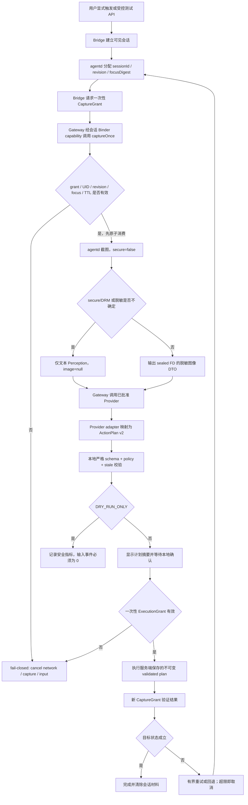

# Android 14/15/16 全局 Agent P1 exact-tree 实施与验收手册

版本：2026-07-19
适用范围：Android 14/15/16，API 34/35/36，AOSP/OEM exact tree，`userdebug`/`eng` Enforcing 设备或 AVD
当前基线：P0 本地检查已通过；生产路径仍为 `NoopDecision`，无 Provider HTTP、无 API Key、无模型动作执行
目标：完成 exact-tree Soong/签名/SELinux 集成、protocol v2、一次性 CaptureGrant、Keystore 凭据、Provider 文本 dry-run，并形成可复核的 Enforcing 证据包

## 0. 实施边界与阶段门

### 0.1 不可变安全边界

| 组件 | 运行身份 | 可用能力 | 明确禁止 |
|---|---|---|---|
| `global-agentd` | `root`，独立 `agentd` SELinux domain | SurfaceFlinger 非 secure 单帧捕获、状态存储、会话/revision/grant 管理 | 网络、直接 InputManager、任意 shell、secure/protected capture |
| `GlobalAgentBridge` | platform 签名、priv-app、独立 `_app` UID、自定义 `global_agent_bridge` domain | 用户会话 UI、焦点元数据、InputManager 注入、代理 native AIDL | `INTERNET`、持有 Provider Key、上传原始截图 |
| `GlobalAgentModelGateway` | 专用非 platform 证书、非 priv-app、独立 `_app` UID、stock `untrusted_app` domain | `INTERNET`、Keystore、Provider HTTP、模型响应适配 | 查找 native service、SurfaceFlinger、InputManager、状态目录、连续截屏 |

强制规则：不使用 `android:sharedUserId`；Bridge 的 platform 证书用于 signature 权限，不等于 `uid=1000`。验收必须证明三个进程 UID/SELinux domain 分离。

### 0.2 阶段门

| Gate | 工作内容 | 进入条件 | 退出条件 |
|---|---|---|---|
| P1-G0 输入冻结 | exact tree、产品 lunch、平台证书、Provider/区域/DPA | 三棵 manifest 与设备/AVD 可用 | `tree-lock.yaml`、`provider-approval.yaml` 无未决阻塞字段 |
| P1-G1 平台构建 | Soong、product mk、init、签名 | G0 tree/cert 完成 | API 34/35/36 模块与镜像构建通过 |
| P1-G2 Enforcing 边界 | seapp/service/file/property contexts、Binder、截图、输入 | G1 镜像可启动 | 无未解释 Agent AVC；权限负向测试通过 |
| P1-G3 protocol v2 | 服务端身份、revision、CaptureGrant、death/timeout | G2 domain 稳定 | Java/NDK AIDL、重放/并发/stale 测试通过 |
| P1-G4 云端 dry-run | Keystore UI、HTTP adapter、文本请求、schema/policy validator | Provider 合规批准；G3 通过 | 真实网络请求成功；`injectedEventsTotal` 始终不变 |
| P1-G5 受控执行候选 | 一次性 ExecutionGrant、可见确认、执行后验证 | G4 连续验收通过且产品批准 | 仅自有测试 App 的逐计划确认用例通过；否则保持禁用 |

P1 的正式验收目标是 G4。G5 是独立发布门，不得因 G4 通过自动开启。

### 0.3 完整链路

---

## 模块一：exact AOSP tree Soong 构建集成

### 1.1 三棵树与证据锁定

必须使用三个独立 checkout，不在同一 out 目录切 API。以下 tag 是 2026-07-19 可用示例；项目应替换为产品批准的确切 tag/OEM commit。

| API | 示例 tag | 期望 `PLATFORM_SDK_VERSION` | 推荐目录 |
|---|---|---:|---|
| 34 | `android-14.0.0_r75` | 34 | `/opt/aosp/android14` |
| 35 | `android-15.0.0_r36` | 35 | `/opt/aosp/android15` |
| 36 | `android-16.0.0_r4` | 36 | `/opt/aosp/android16` |

初始化命令：

    "mkdir -p /opt/aosp/android14 /opt/aosp/android15 /opt/aosp/android16"
    "cd /opt/aosp/android14 && repo init -u https://android.googlesource.com/platform/manifest -b android-14.0.0_r75 && repo sync -c -j$(nproc)"
    "cd /opt/aosp/android15 && repo init -u https://android.googlesource.com/platform/manifest -b android-15.0.0_r36 && repo sync -c -j$(nproc)"
    "cd /opt/aosp/android16 && repo init -u https://android.googlesource.com/platform/manifest -b android-16.0.0_r4 && repo sync -c -j$(nproc)"

每棵树保存可复核 manifest：

    "repo manifest -r -o out/global-agent-exact-manifest.xml"
    "sha256sum out/global-agent-exact-manifest.xml > out/global-agent-exact-manifest.xml.sha256"

预检：

    "source build/envsetup.sh"
    "lunch ${TARGET_LUNCH}"
    "test \"$(get_build_var PLATFORM_SDK_VERSION)\" = \"${EXPECTED_SDK}\""
    "test \"$(get_build_var TARGET_BUILD_VARIANT)\" = \"userdebug\" -o \"$(get_build_var TARGET_BUILD_VARIANT)\" = \"eng\""

Soong 构建仅支持 AOSP 支持的 Linux 主机；当前 macOS 工作区可做 host/SDK/NDK 检查，不能作为 exact-tree Soong 通过证据。

### 1.2 目录结构

代码放在 `system_ext/global_agent/`，不放 `vendor/`。原因是截图客户端依赖 `libgui`/framework private ABI，vendor 位置会触发 VNDK/分区 ABI 边界。

    system_ext/global_agent/
      Android.bp
      Android.mk
      product/global_agent_product.mk
      aidl/v2/com/example/globalagent/v2/*.aidl
      native/core/include/global_agent/*.h
      native/core/src/*.cpp
      native/platform/common/*.cpp
      native/platform/api34/capture_backend.cpp
      native/platform/api35/capture_backend.cpp
      native/platform/api36/capture_backend.cpp
      bridge/AndroidManifest.xml
      bridge/privapp-permissions-com.example.globalagent.xml
      bridge/res/values/gateway_certs.xml
      bridge/src/com/example/globalagent/**/*.java
      gateway/AndroidManifest.xml
      gateway/res/xml/network_security_config.xml
      gateway/src/com/example/globalagent/gateway/**/*.java
      init/global-agentd.rc
      sepolicy/private/*.te
      sepolicy/private/file_contexts
      sepolicy/private/service_contexts
      sepolicy/private/property_contexts
      sepolicy/private/seapp_contexts
      tests/host/**
      tests/device/**

同步本仓库代码到 exact tree 时固定 Git SHA：

    "git clone /path/to/android-agent /opt/aosp/android14/system_ext/global_agent"
    "git -C /opt/aosp/android14/system_ext/global_agent checkout 66bfd6d"

API 15/16 重复执行同一 SHA。后续变更使用 review 后的明确 commit，不复制未提交工作区。

### 1.3 `Android.bp` 基线

下列 Blueprint 是目标结构。`global_agent_v2_aidl` 的 Soong API 版本 `V1` 与业务 `PROTOCOL_VERSION=2` 是两套编号：前者表示首个冻结的 AIDL snapshot，后者表示 wire contract v2。

    package {
        default_applicable_licenses: ["global_agent_license"],
    }

    license {
        name: "global_agent_license",
        visibility: [":__subpackages__"],
        license_kinds: ["SPDX-license-identifier-Apache-2.0"],
        license_text: ["LICENSE"],
    }

    soong_config_string_variable {
        name: "ga_platform_api",
        values: ["34", "35", "36"],
    }

    soong_config_module_type {
        name: "global_agent_capture_defaults_type",
        module_type: "cc_defaults",
        config_namespace: "global_agent",
        variables: ["ga_platform_api"],
        properties: ["srcs", "cflags"],
    }

    global_agent_capture_defaults_type {
        name: "global_agent_capture_defaults",
        soong_config_variables: {
            ga_platform_api: {
                "34": {
                    srcs: ["native/platform/api34/capture_backend.cpp"],
                    cflags: ["-DGLOBAL_AGENT_API=34"],
                },
                "35": {
                    srcs: ["native/platform/api35/capture_backend.cpp"],
                    cflags: ["-DGLOBAL_AGENT_API=35"],
                },
                "36": {
                    srcs: ["native/platform/api36/capture_backend.cpp"],
                    cflags: ["-DGLOBAL_AGENT_API=36"],
                },
                conditions_default: {
                    cflags: ["-DGLOBAL_AGENT_UNSUPPORTED_API=1"],
                },
            },
        },
    }

    aidl_interface {
        name: "global_agent_v2_aidl",
        srcs: ["aidl/v2/com/example/globalagent/v2/*.aidl"],
        local_include_dir: "aidl/v2",
        unstable: false,
        frozen: true,
        versions_with_info: [
            {
                version: "1",
                imports: [],
            },
        ],
        backend: {
            cpp: { enabled: false },
            java: { enabled: true },
            ndk: { enabled: true },
        },
    }

    cc_defaults {
        name: "global_agent_cc_defaults",
        cflags: [
            "-Wall",
            "-Wextra",
            "-Werror",
            "-Wpedantic",
            "-Wconversion",
        ],
        cpp_std: "c++20",
    }

    cc_library_static {
        name: "libglobal_agent_core",
        defaults: ["global_agent_cc_defaults"],
        srcs: ["native/core/src/*.cpp"],
        export_include_dirs: ["native/core/include"],
    }

    cc_binary {
        name: "global-agentd",
        system_ext_specific: true,
        defaults: [
            "global_agent_cc_defaults",
            "global_agent_capture_defaults",
        ],
        srcs: ["native/platform/common/*.cpp"],
        static_libs: [
            "global_agent_v2_aidl-V1-ndk",
            "libglobal_agent_core",
        ],
        shared_libs: [
            "libbase",
            "libbinder",
            "libbinder_ndk",
            "libcrypto",
            "libgui",
            "liblog",
            "libpng",
            "libui",
            "libutils",
        ],
        header_libs: ["libgui_aidl_headers"],
        init_rc: ["init/global-agentd.rc"],
    }

    android_app_certificate {
        name: "global_agent_gateway_certificate",
        certificate: "certs/gateway",
    }

    android_app {
        name: "GlobalAgentBridge",
        system_ext_specific: true,
        manifest: "bridge/AndroidManifest.xml",
        resource_dirs: ["bridge/res"],
        srcs: ["bridge/src/**/*.java"],
        static_libs: ["global_agent_v2_aidl-V1-java"],
        certificate: "platform",
        platform_apis: true,
        privileged: true,
        required: ["privapp-permissions-com.example.globalagent"],
        optimize: { enabled: true },
    }

    android_app {
        name: "GlobalAgentModelGateway",
        system_ext_specific: true,
        manifest: "gateway/AndroidManifest.xml",
        resource_dirs: ["gateway/res"],
        srcs: ["gateway/src/**/*.java"],
        static_libs: ["global_agent_v2_aidl-V1-java"],
        certificate: ":global_agent_gateway_certificate",
        min_sdk_version: "34",
        sdk_version: "current",
        optimize: { enabled: true },
    }

    prebuilt_etc {
        name: "privapp-permissions-com.example.globalagent",
        system_ext_specific: true,
        sub_dir: "permissions",
        src: "bridge/privapp-permissions-com.example.globalagent.xml",
        filename_from_src: true,
    }

    java_test_host {
        name: "GlobalAgentProtocolV2HostTests",
        srcs: ["tests/host/**/*.java"],
        static_libs: ["global_agent_v2_aidl-V1-java"],
        test_suites: ["general-tests"],
    }

    android_test {
        name: "GlobalAgentDeviceTests",
        manifest: "tests/device/AndroidManifest.xml",
        srcs: ["tests/device/**/*.java"],
        instrumentation_for: "GlobalAgentBridge",
        static_libs: ["androidx.test.runner", "global_agent_v2_aidl-V1-java"],
        platform_apis: true,
        certificate: "platform",
        test_suites: ["device-tests"],
    }

关键修正：`global-agentd` 不链接 `libsurfaceflinger`。它是 SurfaceFlinger 客户端，只需要 `libgui`、Binder 和 GraphicBuffer 相关库；链接服务端实现会扩大私有 ABI 和攻击面。

项目侧不存在可直接声明组件策略的通用 `sepolicy_policy` Soong 模块。AOSP 的 `se_policy_conf`、`se_policy_cil`、`se_versioned_policy` 属于平台策略构建内部；产品策略必须通过 `SYSTEM_EXT_PRIVATE_SEPOLICY_DIRS` 合入。

首次冻结 AIDL：

    "m global_agent_v2_aidl-update-api"
    "m global_agent_v2_aidl-freeze-api"
    "git add aidl_api/global_agent_v2_aidl"

若目标树的生成模块后缀与示例不同，以该树执行 `m global_agent_v2_aidl` 后的 `module-info.json` 为准，禁止硬编码 Binder transaction code。

### 1.4 产品 Make 集成与 `Android.mk`

`product/global_agent_product.mk`：

    PRODUCT_PACKAGES += \
        global-agentd \
        GlobalAgentBridge \
        GlobalAgentModelGateway \
        privapp-permissions-com.example.globalagent

    PRODUCT_SOONG_NAMESPACES += \
        system_ext/global_agent

    SOONG_CONFIG_NAMESPACES += global_agent
    SOONG_CONFIG_global_agent += ga_platform_api
    SOONG_CONFIG_global_agent_ga_platform_api := $(PLATFORM_SDK_VERSION)

    PRODUCT_SYSTEM_EXT_PROPERTIES += \
        ro.global_agent.execution_capable=false \
        persist.sys.global_agent.enabled=0

在目标产品 `device/<vendor>/<product>/device.mk` 中：

    $(call inherit-product, system_ext/global_agent/product/global_agent_product.mk)

在目标产品 `device/<vendor>/<product>/BoardConfig.mk` 中合入策略；不要把该变量放入 vendor policy 目录：

    SYSTEM_EXT_PRIVATE_SEPOLICY_DIRS += \
        system_ext/global_agent/sepolicy/private

`Android.mk` 只作为 legacy 入口保护，不重复定义模块：

    LOCAL_PATH := $(call my-dir)
    # All modules are defined in Android.bp. Do not duplicate LOCAL_MODULE names.

### 1.5 Manifest 与签名规则

Bridge Manifest 至少包含：

    <manifest xmlns:android="http://schemas.android.com/apk/res/android"
        package="com.example.globalagent">
        <permission
            android:name="com.example.globalagent.permission.BIND_MODEL_GATEWAY"
            android:protectionLevel="signature" />
        <uses-permission android:name="android.permission.INJECT_EVENTS" />
        <uses-permission android:name="android.permission.REAL_GET_TASKS" />
        <application
            android:name=".AgentBridgeApplication"
            android:allowBackup="false"
            android:directBootAware="true"
            android:persistent="true">
            <activity
                android:name=".AgentSessionActivity"
                android:exported="true" />
        </application>
    </manifest>

Gateway Manifest 只能请求 `INTERNET`；其导出 service 只接受 Bridge 定义的 signature 权限：

    <manifest xmlns:android="http://schemas.android.com/apk/res/android"
        package="com.example.globalagent.gateway">
        <uses-permission android:name="android.permission.INTERNET" />
        <application
            android:allowBackup="false"
            android:networkSecurityConfig="@xml/network_security_config"
            android:usesCleartextTraffic="false">
            <service
                android:name=".runtime.ModelGatewayService"
                android:exported="true"
                android:permission="com.example.globalagent.permission.BIND_MODEL_GATEWAY" />
            <activity
                android:name=".credential.CredentialActivity"
                android:exported="true">
                <intent-filter>
                    <action android:name="android.intent.action.MAIN" />
                    <category android:name="android.intent.category.LAUNCHER" />
                </intent-filter>
            </activity>
        </application>
    </manifest>

Bridge 调用 Gateway 后，在 `IModelGateway.openSession(...)` 参数中传递每会话 Binder capability；Gateway 不通过 service manager 查找 `global_agent`，也不持有原始 `IAgentBridge`。

签名规则：

- AOSP 开发 platform key 位于 `build/target/product/security/platform.pk8` 和 `platform.x509.pem`；仅限非生产 AOSP 测试。
- Gateway 使用 `certs/gateway.pk8`/`gateway.x509.pem` 的专用证书，不能使用 `platform`、`shared` 或 OEM 已映射高权限 `seinfo` 的证书。
- OEM 量产由 build/release security 团队在签名流水线提供 platform 签名；不得从设备提取私钥。
- `INJECT_EVENTS` 依赖 platform signature；privapp allowlist 不能替代签名。
- `privapp-permissions` 只列 `REAL_GET_TASKS`，不列 `INJECT_EVENTS`。

### 1.6 init 规则

`init/global-agentd.rc`：

    on post-fs-data
        mkdir /data/misc/global_agent 0700 root root
        restorecon_recursive /data/misc/global_agent

    service global-agentd /system_ext/bin/global-agentd
        class main
        user root
        group root
        disabled
        restart_period 5

    on property:persist.sys.global_agent.enabled=1
        start global-agentd

    on property:persist.sys.global_agent.enabled=0
        stop global-agentd

不要写 `seclabel`；由 `agentd_exec` 的 file context 和 `init_daemon_domain(agentd)` 完成 domain transition。

### 1.7 三版本编译命令与产物

每棵树分别执行：

    "cd ${AOSP_TREE}"
    "source build/envsetup.sh"
    "lunch ${TARGET_LUNCH}"
    "test \"$(get_build_var PLATFORM_SDK_VERSION)\" = \"${EXPECTED_SDK}\""
    "m -j$(nproc) global-agentd GlobalAgentBridge GlobalAgentModelGateway GlobalAgentProtocolV2HostTests GlobalAgentDeviceTests"
    "m -j$(nproc) systemimage system_extimage"

稳定产物位置：

| 产物 | 路径 |
|---|---|
| daemon | `out/target/product/<product>/system_ext/bin/global-agentd` |
| Bridge | `out/target/product/<product>/system_ext/priv-app/GlobalAgentBridge/GlobalAgentBridge.apk` |
| Gateway | `out/target/product/<product>/system_ext/app/GlobalAgentModelGateway/GlobalAgentModelGateway.apk` |
| privapp XML | `out/target/product/<product>/system_ext/etc/permissions/privapp-permissions-com.example.globalagent.xml` |
| merged policy | `out/target/product/<product>/root/sepolicy` 或该产品生成的 split policy 目录 |
| AIDL API dump | `system_ext/global_agent/aidl_api/global_agent_v2_aidl/1/` |

启动 exact-tree AVD/设备后保持 Enforcing：

    "adb root"
    "adb wait-for-device"
    "adb shell getenforce"
    "adb shell setprop persist.sys.global_agent.enabled 1"
    "adb shell service check global_agent"

预期：`getenforce` 输出 `Enforcing`，`service check global_agent` 输出 `Service global_agent: found`。若修改镜像需 remount，允许 `adb disable-verity`/重启用于 userdebug 部署，但最终验收镜像必须由 Soong 正式打包并在 Enforcing 下启动。

### 1.8 模块一强制自检

| 自检项 | 命令/证据 | 失败处理 |
|---|---|---|
| exact tree | `repo manifest -r`、fingerprint、SPL、Git SHA | 不允许用其他版本预编译 `.so` 补齐 |
| API 匹配 | `get_build_var PLATFORM_SDK_VERSION` | 终止构建 |
| 私有 ABI | 三树分别编译 capture backend | 不用反射/raw transaction code |
| app 身份 | `apksigner verify --print-certs`、`cmd package list packages -U` | 证书/UID 相同即失败 |
| Gateway domain | `ps -AZ | grep com.example.globalagent.gateway` | 不是 `untrusted_app` 即失败并检查证书 `seinfo` |
| Bridge 无网络 | Manifest 无 `INTERNET`；device negative socket test | 发现授权即失败 |
| Gateway 无高权 | Manifest 无 capture/input/task 权限 | 发现授权即失败 |
| AIDL freeze | `m global_agent_v2_aidl-freeze-api` 无 diff | 更新 snapshot 并重新审查 |

AOSP 来源：`build/soong/cc/`、`build/soong/java/`、`system/tools/aidl/build/`、`frameworks/native/libs/gui/include/gui/SurfaceComposerClient.h`、`frameworks/native/libs/gui/include/gui/ScreenCaptureResults.h`、`build/target/product/security/`、`frameworks/base/core/res/AndroidManifest.xml`。

版本差异：API 34/35/36 的 `ScreenshotClient::captureDisplay(DisplayId, gui::CaptureArgs, listener)` 在所列 AOSP tag 中均存在；API 35 起 `ScreenCaptureResults` 增加 HDR gainmap 字段。OEM tree 仍可能改签名，必须按树编译。Android 15 增加 shared-UID allowlist 约束，但本方案不使用 shared UID。Android 15/16 还需验证 16 KiB page-size 构建，禁止引入只支持 4 KiB 的 native prebuilt。

局限：没有三棵 tree、匹配镜像和平台签名，模块一只能生成设计与 host 检查，不能宣称 P1-G1 通过。

---

## 模块二：SELinux 最小权限与 Enforcing 验收

### 2.1 策略布局与信任关系

策略位于 `sepolicy/private/`，因为它只服务同一 system/system_ext 产品，不导出 vendor public policy。默认输入路径是 platform-signed Bridge 调用 InputManager；P1 不授予 `global-agentd` `/dev/uinput`。

### 2.2 完整策略基线

`types.te`：

    type agentd, domain, coredomain;
    type agentd_exec, system_file_type, exec_type, file_type;

    type global_agent_bridge, domain;
    type global_agent_bridge_data_file,
        file_type, data_file_type, core_data_file_type, app_data_file_type;

    type global_agent_service, service_manager_type;
    type global_agent_data_file,
        file_type, data_file_type, core_data_file_type;

    system_internal_prop(agent_enabled_prop)
    system_internal_prop(global_agent_execution_prop)

`agentd.te`：

    init_daemon_domain(agentd)
    binder_use(agentd)
    add_service(agentd, global_agent_service)

    # Only the Bridge is allowed to call the private daemon; callbacks go back.
    binder_call(agentd, global_agent_bridge)

    # SurfaceFlinger client path. Secure/protected capture remains disabled in code.
    allow agentd surfaceflinger_service:service_manager find;
    binder_call(agentd, surfaceflinger)
    # Required only by the exact-tree GraphicBuffer mapper path.
    hal_client_domain(agentd, hal_graphics_allocator)

    allow agentd global_agent_data_file:dir create_dir_perms;
    allow agentd global_agent_data_file:file create_file_perms;
    allow init global_agent_data_file:dir create_dir_perms;

    get_prop(agentd, agent_enabled_prop)
    get_prop(agentd, global_agent_execution_prop)

    # Architectural assertions: daemon has no network and no InputManager path.
    neverallow agentd self:{ tcp_socket udp_socket rawip_socket } *;
    neverallow agentd input_service:service_manager find;
    neverallow agentd { gpu_device ion_device dmabuf_system_heap_device \
        dmabuf_system_secure_heap_device }:chr_file \
        { open read write ioctl map };

`global_agent_bridge.te`：

    app_domain(global_agent_bridge)
    binder_use(global_agent_bridge)

    allow global_agent_bridge global_agent_service:service_manager find;
    binder_call(global_agent_bridge, agentd)

    # Calls are still gated by framework signature permissions.
    binder_call(global_agent_bridge, system_server)
    allow global_agent_bridge input_service:service_manager find;
    allow global_agent_bridge activity_service:service_manager find;
    allow global_agent_bridge activity_task_service:service_manager find;
    allow global_agent_bridge display_service:service_manager find;
    allow global_agent_bridge window_service:service_manager find;
    allow global_agent_bridge package_service:service_manager find;
    get_prop(global_agent_bridge, global_agent_execution_prop)

    # The custom domain intentionally does not use net_domain().
    neverallow global_agent_bridge self:{ tcp_socket udp_socket rawip_socket } *;
    neverallow global_agent_bridge surfaceflinger_service:service_manager find;

`global_agent_service.te`：

    # No stock app domain may discover the private native service.
    neverallow { appdomain -global_agent_bridge } \
        global_agent_service:service_manager find;

    # Only agentd can register this name.
    neverallow { domain -agentd } \
        global_agent_service:service_manager add;

`file_contexts`：

    /system_ext/bin/global-agentd             u:object_r:agentd_exec:s0
    /data/misc/global_agent(/.*)?            u:object_r:global_agent_data_file:s0

`service_contexts`：

    global_agent                             u:object_r:global_agent_service:s0

`property_contexts`：

    persist.sys.global_agent.enabled         u:object_r:agent_enabled_prop:s0 exact bool
    ro.global_agent.execution_capable        u:object_r:global_agent_execution_prop:s0 exact bool

`seapp_contexts`：

    user=_app seinfo=platform isPrivApp=true name=com.example.globalagent domain=global_agent_bridge type=global_agent_bridge_data_file levelFrom=user

`genfs_contexts`：

    # Intentionally empty. No proc/sysfs pseudo-filesystem node is owned by this product.

`genfs_contexts` 不用于普通二进制、app data 或 `/dev/uinput`。设备节点标签来自平台/device policy 与 `ueventd`；不能通过给 `/system/etc/selinux` 推入一个 `.cil` 文件动态生效，也不能用 `setenforce 0/1` 重新加载策略。

`hal_client_domain(agentd, hal_graphics_allocator)` 只解决 `GraphicBuffer::lock()` 所需 mapper/allocator Binder 与 FD 使用，不授权 agentd 直接打开 GPU/ION/dma-buf heap；上面的 neverallow 固化该边界。SELinux 不能按 HAL 方法名限制 Binder transaction，因此代码还必须限制 `maxLongEdge<=1440`、解码后像素内存 `<=12 MiB`、最多一个 buffer 在途，并在 exact tree 的 capture/map 路径证明该 HAL client 宏确有必要。若产品威胁模型不接受该 HAL client 属性，应把 capture+redaction 拆到独立 `agent-captured` domain，而不是给 agentd 添加设备节点权限。

### 2.3 `/dev/uinput` 可选 profile

默认 profile 不开放 uinput。若 OEM 明确要求 kernel 注入，新增独立 `agent-inputd` 二进制/domain，不能把权限并入 `agentd`：

    type agent_inputd, domain, coredomain;
    type agent_inputd_exec, system_file_type, exec_type, file_type;
    init_daemon_domain(agent_inputd)
    binder_use(agent_inputd)
    binder_call(global_agent_bridge, agent_inputd)

    # The exact device type must come from: adb shell ls -lZ /dev/uinput
    allow agent_inputd uhid_device:chr_file { open read write getattr ioctl };
    neverallow agent_inputd self:{ tcp_socket udp_socket rawip_socket } *;
    neverallow agent_inputd surfaceflinger_service:service_manager find;

官方 API 34/35/36 AVD 常见标签为 `uhid_device`、DAC `0660 uhid:uhid`，但 OEM 必须实测。`allowxperm` ioctl 只能根据实际 `strace`/AVC 列出精确命令，禁止复制宽泛 `0x0000-0xffff`。启用该 profile 后要新增单独的攻击面评审；P1 基线验收仍使用 Bridge/InputManager。

### 2.4 Enforcing 调试流程

烧录/启动：

    "adb root"
    "adb wait-for-device"
    "adb shell getenforce"
    "adb shell setprop persist.sys.global_agent.enabled 1"

标签与进程：

    "adb shell ls -lZ /system_ext/bin/global-agentd /data/misc/global_agent"
    "adb shell ps -AZ | grep -E 'global-agentd|com.example.globalagent'"
    "adb shell service list | grep global_agent"

AVC 收集：

    "adb shell su 0 dmesg | grep 'avc: denied' | grep -E 'agentd|global_agent' > avc-agent.log"
    "adb logcat -b all -d | grep 'avc: denied' | grep -E 'agentd|global_agent' >> avc-agent.log"

`audit2allow` 只做解释，不直接产出可提交 policy：

    "out/host/linux-x86/bin/audit2allow -p out/target/product/${TARGET_PRODUCT}/root/sepolicy < avc-agent.log"

每条候选 allow 必须映射到以下之一：已批准 SurfaceFlinger capture、GraphicBuffer mapper、Bridge Binder、状态文件或 InputManager 调用。无法映射的拒绝视为真实越权，修代码而不是加规则。

neverallow/编译检查：

    "m selinux_policy"
    "out/host/linux-x86/bin/sepolicy-analyze out/target/product/${TARGET_PRODUCT}/root/sepolicy neverallow"

### 2.5 权限边界验收

| 场景 | 预期 |
|---|---|
| `agentd` 调用 SurfaceFlinger 非 secure capture | 成功，无 Agent AVC |
| `agentd` 打开 TCP/UDP socket | SELinux 拒绝 |
| `agentd` 查找 `input` service | SELinux 拒绝 |
| Bridge 调用 InputManager | framework permission + SELinux 均通过 |
| Bridge 打开网络 socket | 失败；Manifest 无 INTERNET 且 domain 无网络 |
| Gateway `service check global_agent`/直接 Binder find | 失败 |
| Gateway 调用 SurfaceFlinger/InputManager | permission 或 SELinux 拒绝 |
| shell/普通 app 调用 native service | 拒绝；不能成为“第一个注册者” |
| 正常完整测试后 Agent AVC | 0 条未解释拒绝 |

### 2.6 模块二强制自检

AOSP 来源：`system/sepolicy/public/te_macros` 的 `binder_call`/`app_domain`/`hal_client_domain`，`system/sepolicy/private/service_contexts`、`seapp_contexts`、`surfaceflinger.te`、`system_server.te`，`system/sepolicy/public/service.te`、`device.te`、`hal_graphics_allocator.te`，以及目标 device/vendor policy。

版本差异：策略宏名在所列 AOSP 34/35/36 tag 基本稳定，但 service type、HAL AIDL/HIDL 实现和 OEM GPU/device labels 可能变化；每棵树必须独立 `m selinux_policy`。Android 14/15/16 stock `platform_app` 可具网络属性，因此必须通过 name-specific `seapp_contexts` 进入自定义无网络 domain。Gateway 必须保持非 priv-app、专用未映射证书并以 `ps -AZ` 证明落入 `untrusted_app`。

Key 泄露：SELinux 不能阻止 Gateway 自己读取运行时明文 Key；本模块只能保证 Bridge/agentd 无权访问 Gateway app data。仍需模块四/六的存储和日志检查。

dry-run 隔离：任何 SELinux allow 都不得让 Gateway 查找输入/native service；执行能力只存在 Bridge→agentd 私有路径。

局限：SELinux 无法突破 TEE/DRM，也不能把 Root 设备上的运行时秘密变成不可提取；它只提供可验证的最小访问控制边界。

---

## 模块三：protocol v2 AIDL 与一次性 CaptureGrant

> 当前仓库已实现未冻结的 v2 AIDL、DTO/grant 校验、signature 权限保护的 Gateway
> Service 和包名/证书绑定的 Java capability。private native v2 service 仍未注册，
> 所有 native v2 方法在 exact-tree calling SID 验证前固定 fail-closed；真实截图、
> HTTP 和输入执行均未接通，现有运行时仍是 v1。

### 3.1 拓扑与 v1 必修问题

对外和对内使用同一套冻结 DTO，但接口分成 Java capability `IV2GlobalAgent` 与 private native `IPlatformAgentV2`。native `global_agent` service 只能由 Bridge SELinux domain 查找；Gateway 即使链接到同一生成 DTO 也拿不到它的 Binder handle。Bridge 主动绑定 Gateway 的 `IModelGateway` Android Service，并把一个按会话创建的 `IV2GlobalAgent` Binder capability 传给 Gateway。Gateway 只能在该 capability 上调用 `captureOnce()`、`validatePlan()` 和取消自己的请求；Bridge-only 方法还要做方法级角色鉴权。

当前 v1 在升级前必须修复：

- `registerBridge()` 不能接受“第一个调用者”并动态成为可信 UID。native Binder 必须启用 calling SID，验证 `u:r:global_agent_bridge:s0` 后才 pin UID。
- UID 不能由 `startSession(uid, ...)` 参数提供。v2 删除该参数，只用 `Binder.getCallingUid()`/`AIBinder_getCallingUid()`。
- `userConfirmed`、keyguard、焦点、display 等安全状态不能由 Gateway 自报，只接受 Bridge/系统侧观测。
- 焦点、旋转、display、window token/sequence 变化必须推进服务端 revision 并取消 pending capture/network/input。
- callback、Bridge、Gateway Binder death 都必须进入同一 fail-closed 取消路径。
- 模型不能提交最终 `GestureSpec`；先提交 ActionPlan，服务端 canonicalize/校验并保存不可变计划，确认后按 `serverPlanId + planDigest` 执行，避免校验 A、执行 B。

### 3.2 AIDL 文件完整定义

以下每段分别保存为 `aidl/v2/com/example/globalagent/v2/<Type>.aidl`。所有数组、字符串和文件描述符还必须在实现层做硬上限校验。

`RectDto.aidl`：

    package com.example.globalagent.v2;
    parcelable RectDto {
        int left;
        int top;
        int right;
        int bottom;
    }

`FocusIdentity.aidl`：

    package com.example.globalagent.v2;
    import com.example.globalagent.v2.RectDto;
    parcelable FocusIdentity {
        long focusEpoch;
        byte[] focusDigest;
        int focusedUid;
        int displayId;
        int rotation;
        RectDto bounds;
    }

`SessionStartRequest.aidl`：

    package com.example.globalagent.v2;
    parcelable SessionStartRequest {
        int protocolVersion;
        int triggerSource;
        long triggerElapsedNanos;
        int displayId;
        long clientRequestId;
    }

`SessionHandle.aidl`：

    package com.example.globalagent.v2;
    parcelable SessionHandle {
        int protocolVersion;
        byte[] serviceInstanceId;
        long sessionId;
        long revision;
        long deadlineElapsedNanos;
        int displayId;
        long focusEpoch;
        byte[] focusDigest;
    }

`SessionStatusV2.aidl`：

    package com.example.globalagent.v2;
    parcelable SessionStatusV2 {
        int protocolVersion;
        byte[] serviceInstanceId;
        long sessionId;
        long revision;
        int state;
        int displayId;
        long focusEpoch;
        byte[] focusDigest;
        long deadlineElapsedNanos;
        boolean active;
        int cancelReason;
    }

`CaptureSpec.aidl`：

    package com.example.globalagent.v2;
    import com.example.globalagent.v2.RectDto;
    parcelable CaptureSpec {
        int purpose;
        int displayId;
        RectDto crop;
        int maxLongEdge;
        int maxImageBytes;
        int imageFormat;
        int redactionPolicyVersion;
    }

`CaptureGrant.aidl`：

    package com.example.globalagent.v2;
    import com.example.globalagent.v2.RectDto;
    parcelable CaptureGrant {
        int protocolVersion;
        byte[] serviceInstanceId;
        byte[] token;
        long grantId;
        long sessionId;
        long revision;
        long focusEpoch;
        int displayId;
        RectDto crop;
        long expiresAtElapsedNanos;
        int maxImageBytes;
        int redactionPolicyVersion;
    }

`SensitiveRegion.aidl`：

    package com.example.globalagent.v2;
    import com.example.globalagent.v2.RectDto;
    parcelable SensitiveRegion {
        RectDto bounds;
        int reason;
    }

`OcrNode.aidl`：

    package com.example.globalagent.v2;
    import com.example.globalagent.v2.RectDto;
    parcelable OcrNode {
        long nodeId;
        RectDto bounds;
        String text;
        int confidenceMilli;
        int flags;
        long candidateId;
    }

`ImagePayload.aidl`：

    package com.example.globalagent.v2;
    import android.os.ParcelFileDescriptor;
    parcelable ImagePayload {
        @nullable ParcelFileDescriptor dataFd;
        long byteLength;
        byte[] sha256;
        String mimeType;
        int width;
        int height;
    }

`PerceptionEnvelope.aidl`：

    package com.example.globalagent.v2;
    import com.example.globalagent.v2.ImagePayload;
    import com.example.globalagent.v2.OcrNode;
    import com.example.globalagent.v2.RectDto;
    import com.example.globalagent.v2.SensitiveRegion;
    parcelable PerceptionEnvelope {
        int protocolVersion;
        byte[] serviceInstanceId;
        long sessionId;
        long revision;
        long perceptionId;
        long capturedAtElapsedNanos;
        long focusEpoch;
        byte[] focusDigest;
        int status;
        int displayId;
        int rotation;
        RectDto capturedRegion;
        boolean secureContentExcluded;
        int redactionPolicyVersion;
        SensitiveRegion[] redactions;
        OcrNode[] ocr;
        byte[] perceptionDigest;
        @nullable ImagePayload image;
    }

`ActionDto.aidl`：

    package com.example.globalagent.v2;
    import com.example.globalagent.v2.RectDto;
    parcelable ActionDto {
        long actionId;
        int type;
        long candidateId;
        int displayId;
        RectDto target;
        int startX;
        int startY;
        int endX;
        int endY;
        long durationMillis;
        long waitMillis;
        String text;
    }

`ActionPlan.aidl`：

    package com.example.globalagent.v2;
    import com.example.globalagent.v2.ActionDto;
    parcelable ActionPlan {
        int protocolVersion;
        byte[] serviceInstanceId;
        long sessionId;
        long expectedRevision;
        long perceptionId;
        byte[] perceptionDigest;
        long expectedFocusEpoch;
        byte[] expectedFocusDigest;
        long clientPlanId;
        long deadlineElapsedNanos;
        ActionDto[] actions;
    }

`PolicyViolation.aidl`：

    package com.example.globalagent.v2;
    parcelable PolicyViolation {
        int code;
        int actionIndex;
        String safeMessage;
    }

`PlanValidation.aidl`：

    package com.example.globalagent.v2;
    import com.example.globalagent.v2.PolicyViolation;
    parcelable PlanValidation {
        long serverPlanId;
        long validatedRevision;
        byte[] planDigest;
        boolean schemaValid;
        boolean policyValid;
        boolean requiresConfirmation;
        boolean executableInCurrentMode;
        PolicyViolation[] violations;
    }

`ExecutionGrant.aidl`：

    package com.example.globalagent.v2;
    parcelable ExecutionGrant {
        int protocolVersion;
        byte[] serviceInstanceId;
        byte[] token;
        long sessionId;
        long revision;
        long focusEpoch;
        long serverPlanId;
        byte[] planDigest;
        long expiresAtElapsedNanos;
    }

`ApprovedInput.aidl`：

    package com.example.globalagent.v2;
    import com.example.globalagent.v2.ExecutionGrant;
    parcelable ApprovedInput {
        ExecutionGrant executionGrant;
    }

`ActionReceipt.aidl`：

    package com.example.globalagent.v2;
    parcelable ActionReceipt {
        long sessionId;
        long revision;
        long serverPlanId;
        int status;
        int executedActionCount;
        boolean verificationRequired;
    }

`ModelRequest.aidl`：

    package com.example.globalagent.v2;
    import com.example.globalagent.v2.CaptureGrant;
    import com.example.globalagent.v2.SessionHandle;
    parcelable ModelRequest {
        int protocolVersion;
        SessionHandle session;
        CaptureGrant captureGrant;
        String finalTranscript;
        String focusedPackage;
        String providerProfile;
        boolean imageAllowed;
        long deadlineElapsedNanos;
    }

`GatewayResult.aidl`：

    package com.example.globalagent.v2;
    import com.example.globalagent.v2.PlanValidation;
    parcelable GatewayResult {
        long sessionId;
        long revision;
        int status;
        String safeProviderRequestId;
        long latencyMillis;
        long inputTokens;
        long outputTokens;
        @nullable PlanValidation validation;
    }

`IAgentSessionCallback.aidl`：

    package com.example.globalagent.v2;
    import com.example.globalagent.v2.SessionStatusV2;
    oneway interface IAgentSessionCallback {
        void onSessionChanged(in SessionStatusV2 status);
        void onCancelled(long sessionId, long revision, int reason);
    }

`IModelGatewayCallback.aidl`：

    package com.example.globalagent.v2;
    import com.example.globalagent.v2.GatewayResult;
    oneway interface IModelGatewayCallback {
        void onComplete(in GatewayResult result);
    }

`IV2GlobalAgent.aidl`：

    package com.example.globalagent.v2;
    import com.example.globalagent.v2.ActionPlan;
    import com.example.globalagent.v2.ActionReceipt;
    import com.example.globalagent.v2.ApprovedInput;
    import com.example.globalagent.v2.CaptureGrant;
    import com.example.globalagent.v2.CaptureSpec;
    import com.example.globalagent.v2.ExecutionGrant;
    import com.example.globalagent.v2.FocusIdentity;
    import com.example.globalagent.v2.IAgentSessionCallback;
    import com.example.globalagent.v2.PerceptionEnvelope;
    import com.example.globalagent.v2.PlanValidation;
    import com.example.globalagent.v2.SessionHandle;
    import com.example.globalagent.v2.SessionStartRequest;
    import com.example.globalagent.v2.SessionStatusV2;

    interface IV2GlobalAgent {
        const int PROTOCOL_VERSION = 2;

        SessionHandle startSession(
            in SessionStartRequest request,
            IAgentSessionCallback callback);

        SessionStatusV2 submitTranscript(
            long sessionId,
            long expectedRevision,
            long sequence,
            boolean isFinal,
            String text);

        SessionStatusV2 notifyFocusChanged(in FocusIdentity focus);

        CaptureGrant issueCaptureGrant(
            long sessionId,
            long expectedRevision,
            in CaptureSpec spec);

        PerceptionEnvelope captureOnce(in byte[] grantToken);

        PlanValidation validatePlan(in ActionPlan plan);

        ExecutionGrant approvePlan(
            long sessionId,
            long expectedRevision,
            long serverPlanId,
            in byte[] planDigest);

        ActionReceipt injectInput(in ApprovedInput approved);

        SessionStatusV2 cancelSession(
            long sessionId,
            long expectedRevision,
            int reason);

        void cancelAll(int reason);

        SessionStatusV2 getSessionStatus(long sessionId);
    }

`IModelGateway.aidl`：

    package com.example.globalagent.v2;
    import com.example.globalagent.v2.IModelGatewayCallback;
    import com.example.globalagent.v2.IV2GlobalAgent;
    import com.example.globalagent.v2.ModelRequest;

    interface IModelGateway {
        void openSession(
            in ModelRequest request,
            IV2GlobalAgent sessionCapability,
            IModelGatewayCallback callback);

        oneway void cancel(long sessionId, long revision, int reason);
    }

`IPlatformAgentV2.aidl`，只注册为 private native service，Bridge-only：

    package com.example.globalagent.v2;
    import com.example.globalagent.v2.ActionPlan;
    import com.example.globalagent.v2.ActionReceipt;
    import com.example.globalagent.v2.ApprovedInput;
    import com.example.globalagent.v2.CaptureGrant;
    import com.example.globalagent.v2.CaptureSpec;
    import com.example.globalagent.v2.ExecutionGrant;
    import com.example.globalagent.v2.FocusIdentity;
    import com.example.globalagent.v2.IAgentSessionCallback;
    import com.example.globalagent.v2.PerceptionEnvelope;
    import com.example.globalagent.v2.PlanValidation;
    import com.example.globalagent.v2.SessionHandle;
    import com.example.globalagent.v2.SessionStartRequest;
    import com.example.globalagent.v2.SessionStatusV2;

    interface IPlatformAgentV2 {
        SessionHandle startSessionPrivileged(
            in SessionStartRequest request,
            IAgentSessionCallback callback);
        SessionStatusV2 submitTranscriptPrivileged(
            long sessionId, long expectedRevision, long sequence,
            boolean isFinal, String text);
        SessionStatusV2 notifyFocusChangedPrivileged(in FocusIdentity focus);
        CaptureGrant issueCaptureGrantFor(
            long sessionId, long expectedRevision,
            int granteeUid, long capabilityId,
            in CaptureSpec spec);
        PerceptionEnvelope captureOnceFor(
            in byte[] grantToken, int granteeUid, long capabilityId);
        PlanValidation validatePlanFor(
            in ActionPlan plan, int granteeUid, long capabilityId);
        ExecutionGrant approvePlanPrivileged(
            long sessionId, long expectedRevision,
            long serverPlanId, in byte[] planDigest);
        ActionReceipt injectInputPrivileged(in ApprovedInput approved);
        SessionStatusV2 cancelSessionPrivileged(
            long sessionId, long expectedRevision, int reason);
        void cancelAllPrivileged(int reason);
        SessionStatusV2 getSessionStatusPrivileged(long sessionId);
    }

### 3.3 AIDL 方法表

| 接口/方法 | 调用角色 | 参数 | 返回 | 强制语义 |
|---|---|---|---|---|
| `IV2GlobalAgent.startSession` | Bridge | `SessionStartRequest`, callback | `SessionHandle` | UID/SID 取 Binder；服务端生成 session/revision/deadline |
| `submitTranscript` | Bridge | session、exact revision、sequence、文本 | 新状态 | final transcript 推进 revision；文本有界且不持久化 |
| `notifyFocusChanged` | Bridge | 系统侧焦点身份 | 新状态 | 焦点改变推进 revision，并取消 grant/HTTP/输入 |
| `issueCaptureGrant` | Bridge | session、revision、ROI/格式/脱敏版本 | 一次性 grant | 最多一个 outstanding，默认 TTL 1500 ms、硬上限 3000 ms |
| `captureOnce` | Gateway capability | 32-byte token | `PerceptionEnvelope` | 鉴权后先原子消费；成功或失败均不可重放 |
| `validatePlan` | Gateway capability | `ActionPlan` | `PlanValidation` | strict schema/policy；保存 canonical immutable plan |
| `approvePlan` | Bridge | plan id/digest/revision | `ExecutionGrant` | 必须由可见 UI/受控二次确认触发；一次性 |
| `injectInput` | Bridge | 仅 `ExecutionGrant` | receipt | 不重新接收 plan；按服务端已保存版本执行 |
| `cancelSession` | Bridge；Gateway 仅自身 session | exact revision/reason | 状态 | 授权后 stale 立即 fail-closed；未授权调用不能制造取消 DoS |
| `cancelAll` | Bridge/root shutdown | reason | void | Gateway/普通 app 一律 `SECURITY` |
| `getSessionStatus` | Bridge；Gateway 仅自身 session | session id | 状态 | 不返回 transcript/token/raw image |
| `IModelGateway.openSession` | Bridge | ModelRequest、per-session capability、callback | void | Gateway 先验证 Bridge UID/包名/platform cert；不接收 Key |
| `IModelGateway.cancel` | Bridge | session/revision/reason | void | `disconnect()` HTTP、关闭 FD、清理响应缓冲 |
| `IPlatformAgentV2.*` | Bridge domain only | 包含已验证 `granteeUid`/随机 `capabilityId` 的代理调用 | 与 v2 DTO 相同 | native 每次验证 Bridge SID；Gateway 不持有该 Binder |

### 3.4 CaptureGrant 与 FD 规则

Grant 状态只在内存保存：

    GrantRecord {
        sha256(token),
        serviceInstanceId,
        granteeUid,
        capabilityId,
        sessionId,
        revision,
        focusEpoch,
        focusDigest,
        displayId,
        crop,
        expiresAtElapsedNanos,
        maxImageBytes,
        redactionPolicyVersion,
        consumed
    }

消费顺序：

1. Binder 入口第一行读取实际 UID/SID，完成角色鉴权；鉴权前不调用 `clearCallingIdentity()`。
2. 在同一个 mutex/原子 map 临界区校验 token hash、UID、service instance、活动 session、exact revision、focus、display、crop 和 expiry。
3. 在任何截图、编码或文件 I/O 前设置 `consumed=true` 并移出可用表。
4. 截图/脱敏/编码失败、timeout 或 Binder death 都不恢复 token。
5. 输出前再次检查 session/revision/focus/deadline；变化时关闭 FD、清零 buffer、取消会话。
6. daemon 重启生成新的 128-bit `serviceInstanceId`，旧 token 即使 sessionId/revision 回绕也无效。

所有 TTL 使用服务端 `SystemClock.elapsedRealtimeNanos()` 或 native `CLOCK_BOOTTIME`。客户端 timestamp 只做有界审计，不能决定授权期限。

Binder metadata transaction 硬上限：64 KiB；Action 数量不超过 8；OCR node 不超过 128；OCR UTF-8 总量不超过 24 KiB；单文本不超过 256 bytes；计划文本总量不超过 4 KiB。图像不能放 `byte[]`/Base64 AIDL：

- 使用只读 sealed memfd：创建时 `MFD_ALLOW_SEALING`，写入后加 `F_SEAL_WRITE | F_SEAL_GROW | F_SEAL_SHRINK | F_SEAL_SEAL`。
- 接收端检查 `fstat`、seal、精确 `byteLength`、最大 2 MiB、mime、维度和 SHA-256。
- OEM kernel 不支持 seal 时只允许单向 pipe；不能退回 Binder 大字节数组或可写文件路径。
- 解码器设置像素数和压缩比上限，拒绝解压炸弹。

### 3.5 脱敏与 secure/DRM 处理

脱敏在无 `INTERNET` 的特权边界完成，原始截图永远不进入 Gateway：

1. 由 WindowManager/SurfaceFlinger 状态检查 `FLAG_SECURE`、protected layer 和 display/crop；任何不确定返回 `SECURE_BLOCKED`、`image=null`、OCR 空。
2. 遮盖 `AccessibilityNodeInfo.isPassword()`、password inputType、autofill secret、通知内容、IME/候选条。
3. WebView 默认整块遮盖。只有 package/domain allowlist、当次用户视觉授权和已通过 golden test 时允许局部可见。
4. 本地 OCR 二次检测 OTP、银行卡/Luhn、手机号、邮箱、authorization/token 模式；对应像素涂黑，OCR DTO 删除或替换为固定占位符。
5. 对最终将上传的像素和 canonical metadata 重新计算 `image.sha256` 与 `perceptionDigest`。
6. mask 越界、rotation 映射失败、脱敏版本不一致或 OCR 异常一律 fail closed。

P1-G4 的首轮真实网络验收强制 `imageAllowed=false`，只发送合成/公开 UI 文本。图像路径只有在密码/WebView/通知/IME/secure golden suite 全部通过后单独开启。

### 3.6 revision、焦点和取消

服务端 revision 单调递增。以下事件必须递增并使旧计划 stale：final transcript、focus/window token、rotation、display、锁屏状态、plan approval、执行状态、取消、timeout。grant 的签发/消费本身不递增，以免正常 capture 自我失效。

`focusDigest` 至少覆盖 component、focused UID、display、rotation、bounds 和可用 window token/sequence，不能只用 PID。任何输入 action/frame 执行前检查 cancellation generation、deadline、revision 和 focus；变化时立即注入 `ACTION_CANCEL` 并停止剩余动作。

未授权调用先返回 `SECURITY`，不能因为携带 stale revision 而取消合法会话。只有已认证角色的 stale/focus mismatch 才触发 fail-closed。

### 3.7 Java Bridge 骨架

    final class V2SessionCapability extends IV2GlobalAgent.Stub {
        private final long boundSessionId;
        private final int gatewayUid;
        private final long capabilityId;
        private final byte[] gatewayCertSha256;

        @Override
        public PerceptionEnvelope captureOnce(byte[] token) {
            RequestContext caller = authorizer.requireGateway(
                Binder.getCallingUid(), gatewayUid, gatewayCertSha256);
            long identity = Binder.clearCallingIdentity();
            try {
                return nativeAgent.captureOnceFor(
                    token, caller.uid(), capabilityId);
            } finally {
                Binder.restoreCallingIdentity(identity);
            }
        }

        @Override
        public PlanValidation validatePlan(ActionPlan plan) {
            authorizer.requireGateway(Binder.getCallingUid(), gatewayUid,
                gatewayCertSha256);
            return validator.validateAndStore(plan, currentContext.snapshot());
        }

        @Override
        public SessionHandle startSession(SessionStartRequest request,
                IAgentSessionCallback callback) {
            authorizer.requireBridgeInternal(Binder.getCallingUid());
            return nativeAgent.startSession(request, callback);
        }

        @Override
        public ExecutionGrant approvePlan(long sessionId, long revision,
                long serverPlanId, byte[] digest) {
            authorizer.requireBridgeInternal(Binder.getCallingUid());
            confirmation.requireVisibleAndForeground();
            return nativeAgent.approvePlan(sessionId, revision, serverPlanId, digest);
        }

        @Override
        public ActionReceipt injectInput(ApprovedInput approved) {
            authorizer.requireBridgeInternal(Binder.getCallingUid());
            if (!BuildFlags.MODEL_EXECUTION_ENABLED) {
                throw serviceError(ERROR_EXECUTION_DISABLED);
            }
            return nativeAgent.injectInput(approved);
        }
    }

`PackageManager.getPackagesForUid()` 与 `SigningInfo.getApkContentsSigners()` 同时校验 Gateway 包名和专用证书摘要；拒绝 isolated UID。Bridge 必须先完成该鉴权，再用 `clearCallingIdentity()` 以自身身份调用 private native service，否则嵌套 Binder 可能传播 Gateway 身份；finally 恢复 identity。异步投递前复制不可变 caller context，不在线程切换后重新读取 Binder UID。callback 使用 `linkToDeath()`；death handler 进入同一 `failClosed(sessionId, CALLBACK_DIED)`。

### 3.8 C++/NDK 服务骨架

    #include <android/binder_ibinder.h>
    #include <android/binder_ibinder_platform.h>

    class V2AgentService final : public BnIPlatformAgentV2 {
    public:
      ndk::ScopedAStatus captureOnceFor(
          const std::vector<std::uint8_t>& token,
          std::int32_t grantee_uid,
          std::int64_t capability_id,
          PerceptionEnvelope* out) override {
        const uid_t uid = AIBinder_getCallingUid();
        const char* sid = AIBinder_getCallingSid();
        if (!authorizer_.IsBridge(uid, sid)) return SecurityError();

        CaptureJob job;
        {
          std::lock_guard lock(mutex_);
          auto record = grants_.ConsumeBeforeIo(
              token, state_, grantee_uid, capability_id, NowBoot());
          if (!record.ok()) return record.status();
          job = BuildCaptureJob(*record);
        }

        auto result = capture_.CaptureRedactEncode(job);
        std::vector<DeferredEffect> effects;
        {
          std::lock_guard lock(mutex_);
          if (!IsStillCurrent(job)) {
            result.ResetAndWipe();
            effects = FailClosedLocked(CANCEL_STALE_DURING_CAPTURE);
          } else {
            *out = result.ReleaseEnvelope();
          }
        }
        RunEffectsWithoutLock(effects);
        return effects.empty() ? ndk::ScopedAStatus::ok() : StaleError();
      }
    };

注册服务前：

    AIBinder_setRequestingSid(service->asBinder().get(), true);
    AServiceManager_addService(service->asBinder().get(), "global_agent");

native 只接受 `global_agent_bridge` SID；SID 为 null 或不匹配时 fail closed，通过 SID 后再 pin UID，消除 v1 “first caller wins”。`AIBinder_getCallingSid()`/`AIBinder_setRequestingSid()` 来自 platform header，不是给普通 NDK app 使用的公开 API。`AIBinder_linkToDeath()` 跟踪 Bridge callback。所有跨 Binder callback、InputManager Bridge 调用和 FD 写入必须在释放 session mutex 后进行，避免锁序死锁。

### 3.9 模块三强制自检

| 自检 | 通过条件 |
|---|---|
| UID 不可伪造 | AIDL 无 `uid` 参数；实现只读 Binder calling UID/SID |
| AIDL 稳定性 | Java/NDK backend 编译；snapshot 无意外 diff；无 raw transaction code |
| token 并发 | 32/100 线程重放同一 token，恰好一个进入 capture，其余 `TOKEN_CONSUMED` |
| fail consumption | capture/redaction/timeout 失败后 token 仍失效 |
| restart | 新 `serviceInstanceId`；旧 token/plan/grant 全拒绝 |
| Binder 大小 | 最大 DTO Parcel <64 KiB；图像只经 sealed FD/pipe |
| secure | `FLAG_SECURE`/DRM fixture 返回无 FD，mock Provider 收到 0 图像 bytes |
| stale | capture/HTTP/input 期间切焦点、旋转、锁屏均取消 |
| death | kill Bridge/Gateway/daemon 后 pending capture/network/gesture 全取消 |
| Key 边界 | 所有 v2 AIDL 无 API Key、Authorization header、credential ciphertext |
| dry-run | `approvePlan`/`injectInput` 在 P1 build 固定 `EXECUTION_DISABLED` |

AOSP 来源：Java UID/death 为 `frameworks/base/core/java/android/os/Binder.java`、`IBinder.java`；NDK 为 `frameworks/native/libs/binder/ndk/include_ndk/android/binder_ibinder.h`；AIDL 编译器在 `system/tools/aidl/`；Binder 实现在 `frameworks/native/libs/binder/`；`FLAG_SECURE` 在 `frameworks/base/core/java/android/view/WindowManager.java`；password node 在 `frameworks/base/core/java/android/view/accessibility/AccessibilityNodeInfo.java`；capture 路径在 `frameworks/native/services/surfaceflinger/SurfaceFlinger.cpp`、`frameworks/native/libs/gui/` 和 `frameworks/base/core/java/android/window/ScreenCapture.java`。

版本差异：v2 AIDL 业务语义在 API 34/35/36 保持一致，由各树生成 Binder glue；不得依赖 transaction code。private SurfaceFlinger capture、GraphicBuffer/Fence/HDR 字段需按树编译。`ParcelFileDescriptor`/memfd seal 需在 OEM kernel 实测；不支持 seal 时只降级单向 pipe。

性能预算：grant 鉴权/消费 P95 <2 ms；capture+map P50 <50 ms、P95 <100 ms、硬 deadline 120 ms；脱敏+编码 P95 <80 ms；本地 schema/policy P95 <20 ms；同时最多一个 capture 和一个 Provider 请求，图像 ≤2 MiB。

局限：无法保证识别所有未知敏感 UI；只要 secure/protected/脱敏状态不确定，就必须省略图像。无法读取 TEE、Widevine protected buffer 或绕过硬件 DRM。

---

## 模块四：Provider HTTP 适配器与 Keystore 凭据 UI

### 4.1 Provider 选择接口

Gateway 内部按 Provider 原生协议分 adapter，不把所有服务强行塞进 OpenAI compatibility 层。Claude 使用 `x-api-key` 和版本头，不能假设全部 Provider 都是 Bearer。

建议代码结构：

    gateway/src/com/example/globalagent/gateway/
      provider/
        ProviderAdapter.java
        ProviderCapabilities.java
        ProviderRegistry.java
        ProviderRequest.java
        ProviderResult.java
        OpenAiResponsesAdapter.java
        OpenAiCompatibleChatAdapter.java
        AnthropicMessagesAdapter.java
      transport/
        HttpTransport.java
        HttpsUrlConnectionTransport.java
        BoundedSseReader.java
        TransportLimits.java
      credential/
        CredentialActivity.java
        CredentialStore.java
        CredentialLease.java
        CredentialMetadata.java
      policy/
        EndpointPolicy.java
        ProviderCapabilityPolicy.java
        PlanSchemaValidator.java
        ActionPolicyValidator.java
      runtime/
        ModelGatewayService.java
        DryRunCoordinator.java
        RequestCancellationRegistry.java

核心接口：

    interface ProviderAdapter {
        String kind();
        ProviderCapabilities capabilities(ProviderProfile profile);
        ProviderCall execute(
            ProviderRequest request,
            CredentialLease credential,
            Deadline deadline,
            ProviderEventSink sink);
    }

    record ProviderCapabilities(
        boolean streaming,
        boolean imageInput,
        boolean strictJsonSchema,
        boolean toolCalls,
        int maxInputBytes,
        int maxOutputBytes) {}

    record ProviderRequest(
        long sessionId,
        long revision,
        byte[] perceptionDigest,
        String finalTranscript,
        RedactedPerceptionView perception,
        int maxOutputTokens,
        boolean stream) {}

`CredentialLease` 只能存在 Gateway 进程内，禁止实现 `Parcelable`、`Serializable`，并覆盖 `toString()` 只返回常量 `[REDACTED]`。Provider 原始响应不能跨 Binder；先在 Gateway 映射成 `ActionPlan`，再调用会话 capability 的 `validatePlan()`。

### 4.2 公开配置与外部审批文件

现有公开 schema v2 继续强制 `dryRun=true`。目标 `agent-config.json` 不含 Key：

    {
      "schemaVersion": 2,
      "dryRun": true,
      "activeProfile": "p1-text",
      "profiles": [
        {
          "id": "p1-text",
          "provider": "openai",
          "adapter": "openai-responses",
          "endpoint": "https://api.openai.com/v1/responses",
          "model": "<pinned-model-id>",
          "credentialAlias": "ga.provider.p1-text",
          "sendImage": "never",
          "stream": true,
          "timeoutsMs": {
            "connect": 3000,
            "read": 1500,
            "overall": 1800
          },
          "limits": {
            "maxInputBytes": 131072,
            "maxOutputBytes": 65536,
            "maxOutputTokens": 1024,
            "requestsPerMinute": 6
          }
        }
      ]
    }

Provider 联调前必须提交 `config/provider-approval.yaml`；它是合规证据，不含 secret：

    provider:
      legalEntity: ""
      accountProject: ""
      apiKind: ""
      endpointHost: ""
      endpointRegion: ""
      modelId: ""
      modelVersionPolicy: pinned
      authMode: api-key-or-short-lived-token
      imageInputApproved: false
      customerContentTraining: unresolved
      standardRetentionDays: unresolved
      safetyRetentionExceptions: unresolved
      processingRegion: unresolved
      storageRegion: unresolved
      crossBorderBasis: unresolved
      dpaEvidence: ""
      subprocessorEvidence: ""
      pricingEvidenceDate: ""
      monthlyBudget: 0
      requestsPerMinute: 0
      incidentKeyRotationOwner: ""
      approvedBySecurity: false
      approvedByLegal: false

任一字段为 `unresolved`，或安全/法务未批准时，运行时必须覆盖为：

    sendImage = "never"
    executionMode = "DRY_RUN_ONLY"
    allowedPackages = ["com.example.globalagent.testfixture"]
    realUserData = false

### 4.3 主流 Provider 的 Android/API 兼容性

下表只描述稳定的集成形态。模型 ID、价格和留存条款在验收日从对应账户/区域的官方控制台或合同冻结，不把易变数字写入代码。

| Provider | Android 34/35/36 网络 | 鉴权 | 流式 | 多模态 | 结构化动作 | 成本记录 | 数据/区域门 | P1 建议 |
|---|---|---|---|---|---|---|---|---|
| OpenAI | 公共 HTTPS；仅需 `INTERNET` | Bearer；Responses API | SSE | 取决于所选模型，已批准模型可支持图像 | 优先 strict JSON Schema/tool contract | 按 token/图像计费；验收日冻结价格页和模型 ID | 账户数据控制、区域、ZDR/留存需审批 | 国际环境的首个参考 adapter；G4 先 text-only |
| 阿里云百炼/Qwen | 公共 HTTPS；Key/endpoint 与区域绑定 | 通常 Bearer；原生或兼容端点 | 取决于 endpoint/model，需 capability probe | 仅对明确支持视觉的模型开启 | JSON/tool 能力逐模型 probe | 按区域/模型计费；保存控制台快照 | 中国大陆/海外区域、训练与跨境条款书面确认 | 数据不得出境时的条件推荐 |
| DeepSeek | 公共 HTTPS；仅需 `INTERNET` | Bearer；兼容接口 | 支持情况以选定 API 为准 | P1 默认视为不支持，未确认前禁止图片 | JSON/tool 逐模型 probe | 按 token 计费；验收日冻结 | 处理/存储区域、留存、DPA 需书面确认 | text-only planner/verifier 候选 |
| Anthropic Claude | 公共 HTTPS；仅需 `INTERNET` | `x-api-key` + provider version header | SSE | 取决于所选模型 | 使用原生 Messages/tool use，不走兼容 shim | 按 token/图像计费；验收日冻结 | inference geo、留存/ZDR 与合同确认 | 已有企业合同或特定模型评测优势时采用 |

推荐决策：

1. 若目标数据允许国际处理，先实现 OpenAI Responses adapter，使用审批后固定的当前模型；G4 只发送合成/公开 UI 文本并设置 `store=false` 或对应数据控制参数。
2. 若中国大陆数据不得出境，优先评估指定中国区 Qwen endpoint；DPA、训练用途、留存和图片处理区域未确认前不联真实数据。
3. DeepSeek 在选定模型没有官方图像输入证据时只能作为 text-only planner/verifier。
4. Anthropic 必须使用原生 auth/response mapper，不能把 `x-api-key` 误写为 Bearer。
5. 任何 Provider 都不能因为“兼容 OpenAI”就跳过 capability probe、strict response validation 或合规门。

参考资料在验收日存档：OpenAI `https://developers.openai.com/api/docs/guides/latest-model.md`、`https://developers.openai.com/api/docs/guides/your-data.md`、`https://developers.openai.com/api/docs/guides/images-vision.md`、`https://developers.openai.com/api/docs/pricing.md`；其他 Provider 使用各自官方 API、模型、隐私、区域和定价页面。

### 4.4 HTTP transport

P1 默认使用公共 API `HttpsURLConnection`，避免三棵 exact tree 缺少固定 OkHttp/Okio/Kotlin Soong 模块。若后续引入 OkHttp，必须固定版本并补 SBOM、许可证、CVE、API 34/35/36 dex 测试。

    final class HttpsUrlConnectionTransport implements HttpTransport {
        ProviderHttpResult execute(
                ProviderProfile profile,
                RequestBody body,
                CredentialLease lease,
                CancellationSignal cancel) throws IOException {
            URL url = endpointPolicy.requireApprovedPublicHttps(profile.endpoint());
            HttpsURLConnection connection =
                (HttpsURLConnection) url.openConnection();
            connection.setInstanceFollowRedirects(false);
            connection.setConnectTimeout(profile.connectTimeoutMs());
            connection.setReadTimeout(profile.readTimeoutMs());
            connection.setRequestMethod("POST");
            connection.setDoOutput(true);
            connection.setRequestProperty("Content-Type", "application/json");
            connection.setRequestProperty("Accept", profile.stream()
                ? "text/event-stream" : "application/json");

            providerAuth.applyHeaders(connection, profile, lease);
            cancel.onCancel(connection::disconnect);

            try (OutputStream output = connection.getOutputStream()) {
                boundedWriter.write(body, output);
            }

            int code = connection.getResponseCode();
            if (code >= 300 && code < 400) {
                throw new ProviderException(ERROR_REDIRECT_DENIED);
            }
            return profile.stream()
                ? boundedSseReader.read(connection, cancel)
                : boundedJsonReader.read(connection, cancel);
        }
    }

HTTP 强制规则：

- release 只允许 `provider-approval.yaml` 对应的精确 `scheme + host + port + providerKind`；自定义 Base URL 仅 userdebug 或经签名配置批准。
- 拒绝 URL user-info、query 中凭据、fragment、反斜杠、百分号歧义、IP literal、localhost、`.local`、loopback、RFC1918、link-local、IPv6 ULA 和未审批 host。
- 禁止 redirect；认证 header 不能转发到第二 host。
- 禁止自定义宽松 `HostnameVerifier`、TrustManager、cleartext 或默认信任 user CA。
- 请求、响应、SSE 单行、事件数、JSON 深度、字符串和总 bytes 均有上限。
- P1 不自动重试。401/403/408/429/5xx/TLS/截断响应映射为稳定本地错误码，由上层预算决定是否重新发起。
- session cancel、revision/focus 变化或 Binder death 同时执行 `Future.cancel(true)` 和 `connection.disconnect()`。
- adapter capability 不支持 image 时，在序列化前拒绝，不能依赖远端报错。
- 禁止 HTTP header/body logger；异常不得包含 request/response body 或认证头。

Provider response 适配流程：

    Provider bytes
      -> bounded provider-specific parser
      -> provider schema / tool-call extraction
      -> canonical ActionPlan v2
      -> IV2GlobalAgent.validatePlan()
      -> PlanValidation

不允许将 Provider 原始 JSON、任意 tool 名、任意 URL、shell 命令或未经 schema 的坐标转发给执行层。

### 4.5 Keystore 凭据 UI

UI 在 Gateway APK 内，Bridge 只打开显式 Activity，不接收 API Key。Activity 规则：

- `WindowManager.LayoutParams.FLAG_SECURE`，阻止普通截图/最近任务预览。
- API Key 输入框使用密码 transformation，`importantForAutofill=noExcludeDescendants`，禁用选择/复制菜单。
- Provider、endpoint、profile 可见；Key 只在本次保存流程短暂存在。
- Activity 退后台、取消或保存完成后清空 `Editable`、临时 `char[]` 和 Cipher 引用。
- 清除操作同时删除 ciphertext、metadata 和 Keystore alias。

包装密钥生成：

    KeyGenerator generator = KeyGenerator.getInstance(
        KeyProperties.KEY_ALGORITHM_AES, "AndroidKeyStore");

    KeyGenParameterSpec.Builder builder = new KeyGenParameterSpec.Builder(
        "ga.credential.wrap.v1",
        KeyProperties.PURPOSE_ENCRYPT | KeyProperties.PURPOSE_DECRYPT)
        .setKeySize(256)
        .setBlockModes(KeyProperties.BLOCK_MODE_GCM)
        .setEncryptionPaddings(KeyProperties.ENCRYPTION_PADDING_NONE)
        .setRandomizedEncryptionRequired(true)
        .setUserAuthenticationRequired(true)
        .setUserAuthenticationParameters(
            300,
            KeyProperties.AUTH_BIOMETRIC_STRONG
                | KeyProperties.AUTH_DEVICE_CREDENTIAL);

    if (Build.VERSION.SDK_INT >= 35) {
        builder.setUnlockedDeviceRequired(true);
    }

    generator.init(builder.build());
    SecretKey wrappingKey = generator.generateKey();

Android 14 不启用 `setUnlockedDeviceRequired(true)`，避开 Android 12-14 已知行为问题；API 35/36 启用并执行锁屏/解锁测试。StrongBox 只能在 `PackageManager.FEATURE_STRONGBOX_KEYSTORE` 存在时作为可选增强，AVD 不能证明硬件 TEE。

加密存储骨架：

    final class CredentialStore {
        void save(Profile profile, char[] secret) throws GeneralSecurityException {
            SecretKey key = loadWrappingKey();
            Cipher cipher = Cipher.getInstance("AES/GCM/NoPadding");
            cipher.init(Cipher.ENCRYPT_MODE, key);
            byte[] aad = canonicalAad(profile);
            cipher.updateAAD(aad);
            byte[] plaintext = utf8.encode(secret);
            byte[] ciphertext = cipher.doFinal(plaintext);
            try {
                atomicFile.write(new StoredCredential(
                    FORMAT_V1, profile.alias(), profile.providerKind(),
                    profile.endpointHost(), cipher.getIV(), ciphertext));
            } finally {
                Arrays.fill(plaintext, (byte) 0);
                Arrays.fill(secret, '\0');
            }
        }
    }

AAD 必须包含 `packageName + profileId + providerKind + endpointHost + formatVersion`。持久化字段只允许：

    formatVersion
    credentialAlias
    providerKind
    boundEndpointHost
    iv
    ciphertext
    createdAt
    rotatedAt

API Key 绝不进入：公开配置、AIDL、Intent/Bundle、shell 参数、状态 mmap、native crash dump、logcat、HTTP debug log、对象 `toString()` 或测试 golden。认证失败只记录 `GA_PROVIDER_AUTH_FAILED`，不记录 Provider 原始错误体。

Keystore 只保护静态密文和不可导出 wrapping key。由于项目设备具有 Root，Key 在解密并构造 HTTP header 时仍以运行时明文短暂存在，且 `HttpsURLConnection.setRequestProperty()` 需要 Java `String`。量产优先使用企业服务签发的 5-15 分钟、单设备、单 Provider、有限额度 token；不能声称 Root 下运行时 Key 不可提取。

### 4.6 模块四强制自检

| 自检 | 通过条件 |
|---|---|
| 配置 | `rg -i 'api[_-]?key|authorization|x-api-key'` 不命中生产配置/AIDL/状态定义 |
| endpoint | loopback、私网、link-local、IP literal、trailing dot、redirect、DNS rebinding fixture 全拒绝 |
| auth binding | credential 与 provider kind/host/port 不匹配时本地拒绝，不发网络 |
| capability | text-only adapter 收到 image 时 0 次网络调用 |
| streaming | 任意 SSE chunk 边界可解析；超大行/事件/响应立即取消 |
| Keystore | app data 只有 IV/ciphertext；损坏 AAD/IV/tag 无法解密 |
| user auth | 未认证或锁屏时不能取得 CredentialLease |
| API 34 | 不调用 `setUnlockedDeviceRequired(true)` |
| API 35/36 | 启用 unlocked-device 限制并通过锁屏测试 |
| clear/rotate | ciphertext、metadata、alias 同时删除/替换 |
| logging | release 无 header/body logger；401/403 日志无 secret/response body |
| Binder | Provider Key/原始 response 不进入任何 parcelable |

AOSP/API 来源：`libcore/ojluni/src/main/java/javax/net/ssl/HttpsURLConnection.java`、`java/net/HttpURLConnection.java`；Keystore 为 `frameworks/base/keystore/java/android/security/keystore/KeyGenParameterSpec.java`、`KeyProperties.java`、`KeyInfo.java`；用户认证为 `frameworks/base/core/java/android/hardware/biometrics/BiometricPrompt.java`；`FLAG_SECURE` 为 `frameworks/base/core/java/android/view/WindowManager.java`；原子文件为 `frameworks/base/core/java/android/util/AtomicFile.java`。

版本差异：公共 HTTPS/Keystore API 可覆盖 34/35/36；API 34 对 unlocked-device 约束采用兼容分支，API 35/36 启用。Provider 能力不是 Android API 差异，必须按具体 endpoint/model 做 capability probe。网络权限在三个版本均为 Manifest `INTERNET`，不应增加 platform 权限。

性能预算：请求构造/本地序列化 P95 <30 ms；网络+Provider 目标 P50 <1000 ms、P95 <1800 ms、硬取消 1800 ms；response parse+validation P95 <50 ms；端到端 dry-run P95 目标 <2000 ms。网络环境不稳定时记录分位数，不通过放宽本地 deadline 掩盖。

省电：仅活动会话发请求；屏幕关闭、会话退后台、focus stale 或超时立即断网；不轮询 Provider；图像最多一个在途；无会话时释放 executor、FD、native buffer。

局限：Provider 模型、价格、区域和留存会变化；以验收日账户和合同证据为准。Provider 可能受地区、出口、内容政策或网络限制。

---

## 模块五：云端 dry-run 与逐计划确认执行

### 5.1 代码路径物理隔离

现有 schema v2 的 `dryRun=true` 保持硬约束，不把它改成可由 root/shell 导入的执行布尔值。P1 build 同时设置：

    ro.global_agent.execution_capable=false
    MODEL_EXECUTION_ENABLED=false
    publicConfig.dryRun=true

`MODEL_EXECUTION_ENABLED` 使用独立源文件由 Soong 选择，P1 只编译：

    final class ExecutionBuildFlags {
        static final boolean MODEL_EXECUTION_ENABLED = false;
        private ExecutionBuildFlags() {}
    }

正式执行必须创建新的受保护控制面或 schema v3，并重新走 G5 评审；运行时开关不能绕过编译期开关。

四层隔离：

1. Gateway UID 永远没有截图/输入权限，也不持有 native service Binder；只有会话 capability。
2. Gateway 返回 `ActionPlan`，不能返回 `GestureSpec`、InputEvent 或可直接执行的 callback。
3. Bridge 的 `DryRunCoordinator` 只调用 validator；`ConfirmedExecutionCoordinator` 位于不同 package/source set。
4. native `approvePlan()`/`injectInput()` 在 P1 build 首行返回 `ERROR_EXECUTION_DISABLED`，不读取 plan/grant。

### 5.2 dry-run 主流程

    PlanDraft draft = gateway.plan(request);
    ValidationReport report = validators.validate(
        draft, sessionGuard.currentContext());

    if (!ExecutionBuildFlags.MODEL_EXECUTION_ENABLED
            || mode == ExecutionMode.DRY_RUN_ONLY) {
        audit.recordDryRun(report, 0 /* injectedEvents */);
        return DryRunResult.from(report);
    }

    ConfirmationGrant confirmation = confirmationStore.consume(
        report.serverPlanId(), report.planDigest(),
        report.sessionId(), report.revision());

    sessionGuard.requireCurrent(
        report.sessionId(), report.revision(), report.focusDigest(),
        report.deadlineElapsedNanos());
    return executor.executeStoredPlan(report.serverPlanId(), confirmation);

Provider 的 `deadlineElapsedNanos` 是不可信输入。实际 deadline 取：

    min(sessionDeadline, now + localPolicyMax, providerPlanDeadline)

### 5.3 schema 和策略校验

P1 动作白名单：

    FIND_TEXT
    TAP_CANDIDATE
    SWIPE
    PRESS_BACK
    WAIT
    VERIFY

P1 默认拒绝：

    RAW_COORDINATE_TAP
    INPUT_TEXT
    OPEN_URI
    SHELL
    INSTALL_PACKAGE
    GRANT_PERMISSION
    CHANGE_SYSTEM_SETTING
    SEND_MESSAGE
    PURCHASE
    ACCOUNT_OPERATION

强制规则：

- protocol/serviceInstance/session/revision/perception/focus/deadline 全匹配。
- `actions.size <= 8`，actionId 唯一；未知字段、重复 JSON key、NaN/Infinity、截断响应全部拒绝。
- 优先使用本地生成的 `candidateId`；Bridge 在当前 revision 映射到 bounds。若测试协议允许坐标，必须在 display bounds 和 candidate bounds 内。
- 总手势时长不超过现有 2 秒；每计划/每秒频率受限；多点触控只允许本地固定模板，模型不能直接定义 pointer frames。
- 当前 focus package 必须在自有测试 allowlist；系统设置、PermissionController、安装器、账号、支付、锁屏、密码管理器和安全确认界面拒绝。
- secure/DRM、password、IME、通知、未知 WebView、非 allowlist package 的 perception 不进入 Provider。
- Provider refusal、未知 tool、非 strict schema、低置信度或验证不完整都产生 no-op，不做“尽力执行”。

失败日志只记录安全错误码和随机 request id 的截断 hash：

    GA_PLAN_SCHEMA_UNKNOWN_FIELD
    GA_PLAN_STALE_REVISION
    GA_PLAN_FOCUS_CHANGED
    GA_PLAN_ACTION_DENIED
    GA_PLAN_RATE_LIMITED
    GA_PROVIDER_TIMEOUT
    GA_PROVIDER_AUTH_FAILED
    GA_EXECUTION_DISABLED

不记录 transcript、OCR 原文、截图、Provider 原始响应、token 或完整 digest。

### 5.4 确认与执行后验证

G5 默认确认方式是 Bridge 的可见 Activity 按钮：

- 显示目标 App、计划动作摘要、风险等级、有效期和取消按钮。
- Activity 必须处于 foreground、设备已解锁、screen interactive。
- 用户点击“执行”后，Bridge 对当前 `serverPlanId + planDigest + session + revision + focus` 签发一次性 ExecutionGrant，默认 TTL 5 秒。
- grant 在任何执行 I/O 前消费；并发重放恰好一次成功。
- 安装/卸载、权限授予、账号、支付、发送消息、开发者设置和安全设置在 P1/G5 仍禁止，不因一次确认放开。

电源键二次确认只有在 exact-tree framework 输入路径单独验收后可选；不得用 LSPosed/Magisk 作为生产验收证据，不得改变锁屏、关机或紧急呼叫行为。

执行后验证：每个 action batch 完成后重新签发 `purpose=VERIFY` 的 CaptureGrant，比较 focus、candidate 状态、视觉 hash/脱敏 perception。失败最多重试一次；仍失败、deadline 到期或状态不确定立即回退/取消。重试不能复用旧 CaptureGrant 或 ExecutionGrant。

### 5.5 审计指标与开关

`dumpsys global_agent --proto` 至少暴露计数，不暴露内容：

    sessionsStarted
    captureGrantsIssued
    captureGrantsConsumed
    captureGrantReplayRejected
    dryRunPlansValidated
    dryRunPlansRejected
    executionGrantsIssued
    injectedEventsTotal
    cancelledForStaleRevision
    cancelledForFocusChange
    cancelledForTimeout
    cancelledForBinderDeath

P1 验收前后：

    "adb shell dumpsys global_agent --proto > /data/local/tmp/before.pb"
    "adb shell am instrument -w -e class com.example.globalagent.test.DryRunProviderTest com.example.globalagent.tests/androidx.test.runner.AndroidJUnitRunner"
    "adb shell dumpsys global_agent --proto > /data/local/tmp/after.pb"

通过条件：`dryRunPlansValidated + dryRunPlansRejected` 增加，`injectedEventsTotal` 完全不变。

### 5.6 模块五强制自检

| 自检 | 通过条件 |
|---|---|
| 编译隔离 | P1 APK/daemon 中 `MODEL_EXECUTION_ENABLED=false`；执行 source set 未打包 |
| 运行隔离 | `ro.global_agent.execution_capable=false`；public schema 拒绝 `dryRun=false` |
| 恶意响应 | shell/tool/未知 action/越界坐标/超长计划全部拒绝 |
| 合法响应 | 只产生 `PlanValidation`，输入计数为 0 |
| stale/death | HTTP 返回前切焦点或 kill Binder，计划不可确认/执行 |
| 确认重放 | 同一 ExecutionGrant 并发调用，恰好一次进入 executor |
| TOCTOU | `injectInput()` 不接收 ActionPlan，只按 immutable serverPlanId 执行 |
| Key/隐私 | dry-run 日志不含 Key、transcript、OCR、图像、原始 Provider response |

AOSP/API 来源：InputManager 为 `frameworks/base/core/java/android/hardware/input/InputManager.java`，服务端为 `frameworks/base/services/core/java/com/android/server/input/InputManagerService.java`，native dispatcher 为 `frameworks/native/services/inputflinger/dispatcher/InputDispatcher.cpp`；Settings 为 `frameworks/base/core/java/android/provider/Settings.java`；电源键策略若启用需逐树核对 `frameworks/base/services/core/java/com/android/server/policy/PhoneWindowManager.java` 和 `SingleKeyGestureDetector.java`。

版本差异：InputManager hidden API/注入 mode 和 framework private 签名必须逐树编译；不通过反射适配。AIDL 和本地策略保持同一 v2 contract。Android 14/15/16 的确认 Activity 使用公共生命周期/锁屏 API；电源键私有 policy 签名漂移标为“需 exact-tree 实测”。

性能预算：本地 validator P95 <20 ms；注入 enqueue P95 <20 ms，手势实际时长不计入 enqueue；执行后 capture 使用新的 120 ms hard deadline。云端链路目标端到端 P95 <2000 ms。

局限：dry-run 只能证明本地执行路径没有被调用，不能证明模型永远生成安全计划；实执行仍依赖 allowlist、确认、stale 检查和执行后验证。

---

## 模块六：Enforcing 设备验收与自动化测试

### 6.1 验收环境与证据目录

每个 API 使用独立、从对应 exact tree 构建的 `userdebug`/`eng` 镜像。最终报告至少包含：

    evidence/
      api34/<timestamp>/
      api35/<timestamp>/
      api36/<timestamp>/
        exact-manifest.xml
        build-vars.txt
        device-properties.txt
        package-bridge.txt
        package-gateway.txt
        process-labels.txt
        cert-bridge.txt
        cert-gateway.txt
        service-state.txt
        metrics-before.json
        metrics-after.json
        instrumentation.txt
        avc-normal.txt
        avc-negative.txt
        key-leak-scan.txt
        performance.json
        cases.json
        acceptance-report.md

设备基线：

    "adb root"
    "adb wait-for-device"
    "adb shell getenforce"
    "adb shell getprop ro.build.version.sdk"
    "adb shell getprop ro.build.fingerprint"
    "adb shell getprop ro.build.version.security_patch"
    "adb shell getprop ro.boot.verifiedbootstate"

通过条件：SDK 与树一致；SELinux 为 `Enforcing`。AVB 状态可为 userdebug 开发状态，但必须记录；不得在 permissive 下生成验收结论。

### 6.2 测试模块

建议新增以下 Soong 测试模块：

| 模块 | 类型 | 覆盖 |
|---|---|---|
| `GlobalAgentProtocolV2HostTests` | `java_test_host` | DTO bounds、canonicalization、token/grant 状态机、Provider golden parser |
| `GlobalAgentNativeHostTests` | `cc_test_host` | revision、CRC、grant 并发、deadline、plan digest、fail-closed |
| `GlobalAgentBridgeDeviceTests` | `android_test` | UID/证书角色、InputManager、focus、callback death、注入计数 |
| `GlobalAgentGatewayDeviceTests` | `android_test` | INTERNET-only、Keystore、endpoint/redirect、SSE、Binder capability |
| `GlobalAgentSecurityFixture` | `android_test_helper_app` | `FLAG_SECURE`、password、WebView、IME、通知、普通 UI golden |
| `GlobalAgentMockProvider` | `java_test_host` 或局域网 mock | 401/403/408/429/5xx、SSE 分片、超限、重定向、恶意 JSON |

构建与运行：

    "m GlobalAgentProtocolV2HostTests GlobalAgentNativeHostTests GlobalAgentBridgeDeviceTests GlobalAgentGatewayDeviceTests GlobalAgentSecurityFixture"
    "atest GlobalAgentProtocolV2HostTests GlobalAgentNativeHostTests"
    "atest GlobalAgentBridgeDeviceTests GlobalAgentGatewayDeviceTests"
    "m selinux_policy sepolicy_tests treble_sepolicy_tests"

### 6.3 验收用例矩阵

| ID | 对应阶段标准 | 操作 | 通过标准 | 证据 |
|---|---|---|---|---|
| T01 | exact-tree Soong | 三树完整模块+镜像构建 | 0 error；AIDL snapshot 固定 | build log、manifest |
| T02 | Enforcing/domain | 启动 daemon/两 APK | daemon=`agentd`；Bridge=`global_agent_bridge`；Gateway=`untrusted_app` | `ps -AZ` |
| T03 | 独立 UID/证书 | 查 UID、拉 APK 验签 | 三 UID 分离；Bridge=platform；Gateway=专用不同证书 | package/cert 文件 |
| T04 | Gateway 只有 INTERNET | `dumpsys package`、socket 正向、capture/input 负向 | INTERNET granted；高权限 absent/denied | package dump、instrumentation |
| T05 | Bridge 无 INTERNET | permission check + TCP negative test | INTERNET denied；socket 创建/连接失败 | instrumentation、policy |
| T06 | native Binder 边界 | shell/普通 app/Gateway 查找或调用 | 全部拒绝；Bridge 正常 | service auth test |
| T07 | CaptureGrant 一次性 | 无 token、错误 UID、同 token 串行/并发重放 | 仅首个合法调用可能成功；其余稳定错误 | test result、metrics |
| T08 | grant scope | 错 display/crop/revision/focus/instance/TTL | 全拒绝；授权 stale 按规则取消 | instrumentation |
| T09 | secure/DRM | `FLAG_SECURE` fixture；protected/DRM sample | 无 image FD/OCR；mock Provider 图像 bytes=0 | capture result、mock log |
| T10 | 脱敏 | password/WebView/通知/IME/PII golden | 像素级 mask 通过；DTO 无原文 | golden diff |
| T11 | stale/focus | capture/HTTP/gesture 中切焦点/旋转/锁屏 | 立即取消，结果不可继续使用 | metrics、callback |
| T12 | timeout | grant/HTTP/plan/confirm 超时 | FD/HTTP/input 清理；会话 inactive | test result |
| T13 | Binder death | kill Gateway、Bridge、daemon；重启 | pending 全取消；旧 token/plan 不恢复；Bridge 新会话重连 | log、metrics |
| T14 | SurfaceFlinger death | disposable build 重启 SF | 无超时后注入；恢复后需新 session/grant | log、metrics |
| T15 | Key at rest | 保存/清除/损坏 ciphertext/AAD | 仅密文；损坏不能解密；清除 alias+file | data scan、test |
| T16 | Key 泄露 | 扫 log/config/state/AIDL/cmdline/Binder test wrapper | 无 canary 明文 | scan report |
| T17 | Provider transport | golden、SSE、redirect、SSRF、TLS、错误码 | strict mapping；redirect/私网/超限均本地失败 | mock test |
| T18 | dry-run 合法 plan | Provider 返回合法白名单计划 | validation 通过；输入计数不变 | before/after metrics |
| T19 | dry-run 恶意 plan | shell/unknown/越界/敏感目标/重复 key | validation 拒绝；输入计数不变 | violation codes |
| T20 | 执行确认 | 仅 G5 build：无确认、过期/重放、焦点变更 | 均拒绝；一次合法 grant 至多执行一次 | receipt、metrics |
| T21 | AVC 正常窗 | 跑完整正向场景 | 0 条相关未解释 AVC | `avc-normal.txt` |
| T22 | 性能/资源 | 100 次 session/capture/dry-run | 满足预算；无 FD/buffer/thread 泄露 | performance、meminfo |

DRM 说明：AOSP AVD 不一定具备可验收的 Widevine/protected pipeline。`FLAG_SECURE` fixture 在三棵 AVD 必测；若 DRM/protected sample 不可用，T09 的 DRM 子项必须在匹配 OEM Enforcing 设备完成，不能把 `NOT_AVAILABLE` 计为通过。

### 6.4 权限与证书命令

    "adb shell pm check-permission android.permission.INTERNET com.example.globalagent.gateway"
    "adb shell pm check-permission android.permission.INTERNET com.example.globalagent"
    "adb shell pm check-permission android.permission.INJECT_EVENTS com.example.globalagent.gateway"
    "adb shell pm check-permission android.permission.READ_FRAME_BUFFER com.example.globalagent.gateway"
    "adb shell dumpsys package com.example.globalagent > package-bridge.txt"
    "adb shell dumpsys package com.example.globalagent.gateway > package-gateway.txt"
    "adb shell cmd package list packages -U | grep com.example.globalagent"
    "adb shell ps -AZ | grep -E 'global-agentd|com.example.globalagent'"

拉 APK 并验证证书：

    "BRIDGE_APK=$(adb shell pm path com.example.globalagent | tr -d '\r' | sed 's/^package://')"
    "GATEWAY_APK=$(adb shell pm path com.example.globalagent.gateway | tr -d '\r' | sed 's/^package://')"
    "adb pull \"$BRIDGE_APK\" evidence/GlobalAgentBridge.apk"
    "adb pull \"$GATEWAY_APK\" evidence/GlobalAgentModelGateway.apk"
    "apksigner verify --print-certs evidence/GlobalAgentBridge.apk > evidence/cert-bridge.txt"
    "apksigner verify --print-certs evidence/GlobalAgentModelGateway.apk > evidence/cert-gateway.txt"

预期：Gateway `INTERNET=granted`；Bridge `INTERNET=denied`；Gateway 的 `INJECT_EVENTS`/`READ_FRAME_BUFFER` 为 denied/未请求；证书 digest 不同。

### 6.5 自动化 Shell 脚本

保存为 `tools/p1-acceptance.sh`，参数为 evidence 目录。脚本依赖设备测试 APK 提供列出的 instrumentation class 和 `dumpsys global_agent --json`：

    #!/usr/bin/env bash
    set -euo pipefail

    ADB="${ADB:-adb}"
    APKSIGNER="${APKSIGNER:-apksigner}"
    PLATFORM_CERT_SHA256="${PLATFORM_CERT_SHA256:?set expected platform cert digest}"
    EVIDENCE="${1:?usage: p1-acceptance.sh EVIDENCE_DIR}"
    BRIDGE="com.example.globalagent"
    GATEWAY="com.example.globalagent.gateway"
    TEST_RUNNER="com.example.globalagent.tests/androidx.test.runner.AndroidJUnitRunner"

    mkdir -p "$EVIDENCE"
    "$ADB" root
    "$ADB" wait-for-device

    sdk=$("$ADB" shell getprop ro.build.version.sdk | tr -d '\r')
    enforcing=$("$ADB" shell getenforce | tr -d '\r')
    test "$enforcing" = "Enforcing"
    case "$sdk" in 34|35|36) ;; *) exit 20 ;; esac

    "$ADB" shell getprop > "$EVIDENCE/device-properties.txt"
    "$ADB" shell ps -AZ > "$EVIDENCE/process-labels.txt"
    "$ADB" shell dumpsys package "$BRIDGE" > "$EVIDENCE/package-bridge.txt"
    "$ADB" shell dumpsys package "$GATEWAY" > "$EVIDENCE/package-gateway.txt"
    "$ADB" shell dumpsys global_agent --json > "$EVIDENCE/metrics-before.json"

    check_permission() {
      local expected="$1" permission="$2" package="$3"
      local actual
      actual=$("$ADB" shell pm check-permission \
        "$permission" "$package" | tr -d '\r')
      test "$actual" = "$expected"
    }

    check_permission granted android.permission.INTERNET "$GATEWAY"
    check_permission denied android.permission.INTERNET "$BRIDGE"
    check_permission denied android.permission.INJECT_EVENTS "$GATEWAY"
    check_permission denied android.permission.READ_FRAME_BUFFER "$GATEWAY"

    bridge_path=$("$ADB" shell pm path "$BRIDGE" | tr -d '\r' | sed 's/^package://')
    gateway_path=$("$ADB" shell pm path "$GATEWAY" | tr -d '\r' | sed 's/^package://')
    "$ADB" pull "$bridge_path" "$EVIDENCE/GlobalAgentBridge.apk" >/dev/null
    "$ADB" pull "$gateway_path" "$EVIDENCE/GlobalAgentModelGateway.apk" >/dev/null
    "$APKSIGNER" verify --print-certs "$EVIDENCE/GlobalAgentBridge.apk" \
      > "$EVIDENCE/cert-bridge.txt"
    "$APKSIGNER" verify --print-certs "$EVIDENCE/GlobalAgentModelGateway.apk" \
      > "$EVIDENCE/cert-gateway.txt"
    bridge_digest=$(sed -n 's/.*certificate SHA-256 digest: //p' \
      "$EVIDENCE/cert-bridge.txt" | head -n 1 | tr 'A-F' 'a-f')
    gateway_digest=$(sed -n 's/.*certificate SHA-256 digest: //p' \
      "$EVIDENCE/cert-gateway.txt" | head -n 1 | tr -d ':' | tr 'A-F' 'a-f')
    expected_digest=$(printf '%s' "$PLATFORM_CERT_SHA256" \
      | tr -d ':' | tr 'A-F' 'a-f')
    bridge_digest=$(printf '%s' "$bridge_digest" | tr -d ':')
    test "$bridge_digest" = "$expected_digest"
    test "$gateway_digest" != "$bridge_digest"

    "$ADB" logcat -c
    : > "$EVIDENCE/instrumentation.txt"
    for class in \
      com.example.globalagent.test.IdentityBoundaryTest \
      com.example.globalagent.test.CaptureGrantReplayTest \
      com.example.globalagent.test.CaptureGrantScopeTest \
      com.example.globalagent.test.SecureCaptureTest \
      com.example.globalagent.test.StaleFocusCancellationTest \
      com.example.globalagent.test.BinderDeathRecoveryTest \
      com.example.globalagent.test.KeystoreCredentialTest \
      com.example.globalagent.test.ProviderTransportTest \
      com.example.globalagent.test.DryRunProviderTest; do
      "$ADB" shell am instrument -w -e class "$class" "$TEST_RUNNER" \
        | tee -a "$EVIDENCE/instrumentation.txt"
    done

    "$ADB" shell dumpsys global_agent --json > "$EVIDENCE/metrics-after.json"
    "$ADB" logcat -b all -d > "$EVIDENCE/logcat-all.txt"
    "$ADB" shell ps -A -o PID,NAME,ARGS > "$EVIDENCE/process-cmdline.txt"
    "$ADB" shell su 0 dmesg > "$EVIDENCE/dmesg.txt"
    grep 'avc: denied' "$EVIDENCE/dmesg.txt" \
      | grep -E 'agentd|global_agent_bridge|global_agent' \
      > "$EVIDENCE/avc-normal.txt" || true

    python3 tools/p1-verify-evidence.py "$EVIDENCE"

该脚本只跑正向测试窗口；主动越权负向测试单独清 log 后运行并保存为 `avc-negative.txt`，避免把预期拒绝和正常路径混淆。

### 6.6 自动化 Python 校验脚本

保存为 `tools/p1-verify-evidence.py`：

    #!/usr/bin/env python3
    import json
    import pathlib
    import re
    import sys

    root = pathlib.Path(sys.argv[1]).resolve()
    failures = []

    def read(name):
        path = root / name
        if not path.exists():
            failures.append(f"missing evidence: {name}")
            return ""
        return path.read_text(errors="replace")

    props = read("device-properties.txt")
    labels = read("process-labels.txt")
    bridge = read("package-bridge.txt")
    gateway = read("package-gateway.txt")
    tests = read("instrumentation.txt")
    avc = read("avc-normal.txt").strip()

    if "[ro.build.version.sdk]: [34]" not in props \
            and "[ro.build.version.sdk]: [35]" not in props \
            and "[ro.build.version.sdk]: [36]" not in props:
        failures.append("unexpected SDK")
    for expected in ("u:r:agentd:s0", "u:r:global_agent_bridge:s0", "untrusted_app"):
        if expected not in labels:
            failures.append(f"missing process label: {expected}")
    if "android.permission.INTERNET: granted=true" in bridge:
        failures.append("Bridge has INTERNET")
    if "android.permission.INTERNET: granted=true" not in gateway:
        failures.append("Gateway lacks INTERNET")
    for forbidden in ("INJECT_EVENTS", "READ_FRAME_BUFFER", "CAPTURE_VIDEO_OUTPUT"):
        pattern = rf"android.permission.{forbidden}: granted=true"
        if re.search(pattern, gateway):
            failures.append(f"Gateway has {forbidden}")
    if "FAILURES!!!" in tests or "INSTRUMENTATION_FAILED" in tests:
        failures.append("instrumentation failure")
    if avc:
        failures.append("unexplained AVC in normal test window")

    try:
        before = json.loads(read("metrics-before.json"))
        after = json.loads(read("metrics-after.json"))
        if before["injectedEventsTotal"] != after["injectedEventsTotal"]:
            failures.append("dry-run changed injectedEventsTotal")
        validated = after["dryRunPlansValidated"] - before["dryRunPlansValidated"]
        rejected = after["dryRunPlansRejected"] - before["dryRunPlansRejected"]
        if validated + rejected <= 0:
            failures.append("dry-run exercised no plans")
    except (KeyError, ValueError, TypeError) as exc:
        failures.append(f"invalid metrics JSON: {exc}")

    cases = {
        "status": "PASS" if not failures else "FAIL",
        "failures": failures,
    }
    (root / "cases.json").write_text(
        json.dumps(cases, ensure_ascii=False, indent=2) + "\n")
    print(json.dumps(cases, ensure_ascii=False))
    raise SystemExit(1 if failures else 0)

脚本中 `dumpsys package` 文本格式在 OEM tree 可能变化；如果解析不稳定，device test 应直接用 `PackageManager` 断言并让脚本只消费结构化 test JSON。

### 6.7 API Key 泄露动态测试

禁止把真实 Key 或测试 canary 放进 `adb shell` 参数。test-only Gateway 在自身进程内生成随机 canary、完成 Keystore 保存/Provider mock 调用，并把原文只写入测试专用 `leak_canary` 文件。Root 拉取整个证据副本后删除该专用文件，再在 host 扫描其他文件：

    "adb exec-out su 0 tar -cf - /data/user/0/com.example.globalagent.gateway /data/misc/global_agent > evidence/private-data.tar"
    "mkdir -p evidence/private-data && tar -xf evidence/private-data.tar -C evidence/private-data"
    "cp evidence/private-data/data/user/0/com.example.globalagent.gateway/cache/leak_canary evidence/canary.txt"
    "rm evidence/private-data/data/user/0/com.example.globalagent.gateway/cache/leak_canary"
    "grep -R -a -F -f evidence/canary.txt evidence/private-data evidence/logcat-all.txt evidence/process-cmdline.txt > evidence/key-leak-scan.txt || true"
    "test ! -s evidence/key-leak-scan.txt"

测试 APK 本身、`leak_canary` 源文件和 host 的 `canary.txt` 明确排除。另做静态检查：

    "rg -n -i 'api[_-]?key|authorization|x-api-key|credential' aidl/ native/ bridge/ gateway/ | tee evidence/credential-static-review.txt"

命中词不等于泄露，逐条确认字段是否只是 alias/错误码。Binder 驱动常规 trace 不记录 payload，因此“Binder 无 Key”由 AIDL 静态类型检查和 test-only Parcel wrapper canary test共同证明，不能仅靠 logcat。

### 6.8 崩溃、重连和安全内容命令

daemon death：

    "adb shell su 0 kill -9 $(adb shell pidof global-agentd)"
    "adb shell 'while [ \"$(getprop init.svc.global-agentd)\" != running ]; do sleep 1; done'"
    "adb shell dumpsys global_agent --json"

Gateway/Bridge death：

    "adb shell am force-stop com.example.globalagent.gateway"
    "adb shell am force-stop com.example.globalagent"
    "adb shell monkey -p com.example.globalagent 1"

通过条件：所有旧 session/grant/plan inactive；Bridge 重连后必须新建 session；没有恢复旧输入。

secure fixture：

    "adb shell am start -n com.example.globalagent.fixture/.SecureActivity"
    "adb shell am instrument -w -e class com.example.globalagent.test.SecureCaptureTest com.example.globalagent.tests/androidx.test.runner.AndroidJUnitRunner"

### 6.9 验收报告模板

    # Global Agent P1 Acceptance Report

    - API level:
    - exact manifest SHA-256:
    - target product/lunch:
    - build fingerprint:
    - SPL:
    - build variant:
    - SELinux: Enforcing
    - platform certificate digest:
    - Gateway certificate digest:
    - Provider/region/model:
    - provider approval evidence:
    - execution build flag: false

    | Case | Result | Evidence | Owner | Notes |
    |---|---|---|---|---|
    | T01 | PASS/FAIL/NA | path | name | |

    ## AVC Review
    - Normal-window unexplained AVC count:
    - Negative-test expected denials:
    - Manually approved policy changes and AOSP source mapping:

    ## Privacy Review
    - Image upload enabled: false/true
    - Secure/DRM result:
    - Redaction policy version:
    - Key leak scan:
    - Keystore security level (`KeyInfo.getSecurityLevel()`):

    ## Performance
    - capture P50/P95/P99:
    - redaction/encode P50/P95/P99:
    - provider P50/P95/P99:
    - end-to-end P50/P95/P99:
    - peak RSS / FD delta / thread delta:

    ## Release Decision
    - P1-G4: PASS/FAIL
    - P1-G5 execution: DISABLED/APPROVED
    - residual risks:
    - security approver:
    - privacy/legal approver:

### 6.10 模块六强制自检

AOSP/API 来源：package/permission 状态来自 `frameworks/base/services/core/java/com/android/server/pm/`；SELinux 构建/测试来自 `system/sepolicy/`；instrumentation/UiAutomation 来自 `frameworks/base/core/java/android/app/` 和 `platform_testing/`；dumpsys/Binder shell 实现来自 `frameworks/native/cmds/`、`frameworks/native/libs/binder/`。

版本差异：`dumpsys package` 文本、进程 domain 后缀、AVD DRM 能力和 OEM init service 名可能不同；核心断言用 device test/JSON，不依赖脆弱 grep。API 15/16 的 16 KiB page-size 配置需增加一次 native 启动/ASan 或 HWASan 支持范围检查。

权限边界：T02-T06 必须在每个 API 重跑；不能用 API35 AVD 代替 API34/36 私有 `libgui` 或 policy 证据。

Key 防御：只用 test canary；真实生产 Key 永不进入测试命令或证据包。Root 可读运行时内存，因此验收结论限定为“不进入持久化、日志、AIDL、shell 参数和状态文件”。

dry-run 隔离：T18/T19 必须同时以 metrics 和 InputManager test hook/trace 证明零注入；只看 UI 未变化不充分。

局限：AOSP AVD 不能证明硬件 TEE/StrongBox/Widevine L1；相关结论必须在目标 OEM Enforcing 设备补齐。

---

## 模块七：阻塞解决、阶段排期与 P2 前置条件

### 7.1 三个当前阻塞及解除责任

| 阻塞 | 必需输入 | 责任方 | 可并行工作 | 解除标准 |
|---|---|---|---|---|
| 三棵 exact AOSP/OEM tree | manifest/tag/commit、lunch、kernel/vendor binaries、fingerprint/SPL | Android platform/BSP owner | host AIDL、mock Provider、policy 静态审查 | G1 三树 build logs + manifests |
| 匹配平台证书/镜像 | platform cert signing pipeline、Gateway 专用 cert、userdebug/eng 镜像 | OEM build/release security | dev AOSP test keys 仅做 AVD | Bridge 验签匹配；Gateway 证书分离；镜像可 Enforcing 启动 |
| Provider/认证/区域 | 账户、endpoint、model、DPA、留存、训练、跨境、预算、key rotation owner | 产品安全/隐私/法务/云平台 owner | mock server 和 text-only adapter | `provider-approval.yaml` 无 unresolved 且双审批 |

缺少任何一项时，允许继续本地 contract/mock/host 测试，但不得宣称 P1-G1/G2/G4 通过，也不得上传真实截图或用户数据。

### 7.2 Provider 决策建议

使用模块四的统一 adapter/capability contract，按部署区域决策：

- 国际且已批准跨境：OpenAI Responses 作为首个 reference adapter，固定模型 ID、`store=false`/账户数据控制、月度预算和 hard timeout；先 text-only。
- 中国大陆数据不得出境：选择书面确认的中国区 Qwen endpoint；Key、workspace 和 region 必须一致。
- DeepSeek：在图像能力未由所选模型官方文档和 probe 确认前，只允许 text-only。
- Anthropic：已有企业合同或评测明确获益时使用原生 Messages adapter；认证头和 schema 单独实现。

推荐不是“永久选某一家”，而是先冻结一个区域合规的 reference Provider 完成 G4，同时保留 adapter conformance suite。成本字段保存验收日官方价格快照和预算上限，不把价格常量编进 APK。

### 7.3 平台证书获取

AOSP 开发：

    build/target/product/security/platform.pk8
    build/target/product/security/platform.x509.pem
    build/target/product/security/testkey.pk8
    build/target/product/security/testkey.x509.pem

这些是公开测试密钥，只适用于 AVD/开发镜像。OEM 生产流程：

1. 联系产品 build/release security owner、BSP owner 或企业签名服务管理员。
2. 提供 Bridge package、所需 signature permissions、目标 build fingerprint 和签名申请单。
3. 私钥留在 HSM/签名服务；工程仓只接收已签 APK/target-files 或签名流水线引用。
4. Gateway 生成独立证书，不加入 `system/sepolicy/private/mac_permissions.xml` 的高权限 seinfo 映射。
5. 在每个镜像用 `apksigner --print-certs` 和 `ps -AZ` 做最终证据。

无法取得匹配 platform 证书时，Bridge 不能获得 `INJECT_EVENTS`，P1 输入边界验收阻塞；不能用 privapp XML、shared UID 或反射绕过。

### 7.4 三棵树管理策略

推荐三个 repo checkout + 同一 Agent Git commit：

    manifests/android14.xml
    manifests/android15.xml
    manifests/android16.xml

每个 manifest pin AOSP/OEM projects 和 `system_ext/global_agent` revision。CI 建立三条独立 lane：

    aosp34-exact-soong-enforcing
    aosp35-exact-soong-enforcing
    aosp36-exact-soong-enforcing

不要在一棵 tree 通过宏模拟三个 framework 版本，也不要跨版本复制 `framework.jar`、`libgui.so`、AIDL 生成物或 sepolicy CIL。可共享 core C++/Java 源码；private capture adapter、policy diff 和 platform tests 由各 lane 编译。

### 7.5 P1 建议排期

假设两名熟悉 AOSP 的工程师，三棵 tree/cert/Provider 审批在 Day 0 可用：

| 工作包 | 交付 | 工时 |
|---|---|---:|
| WP1 exact-tree/Soong/签名 | 三树模块、产品 mk、镜像 | 5-8 人日 |
| WP2 SELinux/Enforcing | contexts、最小 allow、AVC evidence | 5-8 人日 |
| WP3 protocol v2 | AIDL、SID/UID、grant、revision/death、tests | 10-15 人日 |
| WP4 Provider/Keystore | UI、credential store、HTTP/SSE、adapters | 8-12 人日 |
| WP5 dry-run/策略 | strict validator、metrics、mock/real text-only | 6-10 人日 |
| WP6 三版本验收 | regression、报告、修复回归 | 6-9 人日 |
| 合计 | P1-G4 | 40-62 人日，约 5-8 周 |

外部审批和 OEM 签名等待时间不计入工程工时，但会决定日历周期。先完成 API34 reference lane，再在 API35/36 并行移植；任何公共 contract 变更回灌三 lane。

### 7.6 P2 前置条件与估算

P2 只有在以下全部通过后启动：

- API34/35/36 exact-tree Soong 和 Enforcing 正/负向边界通过。
- v2、CaptureGrant、ExecutionGrant、revision/focus/death 取消通过。
- Provider 区域、留存、训练、跨境、预算和 image input 已书面批准。
- text-only 云端 dry-run 连续通过，输入事件为 0。
- secure/DRM 和敏感区域不能进入 Gateway。
- Key 泄露动态/静态测试通过。

| P2 工作 | 前置 | 工时 |
|---|---|---:|
| OCR、UI candidate、密码/WebView/通知/IME/PII 脱敏 | redacted DTO + golden fixture | 12-18 人日 |
| 云端视觉灰度 | image approval + redaction suite + cost limit | 5-8 人日 |
| 离线 Vosk STT、麦克风 FGS、静音停止 | 显式会话、麦克风/FGS产品批准 | 8-12 人日 |
| 边缘光效与状态联动 | session state callback 稳定 | 3-5 人日 |
| 真实本地规划、逐计划确认、执行后验证/回退 | G4 通过，G5 单独批准 | 12-18 人日 |
| API34/35/36 性能、安全、耗电回归 | 上述能力冻结 | 8-12 人日 |
| 合计 | P2 | 48-73 人日 |

### 7.7 最终 Definition of Done

P1-G4 只有在以下全部为 PASS 时完成：

- 三棵 exact tree 的 manifest、完整 Soong/镜像构建和 AIDL snapshot 已归档。
- Enforcing 下 `agentd`、Bridge、Gateway domain/UID/证书符合边界，无未解释正常路径 AVC。
- Gateway 只有 INTERNET；Bridge 无 INTERNET；Gateway 无输入/截屏/任务高权限。
- native service 不可被 Gateway/shell/普通 app 注册、查找或调用。
- CaptureGrant 仅一次、短时、绑定 session/revision/focus/display/ROI/service instance，所有失败也消费。
- secure/DRM 内容无 image/OCR/上传；P1 首轮真实 Provider 强制 text-only。
- API Key 只在 Gateway Keystore 包装密文和短生命周期内存中存在，不进入配置、日志、AIDL、shell、状态文件。
- stale revision、焦点变化、timeout、Binder death 都取消 capture/network/input，旧状态不恢复。
- 所有模型输出通过 strict schema 和本地 policy；合法/恶意 dry-run 均保持输入计数不变。
- Provider/区域/DPA/留存/训练/跨境/预算/轮换责任有书面证据。
- G5 执行默认关闭；若未单独通过，发布报告明确 `execution=DISABLED`。

### 7.8 模块七强制自检与局限

AOSP 来源：repo manifest 为 `platform/manifest`；产品/Board 配置为 `build/make/` 与 `system/sepolicy/README.md`；证书为 `build/target/product/security/`；签名权限为 `frameworks/base/core/res/AndroidManifest.xml`；API 35 shared UID allowlist 为 `frameworks/base/data/etc/package-shareduid-allowlist.xml` 与 `frameworks/base/core/java/com/android/server/SystemConfig.java`，本方案通过不使用 shared UID规避。

版本差异：每棵 tree/设备分别锁 manifest、fingerprint、SPL、证书和 policy；任何 OEM backport 都以 exact source 为准。SurfaceFlinger、PhoneWindowManager、Binder/AIDL 生成物和 SELinux 宏不允许跨树复制。

权限边界：每次发布都重跑 T02-T06；签名或 `mac_permissions.xml` 改动可能改变 seinfo/domain，必须视为安全变更。

Key 防御：Keystore 不抵御已取得 Root 且能在运行时注入/调试的攻击者；量产应优先短期 token、设备绑定、额度和服务端撤销。

dry-run/实执行：两者有独立 source set、编译期开关、运行模式和一次性 grant；任何一个条件不满足都只能 dry-run/no-op。

已知局限：无法突破 TEE、StrongBox、Widevine/protected buffer；无法保证所有第三方 WebView/自绘 UI 都能正确脱敏；AOSP AVD 不能代表 OEM GPU/DRM/KeyMint；Provider 受地区、合规、可用性和价格变化影响；Root/系统级组件可能被 Play Protect 或企业安全产品标记，且本方案不用于规避这些检测。
