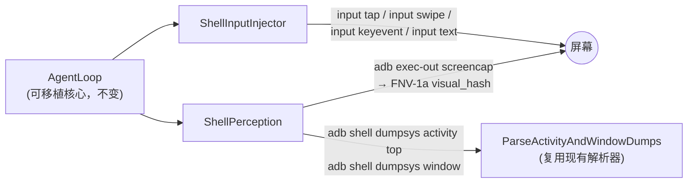

# Shell 指令后端（免 AOSP 构建）

本模块是项目的第三条运行路径：不依赖 AOSP 私有 ABI（`libgui`、平台签名
桥），改用 Android 自带的 Linux 用户空间指令完成感知与控制。守护进程只需
用 NDK 或主机工具链编译，即可在以下环境运行：

- **宿主机 adb 模式**（`--backend shell-adb`）：进程跑在 Linux/macOS/Windows
  主机上，所有指令经 `adb shell` / `adb exec-out` 转发到设备。shell UID
  天然持有 `READ_FRAME_BUFFER` 与 `INJECT_EVENTS` 授权，无需 root。
- **设备端模式**（`--backend shell`）：进程直接跑在 Android 上（root 或
  shell UID），以 `/system/bin/...` 绝对路径直接 `execvp` 子进程。

安全边界与 [SECURITY.md](SECURITY.md) 一致：不绕过 FLAG_SECURE、Restricted
Settings、SELinux 或任何应用策略；安全界面截屏结果为空白或失败，属于预期
行为。仅适用于自有设备或已获明确授权的设备。

## 架构



`DecisionEngine` 接口不变。当前仓库仍默认 `NoopDecision`/演示决策；接入真
实策略（规则或 LLM）时实现 `Decide()` 即可，主循环、状态图、持久化全部复
用。

## 命令映射

| 环节 | Android 指令 | 说明 |
| --- | --- | --- |
| 视觉感知 | `screencap`（raw 输出） | adb 模式用 `exec-out` 保证二进制安全；输出整体 FNV-1a 哈希为 `visual_hash` |
| 窗口语义 | `dumpsys activity top` + `dumpsys window` | 复用 `ParseActivityAndWindowDumps`，提取组件名、PID；失败降级为空元数据，不影响步进 |
| 点击 | `input tap X Y` | 起点、终点距离 ≤ 8px 的手势折叠为 tap |
| 滑动 | `input swipe X1 Y1 X2 Y2 DUR` | 贝塞尔采样路径的起点/终点/时长；中间形状由系统线性插值 |
| 按键 | `input keyevent CODE` | 便捷接口，不属于 Gesture 决策路径 |
| 文本 | `input text STR` | 空格转义为 `%s`；仅可打印 ASCII |

多指手势被明确拒绝（`shell input` 无法表达多指语义），这是与 AIDL 桥路径
的功能差异，不是缺陷。

## 用法

主机构建（Linux/macOS/WSL）：

```sh
tools/run-tests.sh

# 合成回放，不触碰任何设备
build/host/global-agentd --state /tmp/demo.bin --iterations 4

# 连接真机：真实截屏 + 真实滑动（演示手势）
build/host/global-agentd --backend shell-adb --demo-action \
  --state /tmp/demo.bin --iterations 4 --budget-ms 8000

# 指定序列号
build/host/global-agentd --backend shell-adb --adb-serial ZX1G22 ...
```

设备端部署：用 `tools/build-android-stub.sh` 交叉编译后 push 到
`/data/local/tmp/global-agentd`，root 或 shell 下执行
`--backend shell`。Magisk 开机自启可复用 `deploy/magisk/` 脚手架。

## 延迟现实（务必阅读）

`input`/`screencap` 每次调用都要 `fork` + `app_process`/toybox 冷启动：

- 设备端单次 `input tap` 约 300–800 ms；
- adb 模式再叠加一次 adb 往返（USB 约 10–50 ms）。

因此 shell 后端的单步预算默认放宽到 8000 ms（`--budget-ms` 可调），远大于
AOSP 路径的 200 ms。这不是退化，而是把预算花在正确的位置：UI 自动化任务
（截图 → 决策 → 注入 → 反馈）本身是秒级循环。`dumpsys` 高负载时可能持有
system_server 锁，感知层对两条 dumpsys 指令设置独立超时并在失败时丢弃结
果，不阻塞步进。

## 限制与诚实声明

- **多指/捏合**：`input` 不支持；需要时回到 AIDL 桥路径或自研测试应用。
- **滑动形状**：`input swipe` 只保证起终点，贝塞尔中间采样形状会被线性插
  值取代。API 31+ 的 `input motionevent DOWN/MOVE/UP` 可逐点回放，但每点
  一次进程冷启动，仅适合低频校准。
- **文本**：仅可打印 ASCII，无 Unicode/中文输入（`input text` 限制）。
- **FLAG_SECURE/DRM**：截屏为黑帧或失败，与 AOSP 路径行为一致。
- **可检测性**：adb/shell 注入的事件带有 `INJECT_EVENT` 标记，应用可通
  过 `MotionEvent` flag 识别。本模块不做也不承诺任何"防检测"。
- **取消语义**：`CancelActiveGesture()` 为文档化的空操作——shell 传输无法
  撤回已启动的进程，由子进程超时兜底。

## 路线图

1. `uiautomator dump` 语义感知：XML 层级含可点击节点 bounds/text，与视觉
   哈希互补；1–3 s 的耗时决定它只适合低频校准，不适合每步调用。
2. `am start`/`am force-stop`/`pm list packages`/`settings`/`cmd` 的结构化
   包装，作为 DecisionEngine 的动作空间扩展。
3. LLM DecisionEngine：`Decide(graph, perception)` 内调用本地/远端模型，
   输出仍须经 `ValidateGesture` 校验。
4. 设备端常驻：init.rc + SELinux 策略沿用 AOSP 路径脚手架。
