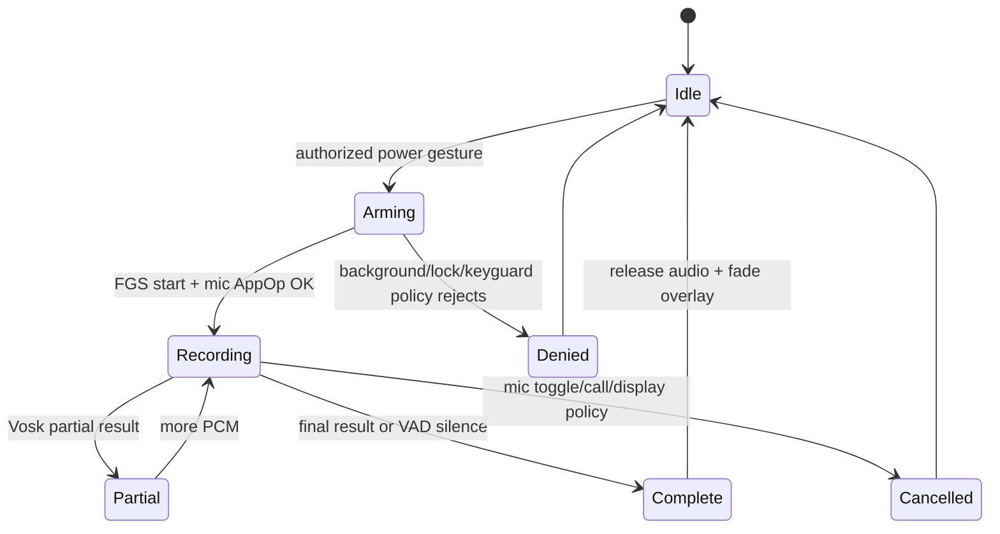

# Android 14 离线 STT 与边缘光效集成说明

本文只描述经用户明确触发和授权的录音与视觉反馈。它不提供隐藏录音、绕过
麦克风隐私开关、绕过锁屏/后台服务限制或通过 Root 伪造权限的做法。

## 1. 结论先行

Android 14 上，离线语音识别可以由一个 `microphone` 类型的前台服务承载，
但它仍然需要用户授予 `RECORD_AUDIO`，并且要满足前台服务启动限制。Root 不会
把普通应用自动变成“正在使用麦克风”的应用；从锁屏或后台首次启动时，
`startForeground()` 可能抛出 `ForegroundServiceStartNotAllowedException` 或被
AppOps 拒绝。长期运行的产品应在用户可见页面中预先完成授权、预热模型并绑定
服务；系统镜像产品可以把入口放在受控的 platform-signed system service 中，
但仍应保留通知、麦克风隐私指示器和可撤销开关。

边缘光效使用 `TYPE_APPLICATION_OVERLAY` 只能覆盖普通应用窗口，不能保证压过
Keyguard、状态栏、导航栏或安全窗口。需要系统 UI 级层级时，应该在自有 AOSP
分支中实现 SystemUI/平台签名组件，而不是给应用伪造 `TYPE_STATUS_BAR` 或
`PRIVATE_FLAG_TRUSTED_OVERLAY`。

## 2. Android 14 API 与源码事实核查

| 接口/策略 | AOSP 路径（Android 14 主线） | 结论 | 置信度 |
| --- | --- | --- | --- |
| `FOREGROUND_SERVICE_MICROPHONE` | `frameworks/base/core/res/AndroidManifest.xml` | target 34 的 microphone FGS 必须在 manifest 声明该类型权限，同时声明 `FOREGROUND_SERVICE` | 高 |
| `ServiceInfo.FOREGROUND_SERVICE_TYPE_MICROPHONE` | `frameworks/base/core/java/android/content/pm/ServiceInfo.java` | `startForeground(id, notification, type)` 的类型位；API 29 起可用 | 高 |
| FGS 启动与 while-in-use 检查 | `frameworks/base/services/core/java/com/android/server/am/ActiveServices.java`、`ActivityManagerService.java` | `RECORD_AUDIO` 是 while-in-use 权限；后台启动 microphone FGS 没有通用 Root 豁免 | 高 |
| 录音入口 | `frameworks/base/media/java/android/media/AudioRecord.java`、`frameworks/av/services/audioflinger/` | 通过 framework AudioRecord 获取 PCM；不要让 daemon 直接读 ALSA 设备 | 高 |
| 麦克风 AppOps/隐私开关 | `frameworks/base/services/core/java/com/android/server/appop/AppOpsService.java`、`frameworks/base/services/core/java/com/android/server/audio/AudioService.java` | 用户关闭麦克风、通话占用或 AppOps 拒绝时应停止/报告失败 | 中高 |
| `TYPE_APPLICATION_OVERLAY` | `frameworks/base/core/java/android/view/WindowManager.java`、`WindowManager.LayoutParams`；权限检查在 `frameworks/base/services/core/java/com/android/server/policy/PhoneWindowManager.java::checkAddPermission()` | 需要 `SYSTEM_ALERT_WINDOW` 和用户授权的 AppOp；层级受 WMS/Keyguard 限制 | 高 |
| Window 层级/遮挡策略 | `frameworks/base/services/core/java/com/android/server/wm/WindowManagerService.java`、`WindowState.java` | 普通 overlay 不能冒充 `TYPE_STATUS_BAR`/trusted overlay | 高 |
| `RuntimeShader`/AGSL | `frameworks/base/graphics/java/android/graphics/RuntimeShader.java` | 公共 API，API 33+；低于 33 使用 `LinearGradient` 等回退 | 高 |
| 帧调度 | `frameworks/base/core/java/android/view/Choreographer.java` | 使用 vsync 回调，不在主线程忙等 | 高 |
| Vosk Android | 非 AOSP，`org.vosk:vosk-android` 及其 NDK/Kaldi 库 | 第三方依赖；版本、ABI、模型许可和内存必须单独锁定并实测 | 高 |

Android 13/14 差异不能只靠 API level 猜测。至少要以目标设备的
`ro.build.version.security_patch`、framework tag 和厂商 sepolicy 复核；没有目标
源码时，不声称某个安全补丁 commit 已“封堵”或“放开”上述路径。

## 3. Manifest 与授权前置

```xml
<manifest ...>
    <uses-permission android:name="android.permission.RECORD_AUDIO" />
    <uses-permission android:name="android.permission.FOREGROUND_SERVICE" />
    <uses-permission android:name="android.permission.FOREGROUND_SERVICE_MICROPHONE" />
    <uses-permission android:name="android.permission.SYSTEM_ALERT_WINDOW" />
    <!-- API 33+ 为了让前台服务通知出现在通知抽屉，按产品需要请求。 -->
    <uses-permission android:name="android.permission.POST_NOTIFICATIONS" />

    <application ...>
        <service
            android:name=".SpeechService"
            android:exported="false"
            android:foregroundServiceType="microphone"
            android:directBootAware="true" />
    </application>
</manifest>
```

在用户可见的 Activity 中完成以下检查，不能在后台偷偷弹授权框：

```java
if (checkSelfPermission(Manifest.permission.RECORD_AUDIO)
        != PackageManager.PERMISSION_GRANTED) {
    requestPermissions(new String[]{Manifest.permission.RECORD_AUDIO}, REQ_MIC);
}
if (!Settings.canDrawOverlays(this)) {
    startActivity(new Intent(Settings.ACTION_MANAGE_OVERLAY_PERMISSION,
            Uri.parse("package:" + getPackageName())));
}
```

`SYSTEM_ALERT_WINDOW` 的设置页授权是用户选择；`chcon`、`pm grant` 或 Root
Shell 不应被当成替代授权。系统镜像可以在产品的 privapp allowlist 中配置自有
包，但仍不能绕过麦克风开关或 AppOps。

## 4. Vosk 服务骨架

Vosk 不是 AOSP API。模型应随应用签名发布、校验哈希后解压到应用私有目录；不要
从网络临时下载未审计模型。模型可放在 device-protected storage 以便 Direct Boot
读取，但读取模型不等于获得录音权限。

以下骨架展示线程边界和停止条件，实际项目应补充错误上报、音频设备切换和
生命周期测试：

```java
public final class SpeechService extends Service {
    private static final int RATE = 16_000;
    private static final int MAX_MS = 10_000;
    private final ExecutorService recognizerExecutor =
            Executors.newSingleThreadExecutor();
    private final AtomicBoolean running = new AtomicBoolean();
    private AudioRecord audioRecord;
    private Model model; // org.vosk.Model; third-party dependency
    private Recognizer recognizer; // org.vosk.Recognizer

    @Override public int onStartCommand(Intent intent, int flags, int id) {
        if (checkSelfPermission(Manifest.permission.RECORD_AUDIO)
                != PackageManager.PERMISSION_GRANTED) {
            stopSelfResult(id);
            return START_NOT_STICKY;
        }
        createNotificationChannel();
        try {
            if (Build.VERSION.SDK_INT >= 29) {
                startForeground(NOTIFICATION_ID, buildRecordingNotification(),
                        ServiceInfo.FOREGROUND_SERVICE_TYPE_MICROPHONE);
            } else {
                startForeground(NOTIFICATION_ID, buildRecordingNotification());
            }
        } catch (SecurityException | IllegalStateException denied) {
            // Includes FGS-start/while-in-use policy failures. Report and stop once;
            // do not loop or fall back to direct /dev/snd access.
            stopSelfResult(id);
            return START_NOT_STICKY;
        }
        if (running.compareAndSet(false, true)) {
            recognizerExecutor.execute(this::recordAndRecognize);
        }
        return START_NOT_STICKY; // a new power-key gesture must re-authorize/restart
    }

    private void recordAndRecognize() {
        final int min = AudioRecord.getMinBufferSize(
                RATE, AudioFormat.CHANNEL_IN_MONO,
                AudioFormat.ENCODING_PCM_16BIT);
        final int size = Math.max(min, RATE / 5 * 2); // >= 200 ms buffer
        AudioRecord local = new AudioRecord.Builder()
                .setAudioSource(MediaRecorder.AudioSource.VOICE_RECOGNITION)
                .setAudioFormat(new AudioFormat.Builder()
                        .setSampleRate(RATE)
                        .setEncoding(AudioFormat.ENCODING_PCM_16BIT)
                        .setChannelMask(AudioFormat.CHANNEL_IN_MONO)
                        .build())
                .setBufferSizeInBytes(size)
                .build();
        audioRecord = local;
        if (local.getState() != AudioRecord.STATE_INITIALIZED) {
            finishRecording();
            return;
        }
        final byte[] pcm = new byte[size];
        final long deadline = SystemClock.elapsedRealtime() + MAX_MS;
        try {
            local.startRecording();
            while (running.get() && SystemClock.elapsedRealtime() < deadline) {
                int n = local.read(pcm, 0, pcm.length,
                        AudioRecord.READ_BLOCKING);
                if (n <= 0) break;
                // recognizer.acceptWaveForm(pcm, n) is third-party Vosk code.
                // Send only bounded partial/final text over authenticated Binder.
                // Do not persist raw PCM or arbitrary Parcelable objects.
            }
        } finally {
            try { local.stop(); } catch (IllegalStateException ignored) {}
            local.release();
            audioRecord = null;
            finishRecording();
        }
    }

    public void cancel() {
        running.set(false);
        AudioRecord local = audioRecord;
        if (local != null) local.stop(); // wakes READ_BLOCKING
    }

    private void finishRecording() {
        stopForeground(STOP_FOREGROUND_REMOVE);
        stopSelf();
        // Notify overlay: COMPLETE, CANCELLED, or ERROR; fade for ~250 ms.
    }
}
```

实现注意事项：

* `AudioRecord` 线程只负责读取固定大小 PCM；识别线程使用有界队列，队列满时
  丢弃最旧的 partial 音频并记录指标，不能阻塞录音线程。
* Vosk 的 `partialResult()` 可每 100--300 ms 合并一次；最终结果通过受签名权限
  保护的 Binder 方法（例如 `submitTranscript(String text, boolean isFinal, long t)`）
  发送，并限制 UTF-8 字节数。`LocalBroadcastManager` 只适用于同一进程，不可作为
  跨进程安全通道。
* 使用 VAD/能量阈值检测连续 0.8--1.2 秒静音，并设置 8--10 秒总时限；每次停止
  都释放 `AudioRecord`、Recognizer 和临时 PCM。通话、蓝牙路由变化、全局麦克风
  开关关闭时立即取消。
* 预加载模型可减少首字延迟，但会让进程常驻。小模型通常需要几十 MB 到一百多
  MB RSS，CPU 约为实时级别；这是设备、语言模型和采样率相关的经验范围，必须
  用 `dumpsys meminfo`/`simpleperf` 在目标机实测，不能承诺固定功耗。
* 首次启动服务必须在系统规定窗口内调用 `startForeground()`；通知中应明确“正在
  使用麦克风”并提供停止动作。无 `RECORD_AUDIO`、AppOps 拒绝或麦克风隐私开关关闭
  时，不应尝试重试或改走 `/dev/snd`。

## 5. 后台、锁屏和 Direct Boot

长按电源键的系统侧入口应调用一个受签名权限保护的 Binder 服务，由服务向已经
授权且预热的桥接进程发起一次性录音请求。普通应用不能接收原始 `KEYCODE_POWER`
事件，也不能在锁屏时凭 Root 直接获得录音资格。

建议状态机：



锁屏时可继续一个已获授权、已在前台运行的录音会话，但“锁屏首次启动”是否
允许取决于目标版本、设备策略和调用者状态，必须记录 `ActiveServices` 的拒绝
原因并向用户显示失败反馈。熄屏没有可见光效；不要为了显示光效自动唤醒屏幕。

需要区分两个检查：AOSP `ActiveServices` 的 `hasSystemAlertWindowPermission()`
可以成为“允许后台启动 FGS”的 reason，但 `shouldAllowFgsWhileInUsePermissionLocked()`
仍单独判断 microphone 的 while-in-use 能力。因而即使用户授予悬浮窗权限，也不能
把它当成 `RECORD_AUDIO` 或麦克风隐私开关的替代品。

## 6. 边缘光效 overlay

### WindowManager 路径

```java
final class EdgeGlowController {
    private final WindowManager wm;
    private EdgeGlowView view;

    void show() {
        if (!Settings.canDrawOverlays(context)) return;
        if (view != null) return;
        view = new EdgeGlowView(context);
        WindowManager.LayoutParams lp = new WindowManager.LayoutParams(
                MATCH_PARENT, MATCH_PARENT,
                WindowManager.LayoutParams.TYPE_APPLICATION_OVERLAY,
                WindowManager.LayoutParams.FLAG_NOT_FOCUSABLE
                | WindowManager.LayoutParams.FLAG_NOT_TOUCHABLE
                | WindowManager.LayoutParams.FLAG_LAYOUT_IN_SCREEN,
                PixelFormat.TRANSLUCENT);
        lp.gravity = Gravity.TOP | Gravity.START;
        try {
            wm.addView(view, lp);
        } catch (WindowManager.BadTokenException | SecurityException denied) {
            view = null; // report a visible, non-sensitive error state
        }
    }

    void hide() {
        EdgeGlowView old = view;
        view = null;
        if (old != null) {
            old.animate().alpha(0f).setDuration(250)
                    .withEndAction(() -> wm.removeViewImmediate(old)).start();
        }
    }
}
```

`FLAG_NOT_TOUCHABLE` 和 `FLAG_NOT_FOCUSABLE` 确保光效不截获点击与输入焦点。
不要给该窗口设置 `TYPE_STATUS_BAR`、`TYPE_SYSTEM_ERROR` 或隐藏的 trusted-overlay
标志；这些是系统签名/系统 UI 边界，Root Shell 伪造标签也不能合法替代 WMS 检查。
Overlay 可能被 Keyguard、安全窗口、屏幕录制保护策略或 OEM 的悬浮窗管控遮住。

### RuntimeShader（API 33+）

```java
private static final String AGSL =
        "uniform float2 resolution;" +
        "uniform float time;" +
        "half4 main(float2 p) {" +
        "  float2 uv = p / resolution;" +
        "  float edge = min(min(uv.x, 1.0 - uv.x)," +
        "                    min(uv.y, 1.0 - uv.y));" +
        "  float wave = 0.5 + 0.5 * sin(time * 6.283 +" +
        "                    (uv.x + uv.y) * 18.0);" +
        "  float a = (1.0 - smoothstep(0.0, 0.07, edge)) * wave;" +
        "  return half4(float3(0.10, 0.70, 1.0) * a, a);" +
        "}";

final class EdgeGlowView extends View {
    private final Paint paint = new Paint(Paint.ANTI_ALIAS_FLAG);
    private final RuntimeShader shader = new RuntimeShader(AGSL);
    private long started;

    EdgeGlowView(Context c) { super(c); setLayerType(View.LAYER_TYPE_HARDWARE, null); }

    @Override protected void onDraw(Canvas c) {
        float t = (SystemClock.uptimeMillis() - started) / 1000f;
        shader.setFloatUniform("resolution", getWidth(), getHeight());
        shader.setFloatUniform("time", t);
        paint.setShader(shader);
        float edge = getResources().getDisplayMetrics().density * 24f;
        // Keep the expensive fragment shader on four narrow strips, not the full frame.
        c.drawRect(0, 0, getWidth(), edge, paint);
        c.drawRect(0, getHeight() - edge, getWidth(), getHeight(), paint);
        c.drawRect(0, edge, edge, getHeight() - edge, paint);
        c.drawRect(getWidth() - edge, edge, getWidth(), getHeight() - edge, paint);
        postInvalidateOnAnimation();
    }
}
```

生产实现应只绘制四条 8--32dp 边带或使用裁剪矩形，避免每帧给整块屏幕做昂贵
片元计算。API 32 及以下回退为四个 `LinearGradient`/`SweepGradient`，并使用
`Choreographer` 或 `postInvalidateOnAnimation()` 驱动。动画状态应与 STT 绑定：
`ARMING` 快速亮起，`RECORDING` 脉动，`PARTIAL` 保持，`COMPLETE/ERROR` 250ms
渐出；屏幕关闭时暂停绘制，亮屏后仅在会话仍有效时恢复。

## 7. 性能、失败和降级

| 项目 | 目标/测量方法 |
| --- | --- |
| 首次 STT 响应 | 模型预热后以 PCM 首帧到 partial callback 的 P50/P95 测量；不承诺固定 <200ms |
| 录音内存 | `dumpsys meminfo <uid>`；模型、AudioRecord buffer、Binder payload 分开统计 |
| 光效 GPU | `dumpsys gfxinfo`/Perfetto；边带绘制优先于全屏 shader |
| 后台拒绝 | 记录 `ForegroundServiceStartNotAllowedException`、AppOps 和 Keyguard 状态，单次退避，不循环重试 |
| SystemUI/WMS 重启 | 捕获 `DeadObjectException`/`BadTokenException`，移除旧 view，等待 binder 重连与下一次显示确认后重建 |

无录音权限或设备策略不允许时，降级为用户可见的通知、状态栏图标或
`AccessibilityService`（仍需用户在设置中显式启用）；不使用 Root Shell 读取音频、
不修改 SELinux 为普通域放行麦克风设备、不绕过隐私指示器。

**STT 置信度：0.91（AOSP 14 API/权限边界）；Vosk 性能：0.75（必须按模型和设备实测）。**

**Overlay 置信度：0.89（WMS/公开 API）；跨 Keyguard/OEM 层级：0.65，必须在
目标 ROM 上验证。**
