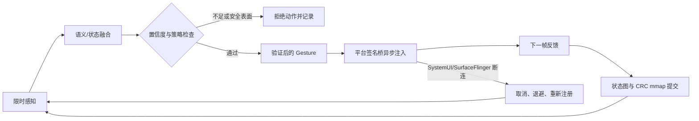

# Android 14 全局 Agent 技术设计（安全边界版）

本文面向已获授权的工程设备和自有应用测试。它描述可编译、可审计的
实现边界，不提供绕过 Restricted Settings、Enhanced Confirmation Mode、
SELinux、Play Protect、`FLAG_SECURE`、DRM、TEE 或第三方应用沙箱的步骤。
Android 14 的系统设置限制通常称为 Restricted Settings；Enhanced
Confirmation Mode 是较新的平台概念，不能把它倒推成 Android 14 的稳定
API。

电源键触发、离线 STT、前台麦克风服务和边缘光效的扩展边界分别见
[POWER_KEY_AUDIT.md](POWER_KEY_AUDIT.md)、[STT_OVERLAY_ANDROID14.md](STT_OVERLAY_ANDROID14.md)
和 [TRIGGER_STT_INTEGRATION.md](TRIGGER_STT_INTEGRATION.md)。这些模块目前是
设计/集成骨架，尚未替换生产入口中的 `NoopDecision`。

## 事实核查

| 接口/结论 | Android 14 源码位置 | 结论与风险 | 置信度 |
| --- | --- | --- | --- |
| 显示截屏入口 | `frameworks/native/libs/gui/include/gui/SurfaceComposerClient.h`；`frameworks/native/services/surfaceflinger/SurfaceFlinger.cpp` | `android::ScreenshotClient::captureDisplay(android::DisplayId, ...)` 进入 `captureDisplayById`，AOSP 14 明确允许 root 并关闭安全层；不是主线 `SurfaceComposerClient::captureDisplay` | 高 |
| 截屏结果 | `frameworks/native/libs/gui/include/gui/ScreenCaptureResults.h` | 字段是 `buffer` 和 `fenceResult`；不能读取不存在的 `result`/`fence` 字段 | 高 |
| GraphicBuffer 映射 | `frameworks/native/libs/ui/include/ui/GraphicBuffer.h` | `lock()`/`unlock()` 是私有平台 ABI，需要精确匹配设备源码和 gralloc | 高 |
| Fence | `frameworks/native/libs/ui/include/ui/Fence.h`、`FenceResult.h` | 只能在剩余 deadline 内等待；`SyncScreenCaptureListener::waitForResults()` 会无限等待 | 高 |
| 输入注入 | `frameworks/base/core/java/android/hardware/input/InputManager.java`、`services/core/java/com/android/server/input/InputManagerService.java` | 方法存在，但受权限、调用者 UID 和系统策略检查；不通过反射规避 Hidden API | 高 |
| 顶层任务 | `frameworks/base/core/java/android/app/ActivityManager.java` | `RunningTaskInfo` 只描述 Activity 容器，不是 Fragment/Compose/View 树 | 高 |
| Settings 监听 | `frameworks/base/core/java/android/provider/Settings.java`、`ContentObserver` | 只监听固定 allowlist；不能把所有 Global 设置当成语义数据 | 高 |
| `/data/system/activity_state` | AOSP 14 无稳定公共契约 | 不依赖该文件；使用 Agent 自有 mmap 文件 | 高 |
| ViewHolder 文本 | 无通用 Root Shell API | 不能从 `dumpsys window` 推导 RecyclerView 私有 ViewHolder 文本 | 高 |
| Parcel 限制 | `frameworks/native/libs/binder`、`frameworks/base/core/java/android/os/Parcel.java` | 事务大小、对象校验和 `enforceNoDataAvail()` 会让任意 Parcelable 转发失败；不传未知对象 | 高 |
| 2024 安全补丁 | 设备的 build fingerprint/SPL 与对应 release notes | 未拿到目标设备源码和 SPL 前不猜 commit ID；必须实测 | 中 |

所有私有接口都在构建时从目标 AOSP/OEM 源码生成或链接。若设备分支改动
签名，适配器应在边界处失败并记录版本，而不是复制另一版本的 `.so`。

## 主循环



“低于 200 ms”在本项目中是单步预算和失败上限，不是硬实时保证。Binder、
SurfaceFlinger 合成、gralloc 映射和调度都可能超过预算；任何超时都应跳过
动作，不能在超时后继续注入。

## 全局感知层

### 截屏路径

当前实现位于
`src/platform/aosp/aosp_surface_capture.cpp`，选择单帧
`ScreenshotClient::captureDisplay(DisplayId, ...)`，原因是 root daemon 在
AOSP 14 的 `captureDisplayById` 路径有明确调用者边界，并可在每步设置
callback/fence deadline。代码使用：

```text
frameworks/native/libs/gui/include/gui/SurfaceComposerClient.h
frameworks/native/libs/gui/include/gui/DisplayCaptureArgs.h
frameworks/native/libs/gui/include/gui/ScreenCaptureResults.h
frameworks/native/libs/ui/include/ui/GraphicBuffer.h
frameworks/native/libs/ui/include/ui/FenceResult.h
```

链接边界通常包括 `libgui`、`libui`、`libbinder`、`libbinder_ndk`、`libutils`
和 `liblog`，但 Soong 模块和导出头必须以目标树为准。`captureSecureLayers`
固定为 `false`；安全/受保护内容应失败、空白或被拒绝，不能通过 root 读取。

持续 30/60 fps 可以另建 Virtual Display + BufferQueue consumer，但它会引入
BufferQueue 生命周期、消费者背压、旋转和内存回收问题；不应为了“更快”复制
跨版本私有库。当前适配器的 callback、fence、`GraphicBuffer::lock` 都受单步
deadline 限制，仍需在真机上测量 P50/P95/P99。

### 语义补充

桥接 APK 每 500 ms 发布受限的顶层 Activity、display、bounds、rotation 和
近似 foreground PID。`dumpsys activity/window` 解析器仅用于离线/授权诊断，
子进程使用参数数组、输出上限和毫秒级 timeout，不在 UI 线程执行。高负载时
`dumpsys` 可能持有 system_server 锁，因此建议 50--100 ms 超时并丢弃本次
结果；不得把它当作稳定 View hierarchy API。

`dumpsys activity top` 偶尔可显示 ViewRoot 诊断片段，但 Android 14 没有承诺
完整 View 树、RecyclerView 文本或稳定的“View 层级哈希”。本项目只对收到的
诊断文本做规范化 hash，并把它视为低置信度信号。

**全局感知置信度：0.90。** AOSP 接口字段已按 Android 14 主线核对；具体
OEM 权限、gralloc 格式和端到端延迟仍需目标源码/设备验证。

## 全局控制层

### SELinux 与 uinput

不提供通过 Magisk 注入宽泛 `te` 规则、把 `system_app`/通用 root 域授权给
`uinput_device` 或修改 `/dev/uinput` 标签来绕过策略的实现。`chcon` 只改变
标签，不创造允许规则；Android 14 的 neverallow、设备策略和 framework
调用者检查仍然生效，而且错误标签可能扩大故障面。

输入路径是 platform-signed bridge 调用 `InputManager.injectInputEvent`，并由
`INJECT_EVENTS`、UID、display 和系统输入策略共同检查。平台构建使用
`platform_apis: true`，不使用反射或 Hidden API 绕过。桥接层对帧数、指针数、
时间单调性、有限坐标和 DOWN/UP 状态机做校验，异步按时间戳发送，失败发送
`ACTION_CANCEL`。

普通 shell 的 `input swipe` 只适合单指测试，不能证明多指语义或绕过目标应用
策略。多指事件应只通过项目的结构化 AIDL 测试接口发送，并在自有测试应用上
验证；不要把命令行注入扩展成跨应用权限绕过。

三次 Bézier 采样在 `src/bezier.cpp` 中按近似弧长分段，目标是稳定采样密度，
不是“伪装真人”或规避风控。任何金融/反滥用场景应使用官方测试入口和明确授权。

**全局控制置信度：0.93。** 桥接 API 和验证器可本地构建；系统权限结果、
OEM 输入策略和安全补丁必须在目标设备上确认。

## 状态图与长期记忆

`src/state_store.cpp` 将 Agent 自有状态保存到
`/data/misc/global_agent/state.bin`：双槽、generation、CRC32、`flock` 单写者、
`O_NOFOLLOW`、0600 权限和崩溃恢复。普通观察最多每秒提交，动作反馈立即提交。
内容只有 hash、边和时间戳，不含截图、token、密码或第三方私有 payload。

`SettingsObserver` 仅监听动画缩放等固定 allowlist；设置变化只增加 epoch，
不读取敏感值。状态图是有上限的内存结构，mmap 只是持久化介质；恢复时校验
版本、长度、CRC 和 current node，坏槽自动回退到上一代。

**状态与记忆置信度：0.94。** 文件格式和恢复测试已覆盖；真实设备的 SELinux
文件上下文及断电一致性仍需工程机测试。

## LSPosed/Xposed 评估

项目不内置 LSPosed 模块。只有在自有、可调试应用中确实需要应用内生命周期
或 Intent 观测时，才考虑测试 flavor 的 instrumentation；不能用它提取未授权
第三方 App 私有数据，也不能把 hook 当作绕过 ECM/Play Protect 的工具。

纯 Root Shell 无法可靠获得 RecyclerView 的 Adapter/ViewHolder 文本。把未知
Parcelable、Bundle 或跨进程对象强行转发会触发 Binder 事务大小、类加载、对象
校验和 `enforceNoDataAvail()` 失败，常见结果是 `BadParcelableException`、
`TransactionTooLargeException` 或服务崩溃。规避方式是：

1. 自有应用提供窄化的 debug/test AIDL 或日志接口，只传字符串和固定上限的
   DTO。
2. 使用应用内 instrumentation/测试构建直接读取自己的 adapter 数据。
3. 对第三方应用只使用其公开 API、用户授权的 Accessibility 流程或视觉结果，
   不读取私有对象。

**桥接层置信度：0.91。** Android 14 的 Parcel 约束和无通用 ViewHolder API
已核对；具体 OEM hook 行为不作推测。

## 稳定性、恢复与可观测性

`android/init/global-agent.rc` 使用 `class main`、独立 `agentd` 域、死亡后
重启和 `oom_score_adjust`。`restart_period` 的单位是秒，init 还会做崩溃
频率限制，因此不能承诺 50 ms 拉起；任何声称固定 50 ms 的方案都是推测，需
实测验证。Agent 连接 Binder death、SurfaceFlinger capture 错误和 SystemUI
重启时应取消活动手势、清空 pending action、退避重连，并在新帧确认焦点后
才恢复决策。不要隐藏日志、篡改审计或实现“隐身”。

安全版初始化脚本只处理 Agent 自有路径：

```sh
#!/system/bin/sh
set -eu

DATA=/data/misc/global_agent
BIN=/system_ext/bin/global-agentd

mkdir -p "$DATA"
chown 0:0 "$DATA"
chmod 0700 "$DATA"
chcon u:object_r:global_agent_data_file:s0 "$DATA" 2>/dev/null || true

if [ -e "$BIN" ]; then
  chown 0:0 "$BIN"
  chmod 0755 "$BIN"
  chcon u:object_r:agentd_exec:s0 "$BIN" 2>/dev/null || true
fi

# Do not relabel /dev/uinput and do not call setenforce.
restorecon -RF "$DATA" "$BIN" 2>/dev/null || true
```

`chcon` 不替代产品 sepolicy；正式部署必须在匹配的 AOSP/OEM policy tree 中
编译 `agentd`、service/property/file contexts，并从 enforcing 模式开始收集
最小化 AVC。SurfaceFlinger 崩溃、SystemUI 重启和 agentd 被杀都应成为可观测
的状态转换，而不是触发更高权限。

**稳定性置信度：0.88。** init/SELinux 片段是集成骨架；启动节拍、策略宏和
厂商 watchdog 行为仍必须由目标树编译和设备测试确认。

## 方案对比

| 维度 | Root-only（本项目核心） | Root + LSPosed（仅自有测试 flavor） |
| --- | --- | --- |
| 延迟 | 视觉/桥接路径短；单步预算 200 ms，非硬实时 | 应用内数据可少一次视觉解析，但 hook 调度和 IPC 仍有抖动 |
| 稳定性 | 依赖私有 `libgui`、系统服务和权限，跨 OEM 易变 | 额外依赖 LSPosed/ART 版本，应用更新易失效 |
| 隐蔽性 | root、解锁 bootloader、平台改动可被检测；不承诺隐身 | LSPosed/hook 更容易被完整性和反篡改检测 |
| 语义范围 | 顶层任务、视觉 hash、公开诊断；无私有 ViewHolder | 只在明确授权的自有 app 中增加生命周期/测试 DTO |
| 安全边界 | 不碰 `uinput`、secure surface、TEE | 同样不允许跨应用私有数据提取或策略绕过 |
| 验证门槛 | 需目标 AOSP 14 源码、SELinux 和真机 | 还需对应 ROM、ART、LSPosed 版本矩阵 |

## 未完成门槛与强制声明

- 工作区已通过主机 ASan/UBSan、CTest、API 34 arm64 NDK stub 和 API 35
  enforcing emulator smoke/recovery；这不等价于完整 AOSP 14 `libgui`、平台
  Java 和设备 sepolicy 构建。
- 没有可核实的安全补丁 commit ID 时不猜测；应按目标 fingerprint、SPL 和
  源码 tag 复核。若接口被补丁封堵，备用路径是用户可见的
  `AccessibilityService + Root 辅助校准`，并保留 secure surface 和权限边界。
- 纯Root方案无法完美绕过Google Play Protect的检测，且无法在硬件级TEE（如StrongBox）中获取密钥，凡是声称能破解金融类App加密传输的方案均为幻觉。
- 本轮独立 AI 审批因 Gemini 模型不可用且插件没有受管 DeepSeek 凭据而为
  `blocked`；[outputs/ai-review.md](../outputs/ai-review.md) 是诚实记录，不是
  “已通过”证明。

**总体置信度：0.90（实现骨架）；生产可用性：未宣称，待目标 AOSP 14 源码和
设备验证。**
